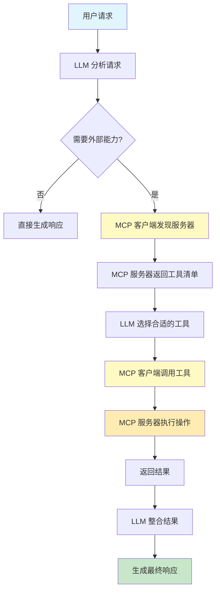

# 模型上下文协议 (MCP)

## 范式概述

模型上下文协议(MCP)是一个开放标准,旨在标准化 LLM 与外部应用程序 数据源和工具之间的通信. MCP 通过提供统一的接口和发现机制,使智能体能够动态发现和使用外部能力,从而显著简化复杂 AI 系统的构建和集成. 

MCP 解决了 LLM 集成面临的核心问题: 
- 如何标准化 LLM 与外部系统的通信?
- 如何实现工具和能力的动态发现?
- 如何提高 LLM 工具集成的可重用性和互操作性?
- 如何构建可扩展的 多工具的智能体系统?

## 核心概念

### MCP 架构
- **客户端-服务器模型**: MCP 客户端连接到 MCP 服务器
- **标准化接口**: 统一的工具 资源和提示定义
- **动态发现**: 客户端可以查询服务器的能力
- **开放协议**: 促进不同 LLM 和工具间的互操作性

### MCP 组件
1. **工具(Tools)**: 可执行函数,用于执行操作
2. **资源(Resources)**: 静态数据,提供数据访问
3. **提示(Prompts)**: 交互模板,指导 LLM 使用资源或工具

### MCP 与函数调用的区别

| 特性 | 函数调用 | MCP |
|-----|---------|-----|
| 标准化 | 专有,供应商特定 | 开放标准协议 |
| 范围 | 特定函数调用 | 广泛的通信框架 |
| 架构 | 一对一交互 | 客户端-服务器 |
| 发现 | 静态配置 | 动态发现 |
| 可重用性 | 紧耦合 | 高度可重用 |

## 流程图



## 代码实现

### 1. MCP 服务器实现

```python
"""
模型上下文协议(MCP)示例代码
演示如何创建 MCP 服务器和客户端
"""
from typing import Dict, List, Any, Optional
from dataclasses import dataclass
from abc import ABC, abstractmethod
import json
from llm_config import create_llm


@dataclass
class MCPResource:
    """MCP 资源 - 静态数据"""
    uri: str
    name: str
    description: str
    mime_type: str
    data: Any


@dataclass
class MCPTool:
    """MCP 工具 - 可执行函数"""
    name: str
    description: str
    parameters: Dict[str, Any]
    function: callable


@dataclass
class MCPrompt:
    """MCP 提示 - 交互模板"""
    name: str
    description: str
    template: str


class MCPServer(ABC):
    """MCP 服务器抽象基类"""

    def __init__(self, server_name: str):
        self.server_name = server_name
        self.resources: List[MCPResource] = []
        self.tools: Dict[str, MCPTool] = {}
        self.prompts: List[MCPrompt] = []

    @abstractmethod
    def register_resources(self):
        """注册资源"""
        pass

    @abstractmethod
    def register_tools(self):
        """注册工具"""
        pass

    def register_prompt(self, name: str, description: str, template: str):
        """注册提示"""
        prompt = MCPrompt(name, description, template)
        self.prompts.append(prompt)

    def get_resource(self, uri: str) -> Optional[MCPResource]:
        """获取资源"""
        for resource in self.resources:
            if resource.uri == uri:
                return resource
        return None

    def list_resources(self) -> List[Dict]:
        """列出所有资源"""
        return [
            {
                'uri': r.uri,
                'name': r.name,
                'description': r.description,
                'mime_type': r.mime_type
            }
            for r in self.resources
        ]

    def list_tools(self) -> List[Dict]:
        """列出所有工具"""
        return [
            {
                'name': t.name,
                'description': t.description,
                'parameters': t.parameters
            }
            for t in self.tools.values()
        ]

    def execute_tool(self, tool_name: str, arguments: Dict) -> Any:
        """执行工具"""
        if tool_name not in self.tools:
            raise ValueError(f"工具 '{tool_name}' 不存在")

        tool = self.tools[tool_name]
        return tool.function(**arguments)


class FileSystemMCPServer(MCPServer):
    """文件系统 MCP 服务器示例"""

    def __init__(self, root_directory: str = "/tmp/mcp_files"):
        super().__init__("filesystem_server")
        self.root_directory = root_directory
        self.register_resources()
        self.register_tools()

    def register_resources(self):
        """注册文件系统资源"""
        self.resources.append(
            MCPResource(
                uri="file:///documents/readme.md",
                name="README",
                description="项目说明文档",
                mime_type="text/markdown",
                data="# 项目说明\n\n这是一个使用 MCP 的项目. "
            )
        )

    def register_tools(self):
        """注册文件系统工具"""

        def list_directory(path: str = ".") -> List[str]:
            """列出目录内容"""
            print(f"  列出目录: {path}")
            files = ["document1.txt", "document2.md", "data.csv"]
            return files

        def read_file(filepath: str) -> str:
            """读取文件内容"""
            print(f"  读取文件: {filepath}")
            return f"这是 {filepath} 的内容"

        def write_file(filepath: str, content: str) -> bool:
            """写入文件内容"""
            print(f"  写入文件: {filepath}")
            return True

        # 注册工具
        self.tools["list_directory"] = MCPTool(
            name="list_directory",
            description="列出指定目录中的文件和子目录",
            parameters={
                "type": "object",
                "properties": {
                    "path": {
                        "type": "string",
                        "description": "要列出的目录路径"
                    }
                }
            },
            function=list_directory
        )

        self.tools["read_file"] = MCPTool(
            name="read_file",
            description="读取文件内容",
            parameters={
                "type": "object",
                "properties": {
                    "filepath": {
                        "type": "string",
                        "description": "要读取的文件路径"
                    }
                }
            },
            function=read_file
        )

        self.tools["write_file"] = MCPTool(
            name="write_file",
            description="写入内容到文件",
            parameters={
                "type": "object",
                "properties": {
                    "filepath": {
                        "type": "string",
                        "description": "要写入的文件路径"
                    },
                    "content": {
                        "type": "string",
                        "description": "要写入的内容"
                    }
                }
            },
            function=write_file
        )
```

**使用的范式**: 
- **MCP 服务器**: 标准化外部能力提供者
- **工具注册**: 定义可执行的函数和参数
- **资源注册**: 提供静态数据访问
- **抽象基类**: 为不同类型的服务器提供模板

### 2. MCP 客户端和智能体

```python
class MCPClient:
    """MCP 客户端"""

    def __init__(self, name: str):
        self.name = name
        self.connected_servers: Dict[str, MCPServer] = {}

    def connect_to_server(self, server: MCPServer):
        """连接到 MCP 服务器"""
        print(f"\n{self.name} 连接到服务器: {server.server_name}")
        self.connected_servers[server.server_name] = server

        # 发现服务器能力
        print(f"  发现 {len(server.list_resources())} 个资源")
        print(f"  发现 {len(server.list_tools())} 个工具")
        print(f"  发现 {len(server.list_prompts())} 个提示")

    def discover_tools(self, server_name: str) -> List[Dict]:
        """发现服务器上的工具"""
        if server_name not in self.connected_servers:
            raise ValueError(f"未连接到服务器: {server_name}")

        server = self.connected_servers[server_name]
        return server.list_tools()

    def call_tool(self, server_name: str, tool_name: str, arguments: Dict) -> Any:
        """调用服务器上的工具"""
        if server_name not in self.connected_servers:
            raise ValueError(f"未连接到服务器: {server_name}")

        print(f"\n{self.name} 调用工具: {server_name}.{tool_name}")
        print(f"  参数: {arguments}")

        server = self.connected_servers[server_name]
        result = server.execute_tool(tool_name, arguments)

        print(f"  结果: {result}")
        return result


class MCPAgent:
    """使用 MCP 的智能体"""

    def __init__(self, name: str, llm):
        self.name = name
        self.llm = llm
        self.mcp_client = MCPClient(f"{name}_client")

    def connect_mcp_server(self, server: MCPServer):
        """连接 MCP 服务器"""
        self.mcp_client.connect_to_server(server)

    def process_request(self, user_request: str) -> str:
        """处理用户请求"""
        print(f"\n{'='*60}")
        print(f"智能体 {self.name} 处理请求: {user_request}")
        print(f"{'='*60}\n")

        # 分析请求并决定使用哪个工具
        analysis = self._analyze_request(user_request)
        print(f"分析结果: {analysis}")

        # 执行工具调用
        if analysis['action'] == 'list_files':
            server_name = analysis['server']
            files = self.mcp_client.call_tool(
                server_name,
                "list_directory",
                {"path": analysis.get('path', '.')}
            )
            return f"找到 {len(files)} 个文件: {files}"

        elif analysis['action'] == 'read_file':
            server_name = analysis['server']
            content = self.mcp_client.call_tool(
                server_name,
                "read_file",
                {"filepath": analysis['filepath']}
            )
            return content

        else:
            return "无法理解请求"

    def _analyze_request(self, request: str) -> Dict:
        """分析请求(简化版本)"""
        request_lower = request.lower()

        if "文件" in request_lower and ("列表" in request_lower or "列出" in request_lower):
            return {
                'action': 'list_files',
                'server': 'filesystem_server',
                'path': '.'
            }
        elif "读取" in request_lower and "文件" in request_lower:
            return {
                'action': 'read_file',
                'server': 'filesystem_server',
                'filepath': 'document1.txt'
            }
        else:
            return {'action': 'unknown'}
```

**使用的范式**: 
- **MCP 客户端**: 连接和调用 MCP 服务器
- **工具发现**: 动态查询服务器能力
- **智能体集成**: LLM 通过 MCP 使用外部工具
- **请求分析**: 决定使用哪个工具执行任务

### 3. 数据库 MCP 服务器

```python
class DatabaseMCPServer(MCPServer):
    """数据库 MCP 服务器示例"""

    def __init__(self):
        super().__init__("database_server")
        self.mock_data = {
            "users": [
                {"id": 1, "name": "张三", "email": "zhangsan@example.com"},
                {"id": 2, "name": "李四", "email": "lisi@example.com"}
            ]
        }
        self.register_resources()
        self.register_tools()

    def register_tools(self):
        """注册数据库工具"""

        def query_database(query: str) -> List[Dict]:
            """执行数据库查询"""
            print(f"  执行查询: {query[:50]}...")
            return self.mock_data["users"]

        def get_user_by_id(user_id: int) -> Optional[Dict]:
            """根据ID获取用户"""
            print(f"  查询用户ID: {user_id}")
            for user in self.mock_data["users"]:
                if user["id"] == user_id:
                    return user
            return None

        def insert_user(name: str, email: str) -> Dict:
            """插入新用户"""
            print(f"  插入用户: {name}")
            new_id = len(self.mock_data["users"]) + 1
            new_user = {"id": new_id, "name": name, "email": email}
            self.mock_data["users"].append(new_user)
            return new_user

        # 注册工具
        self.tools["query_database"] = MCPTool(
            name="query_database",
            description="执行SQL查询",
            parameters={
                "type": "object",
                "properties": {
                    "query": {
                        "type": "string",
                        "description": "SQL查询语句"
                    }
                }
            },
            function=query_database
        )

        self.tools["get_user_by_id"] = MCPTool(
            name="get_user_by_id",
            description="根据ID获取用户",
            parameters={
                "type": "object",
                "properties": {
                    "user_id": {
                        "type": "integer",
                        "description": "用户ID"
                    }
                }
            },
            function=get_user_by_id
        )

        self.tools["insert_user"] = MCPTool(
            name="insert_user",
            description="插入新用户",
            parameters={
                "type": "object",
                "properties": {
                    "name": {
                        "type": "string",
                        "description": "用户姓名"
                    },
                    "email": {
                        "type": "string",
                        "description": "用户邮箱"
                    }
                }
            },
            function=insert_user
        )
```

**使用的范式**: 
- **数据库集成**: 通过 MCP 标准化数据库访问
- **CRUD 操作**: 创建 读取 更新 删除操作
- **类型安全**: 定义清晰的参数和返回类型

## 使用场景

### 1. 数据库集成
- 查询 BigQuery 数据集
- 生成报告和统计
- 更新数据库记录
- 实时数据访问

### 2. 生成媒体编排
- Google Imagen 图像生成
- Google Veo 视频创建
- Google Chirp 语音生成
- Google Lyria 音乐创作

### 3. 外部 API 交互
- 获取实时天气数据
- 拉取股票价格
- 发送电子邮件
- 与 CRM 系统交互

### 4. 文件系统操作
- 列出目录内容
- 读取和写入文件
- 创建和管理文件
- 文件搜索和过滤

### 5. IoT 设备控制
- 智能家居设备控制
- 工业传感器监控
- 机器人命令执行
- 设备状态查询

### 6. 金融服务自动化
- 市场数据分析
- 交易执行
- 财务报告生成
- 合规性检查

### 7. 知识库访问
- 检索文档内容
- 语义搜索
- 知识图谱查询
- RAG 集成

### 8. 复杂工作流编排
- 多步骤任务协调
- 跨系统集成
- 数据管道处理
- 自动化工作流

## 最佳实践

### 1. API 设计原则
- 设计智能体友好的 API
- 提供过滤和排序功能
- 使用确定性的数据格式
- 返回可解析的结构化数据

### 2. 工具设计
- 清晰的工具描述
- 完整的参数定义
- 类型验证
- 错误处理

### 3. 安全性
- 实施身份验证和授权
- 限制工具访问权限
- 验证输入参数
- 记录访问日志

### 4. 错误处理
- 定义标准错误格式
- 提供有用的错误消息
- 支持重试机制
- 超时处理

### 5. 性能优化
- 批处理操作支持
- 结果缓存
- 异步操作
- 资源限制管理

### 6. 可发现性
- 提供详细的工具描述
- 包含使用示例
- 清晰的参数说明
- 文档链接

## MCP 实现选项

### 1. FastMCP(Python)
```python
from fastmcp import FastMCP

mcp_server = FastMCP()

@mcp_server.tool
def greet(name: str) -> str:
    """生成个性化问候语"""
    return f"Hello, {name}!"

mcp_server.run(transport="http", host="127.0.0.1", port=8000)
```

### 2. Google ADK 集成
```python
from google.adk.agents import LlmAgent
from google.adk.tools.mcp_tool.mcp_toolset import MCPToolset, StdioServerParameters

agent = LlmAgent(
    model='gemini-2.0-flash',
    name='filesystem_assistant',
    instruction='帮助用户管理文件',
    tools=[
        MCPToolset(
            connection_params=StdioServerParameters(
                command='npx',
                args=["@modelcontextprotocol/server-filesystem", "/path/to/folder"]
            )
        )
    ]
)
```

### 3. HTTP vs STDIO 传输
- **HTTP**: 适用于远程服务器 Web 应用
- **STDIO**: 适用于本地进程 高性能场景

## 关键优势

1. **标准化**: 开放标准,促进互操作性
2. **可发现性**: 动态发现工具和资源
3. **可配置性**: 灵活的配置选项
4. **可扩展性**: 支持分布式部署
5. **组合性**: 轻松组合多个 MCP 服务器
6. **安全性**: 标准化的认证和授权
7. **可维护性**: 统一的接口和文档

## 配置示例

```python
# LLM 配置(与 Chapter 1 保持一致)
from llm_config import create_llm

llm = create_llm(
    model="gpt-3.5-turbo",
    temperature=0.7
)
```

## 总结

模型上下文协议(MCP)是构建复杂 可扩展智能体系统的关键模式. 通过标准化的客户端-服务器架构,MCP 使智能体能够: 
- 动态发现和使用外部能力
- 与多种系统和 API 互操作
- 构建可组合和可重用的工具
- 简化复杂系统的集成

该模式特别适用于需要与多个外部系统交互的企业级应用,如数据集成 API 编排 IoT 控制等场景. MCP 与其他模式(如记忆管理 学习适应)结合,可以构建功能强大的智能体系统. 
