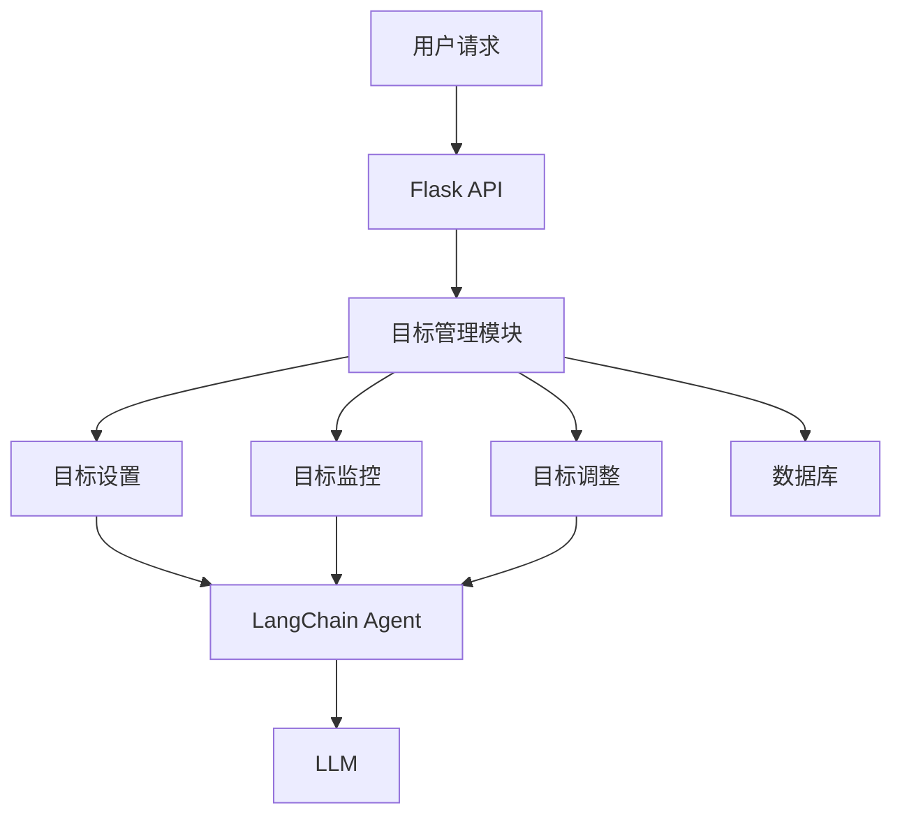

# 智能项目管理系统

## 项目概述

本项目是Chapter 11"目标设置与监控"模式的实战应用，实现了一个智能的项目管理系统，能够创建、监控和调整项目目标。

## 系统架构



## 核心功能

### 1. 目标设置
- 创建SMART目标（具体、可衡量、可实现、相关、有时限）
- 目标分解和层次化
- 目标优先级设置

### 2. 目标监控
- 实时追踪目标执行进度
- 可视化进度展示
- 异常检测和告警

### 3. 目标调整
- 基于进度动态调整目标
- 处理环境变化
- 目标重新评估

### 4. 多项目管理
- 并行管理多个项目
- 项目间依赖关系
- 资源分配优化

## 技术栈

- **Flask**: Web应用框架
- **LangChain**: AI Agent框架
- **Flasgger**: Swagger API文档
- **SQLite**: 数据持久化

## 快速开始

### 1. 安装依赖

```bash
pip install -r requirements.txt
```

### 2. 配置环境变量

```bash
export OPENAI_API_KEY='your-api-key'
export OPENAI_API_URL='your-api-url'  # 可选
```

### 3. 启动服务

```bash
python app.py
```

服务将在 `http://localhost:5000` 启动

### 4. 访问API文档

打开浏览器访问:
- Swagger UI: `http://localhost:5000/api/docs`
- Swagger JSON: `http://localhost:5000/api/swagger.json`

## API接口

### 创建目标
- **POST** `/api/v1/goals`
- 创建新的项目目标

### 获取目标
- **GET** `/api/v1/goals/{goal_id}`
- 获取指定目标的详细信息

### 更新目标
- **PUT** `/api/v1/goals/{goal_id}`
- 更新目标信息

### 监控进度
- **GET** `/api/v1/goals/{goal_id}/progress`
- 获取目标执行进度

### 调整目标
- **POST** `/api/v1/goals/{goal_id}/adjust`
- 调整目标参数

## 使用示例

### 通过Swagger UI测试

1. 访问 `http://localhost:5000/api/docs`
2. 展开"创建目标"接口
3. 点击"Try it out"
4. 输入目标JSON数据
5. 点击"Execute"发送请求

### 通过curl测试

```bash
# 创建目标
curl -X POST "http://localhost:5000/api/v1/goals" \
  -H "Content-Type: application/json" \
  -d '{
    "title": "完成项目开发",
    "description": "在指定时间内完成所有功能开发",
    "target_value": 100,
    "unit": "%",
    "deadline": "2026-04-30"
  }'

# 查询进度
curl "http://localhost:5000/api/v1/goals/{goal_id}/progress"
```

## 项目结构

```
practical/
├── app.py                 # Flask应用主文件
├── llm_config.py         # LLM配置
├── goal_manager.py       # 目标管理核心逻辑
├── database.py           # 数据库操作
├── README.md             # 本文件
├── requirements.txt       # Python依赖
└── docs/                 # API文档目录
    └── api_*.yml        # 各接口的Swagger文档
```

## 设计理念

### 节点可视化

系统对每个关键操作都记录详细的节点信息，包括：
- **入参**: 节点接收的输入参数
- **出参**: 节点处理后的输出结果
- **Tips**: 代码文件名和方法名

通过流程图可视化整个执行过程，便于调试和问题排查。

### 错误处理

- 所有错误都返回标准化的错误响应
- 详细的错误日志记录
- 友好的错误提示信息

## 许可证

本项目仅用于学习和演示目的。
