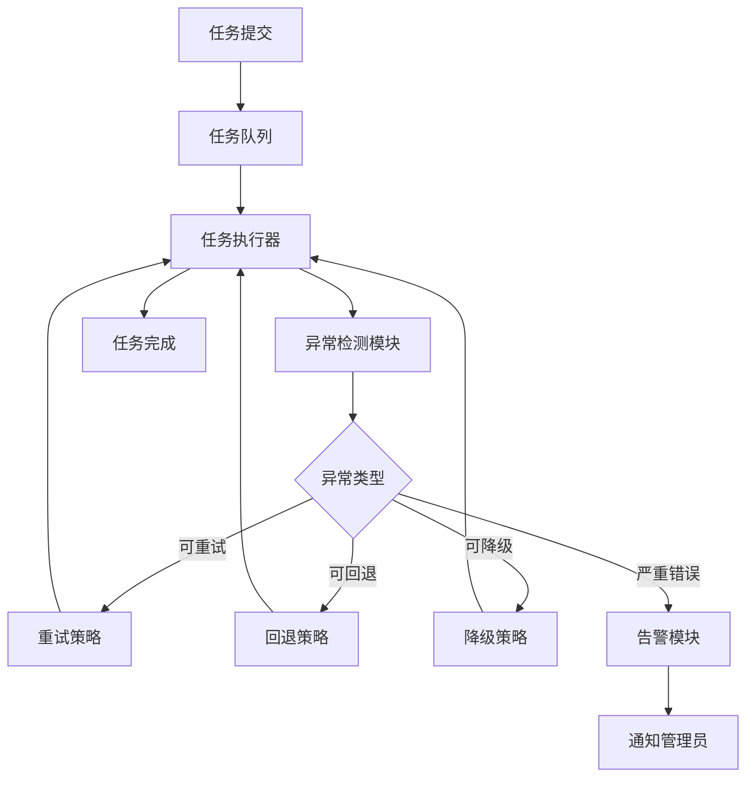

# 智能任务执行引擎

## 项目概述

本项目是Chapter 12"异常处理与恢复"模式的实战应用，实现了一个可靠的智能任务执行引擎，具备完善的错误检测和恢复机制。

## 系统架构



## 核心功能

### 1. 任务执行
- 异步任务执行
- 任务队列管理
- 任务状态追踪

### 2. 异常检测
- 实时异常捕获
- 异常分类和识别
- 异常上下文记录

### 3. 错误恢复
- 自动重试机制（指数退避）
- 状态回退策略
- 服务降级方案
- 熔断保护

### 4. 监控和告警
- 任务执行监控
- 异常统计和分析
- 实时告警通知

## 技术栈

- **Flask**: Web应用框架
- **LangChain**: AI Agent框架
- **Celery**: 异步任务队列
- **Flasgger**: Swagger API文档
- **Redis**: 任务队列和状态存储

## 快速开始

### 1. 安装依赖

```bash
pip install -r requirements.txt
```

### 2. 配置环境变量

```bash
export OPENAI_API_KEY='your-api-key'
export OPENAI_API_URL='your-api-url'  # 可选
export REDIS_URL='redis://localhost:6379/0'
```

### 3. 启动Redis服务

```bash
redis-server
```

### 4. 启动Celery Worker

```bash
celery -A app.celery worker --loglevel=info
```

### 5. 启动Web服务

```bash
python app.py
```

服务将在 `http://localhost:5000` 启动

### 6. 访问API文档

打开浏览器访问:
- Swagger UI: `http://localhost:5000/api/docs`
- Swagger JSON: `http://localhost:5000/api/swagger.json`

## API接口

### 提交任务
- **POST** `/api/v1/tasks`
- 提交新的任务到执行队列

### 查询任务状态
- **GET** `/api/v1/tasks/{task_id}`
- 获取任务当前状态和进度

### 获取任务日志
- **GET** `/api/v1/tasks/{task_id}/logs`
- 获取任务执行日志

### 取消任务
- **DELETE** `/api/v1/tasks/{task_id}`
- 取消正在执行或排队的任务

### 获取异常统计
- **GET** `/api/v1/exceptions/stats`
- 获取异常统计数据

## 使用示例

### 通过Swagger UI测试

1. 访问 `http://localhost:5000/api/docs`
2. 展开"提交任务"接口
3. 点击"Try it out"
4. 输入任务JSON数据
5. 点击"Execute"发送请求

### 通过curl测试

```bash
# 提交任务
curl -X POST "http://localhost:5000/api/v1/tasks" \
  -H "Content-Type: application/json" \
  -d '{
    "name": "数据处理任务",
    "description": "处理大量数据",
    "retry_policy": {
      "max_retries": 3,
      "backoff_factor": 2
    }
  }'

# 查询任务状态
curl "http://localhost:5000/api/v1/tasks/{task_id}"
```

## 项目结构

```
practical/
├── app.py                 # Flask应用主文件
├── llm_config.py         # LLM配置
├── celery.py             # Celery配置
├── task_executor.py      # 任务执行器
├── exception_handler.py  # 异常处理器
├── recovery_strategies.py # 恢复策略
├── monitor.py            # 监控模块
├── README.md             # 本文件
├── requirements.txt       # Python依赖
└── docs/                 # API文档目录
    └── api_*.yml        # 各接口的Swagger文档
```

## 恢复策略

### 重试策略
- 指数退避重试
- 线性退避重试
- 最大重试次数限制

### 回退策略
- 状态检查点
- 回退到上一个稳定状态
- 事务回滚

### 降级策略
- 提供简化功能
- 使用缓存数据
- 返回默认值

### 熔断策略
- 失败率阈值检测
- 熔断器状态转换
- 半开放状态探测

## 设计理念

### 节点可视化

系统对每个关键操作都记录详细的节点信息，包括：
- **入参**: 节点接收的输入参数
- **出参**: 节点处理后的输出结果
- **Tips**: 代码文件名和方法名

通过流程图可视化整个执行过程，便于调试和问题排查。

### 异常处理原则

- **快速失败**: 尽早检测和报告错误
- **详细上下文**: 记录完整的异常信息
- **自动恢复**: 尽可能自动恢复错误
- **人工介入**: 处理需要人工干预的错误

## 许可证

本项目仅用于学习和演示目的。
