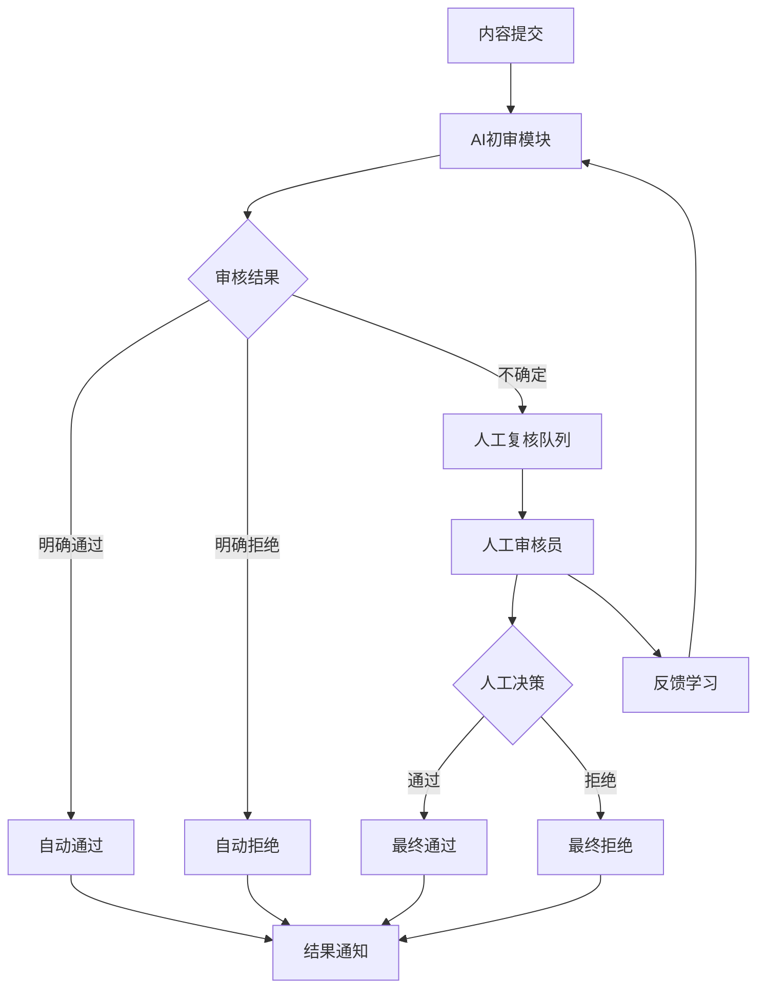

# 智能内容审核系统

## 项目概述

本项目是Chapter 13"人在回路"模式的实战应用，实现了一个智能内容审核系统，结合AI自动审核和人工复核机制，确保审核质量。

## 系统架构



## 核心功能

### 1. AI自动审核
- 文本内容安全检测
- 敏感信息识别
- 风险等级评估

### 2. 人工复核
- 可疑内容人工审核
- 审核员工作队列
- 审核优先级管理

### 3. 反馈学习
- 人工审核反馈收集
- AI模型持续优化
- 审核质量评估

### 4. 结果追踪
- 审核决策记录
- 审核历史查询
- 统计分析报告

## 技术栈

- **Flask**: Web应用框架
- **LangChain**: AI Agent框架
- **Flasgger**: Swagger API文档
- **SQLite**: 数据持久化
- **WebSocket**: 实时通知

## 快速开始

### 1. 安装依赖

```bash
pip install -r requirements.txt
```

### 2. 配置环境变量

```bash
export OPENAI_API_KEY='your-api-key'
export OPENAI_API_URL='your-api-url'  # 可选
```

### 3. 启动服务

```bash
python app.py
```

服务将在 `http://localhost:5000` 启动

### 4. 访问API文档

打开浏览器访问:
- Swagger UI: `http://localhost:5000/api/docs`
- Swagger JSON: `http://localhost:5000/api/swagger.json`

## API接口

### 提交内容审核
- **POST** `/api/v1/reviews`
- 提交内容进行审核

### 查询审核状态
- **GET** `/api/v1/reviews/{review_id}`
- 获取审核进度和结果

### 获取待审核队列
- **GET** `/api/v1/reviews/pending`
- 获取待人工审核的内容列表

### 人工审核决策
- **POST** `/api/v1/reviews/{review_id}/decide`
- 人工审核员提交审核决策

### 提供审核反馈
- **POST** `/api/v1/reviews/{review_id}/feedback`
- 提供审核质量反馈

## 使用示例

### 通过Swagger UI测试

1. 访问 `http://localhost:5000/api/docs`
2. 展开"提交内容审核"接口
3. 点击"Try it out"
4. 输入内容JSON数据
5. 点击"Execute"发送请求

### 通过curl测试

```bash
# 提交内容审核
curl -X POST "http://localhost:5000/api/v1/reviews" \
  -H "Content-Type: application/json" \
  -d '{
    "content_type": "text",
    "content": "待审核的内容文本",
    "source": "user_post",
    "metadata": {
      "user_id": "12345",
      "timestamp": "2026-04-11T12:00:00Z"
    }
  }'

# 查询审核状态
curl "http://localhost:5000/api/v1/reviews/{review_id}"

# 人工审核决策
curl -X POST "http://localhost:5000/api/v1/reviews/{review_id}/decide" \
  -H "Content-Type: application/json" \
  -d '{
    "decision": "approve",
    "reviewer_id": "reviewer_001",
    "notes": "内容符合规范"
  }'
```

## 项目结构

```
practical/
├── app.py                 # Flask应用主文件
├── llm_config.py         # LLM配置
├── ai_reviewer.py        # AI审核模块
├── human_reviewer.py     # 人工审核模块
├── feedback_learner.py   # 反馈学习模块
├── notification.py       # 通知模块
├── README.md             # 本文件
├── requirements.txt       # Python依赖
└── docs/                 # API文档目录
    └── api_*.yml        # 各接口的Swagger文档
```

## 审核流程

### 1. 自动审核
- AI分析内容风险
- 生成审核建议
- 对于明确内容自动决策

### 2. 人工复核
- 可疑内容进入人工队列
- 审核员可以：
  - 通过审核
  - 拒绝审核
  - 要求修改
  - 提供审核说明

### 3. 反馈学习
- 记录AI预测和人工决策
- 分析AI决策偏差
- 更新AI模型参数

### 4. 质量监控
- 审核准确率统计
- 审核时效分析
- 审核员绩效评估

## 设计理念

### 节点可视化

系统对每个关键操作都记录详细的节点信息，包括：
- **入参**: 节点接收的输入参数
- **出参**: 节点处理后的输出结果
- **Tips**: 代码文件名和方法名

通过流程图可视化整个执行过程，便于调试和问题排查。

### 人机协作原则

- **AI优先**: AI处理明确内容，提高效率
- **关键人工**: 不确定和高风险内容人工审核
- **持续学习**: 人工反馈持续优化AI
- **可追溯**: 所有决策都有完整记录

## 许可证

本项目仅用于学习和演示目的。
