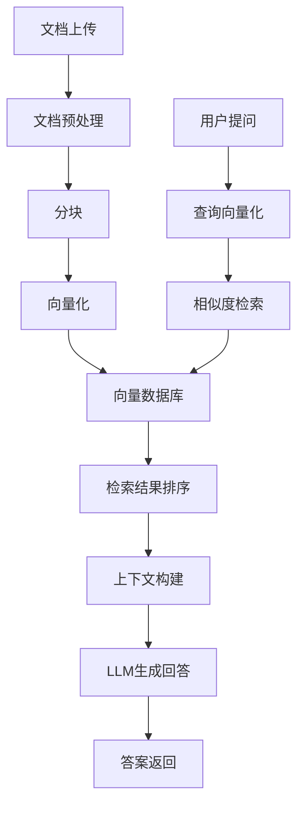

# 智能企业知识库

## 项目概述

本项目是Chapter 14"知识检索（RAG）"模式的实战应用，实现了一个智能企业知识库系统，支持文档索引、RAG问答和知识管理。

## 系统架构



## 核心功能

### 1. 文档管理
- 文档上传和解析
- 多种文档格式支持（PDF、Word、Markdown等）
- 文档分类和标签

### 2. 知识索引
- 智能文档分块
- 文本嵌入向量化
- 向量数据库存储

### 3. 智能检索
- 语义相似度检索
- 关键词检索（BM25）
- 混合检索策略
- 检索结果重排序

### 4. RAG问答
- 基于检索结果生成回答
- 知识来源引用
- 答案质量评估

## 技术栈

- **Flask**: Web应用框架
- **LangChain**: AI Agent框架
- **LangChain Community**: 向量存储
- **ChromaDB**: 向量数据库
- **Flasgger**: Swagger API文档

## 快速开始

### 1. 安装依赖

```bash
pip install -r requirements.txt
```

### 2. 配置环境变量

```bash
export OPENAI_API_KEY='your-api-key'
export OPENAI_API_URL='your-api-url'  # 可选
export CHROMA_DB_PATH='./chroma_db'     # 向量数据库路径
```

### 3. 启动服务

```bash
python app.py
```

服务将在 `http://localhost:5000` 启动

### 4. 访问API文档

打开浏览器访问:
- Swagger UI: `http://localhost:5000/api/docs`
- Swagger JSON: `http://localhost:5000/api/swagger.json`

## API接口

### 上传文档
- **POST** `/api/v1/documents`
- 上传文档到知识库

### 删除文档
- **DELETE** `/api/v1/documents/{document_id}`
- 从知识库删除文档

### 获取文档列表
- **GET** `/api/v1/documents`
- 获取知识库中的文档列表

### 知识问答
- **POST** `/api/v1/qa`
- 提问并基于知识库生成回答

### 获取检索结果
- **POST** `/api/v1/search`
- 仅检索相关文档，不生成回答

## 使用示例

### 通过Swagger UI测试

1. 访问 `http://localhost:5000/api/docs`
2. 展开"上传文档"接口
3. 点击"Try it out"
4. 上传文档文件
5. 点击"Execute"发送请求

### 通过curl测试

```bash
# 上传文档
curl -X POST "http://localhost:5000/api/v1/documents" \
  -F "file=@document.pdf" \
  -F "category=技术文档" \
  -F "tags=API,开发指南"

# 知识问答
curl -X POST "http://localhost:5000/api/v1/qa" \
  -H "Content-Type: application/json" \
  -d '{
    "question": "如何使用API接口？",
    "top_k": 5,
    "use_hybrid_search": true
  }'

# 仅检索
curl -X POST "http://localhost:5000/api/v1/search" \
  -H "Content-Type: application/json" \
  -d '{
    "query": "API使用方法",
    "top_k": 10
  }'
```

## 项目结构

```
practical/
├── app.py                 # Flask应用主文件
├── llm_config.py         # LLM配置
├── document_processor.py # 文档处理模块
├── vector_store.py       # 向量存储管理
├── retriever.py          # 检索器
├── rag_chain.py          # RAG链
├── README.md             # 本文件
├── requirements.txt       # Python依赖
└── docs/                 # API文档目录
    └── api_*.yml        # 各接口的Swagger文档
```

## RAG优化技术

### 1. 文档分块策略
- 固定大小分块
- 段落分块
- 语义分块

### 2. 检索策略
- 语义检索（基于向量相似度）
- 关键词检索（BM25）
- 混合检索（RRF融合）
- 自查询检索

### 3. 结果优化
- 检索结果重排序
- 上下文压缩
- 多路召回

###### 4. 生成优化
- 提示词工程
- 流式输出
- 答案验证

## 设计理念

### 节点可视化

系统对每个关键操作都记录详细的节点信息，包括：
- **入参**: 节点接收的输入参数
- **出参**: 节点处理后的输出结果
- **Tips**: 代码文件名和方法名

通过流程图可视化整个执行过程，便于调试和问题排查。

### 知识管理原则

- **结构化索引**: 优化文档分块和索引策略
- **精准检索**: 结合多种检索方法提高准确性
- **可追溯**: 提供知识来源引用
- **持续优化**: 根据反馈不断改进检索质量

## 许可证

本项目仅用于学习和演示目的。
