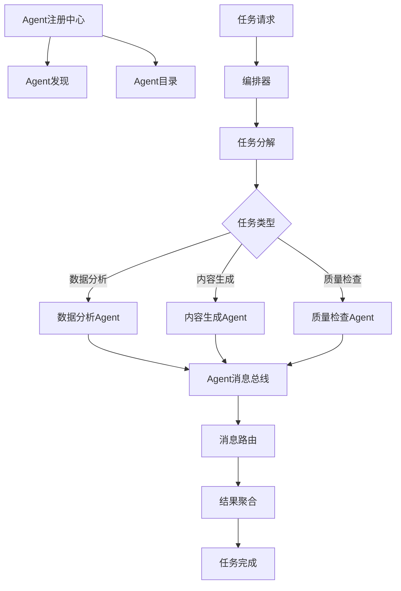

# 智能任务编排系统

## 项目概述

本项目是Chapter 15"智能体间通信（A2A）"模式的实战应用，实现了一个多Agent协作的任务编排系统，支持Agent发现、通信和任务协调。

## 系统架构



## 核心功能

### 1. Agent管理
- Agent注册和发现
- Agent能力描述
- Agent健康检查
- Agent生命周期管理

### 2. 消息通信
- Agent间消息传递
- 同步和异步通信
- 消息队列和路由
- 消息协议标准化

### 3. 任务编排
- 任务分解和分配
- Agent协调执行
- 依赖关系管理
- 任务状态追踪

### 4. 协作模式
- 主从模式（Master-Slave）
- 对等模式（Peer-to-Peer）
- 委员会模式（Committee）
- 管道模式（Pipeline）

## 技术栈

- **Flask**: Web应用框架
- **LangChain**: AI Agent框架
- **Flasgger**: Swagger API文档
- **Redis**: 消息队列和Agent状态
- **WebSocket**: 实时消息通信

## 快速开始

### 1. 安装依赖

```bash
pip install -r requirements.txt
```

### 2. 配置环境变量

```bash
export OPENAI_API_KEY='your-api-key'
export OPENAI_API_URL='your-api-url'  # 可选
export REDIS_URL='redis://localhost:6379/0'
```

### 3. 启动Redis服务

```bash
redis-server
```

### 4. 启动编排器服务

```bash
python orchestrator.py
```

### 5. 启动多个Agent实例

```bash
# 启动数据分析Agent
python agent.py --agent-type data_analyzer --agent-id agent_001

# 启动内容生成Agent
python agent.py --agent-type content_generator --agent-id agent_002

# 启动质量检查Agent
python agent.py --agent-type quality_checker --agent-id agent_003
```

### 6. 启动API服务

```bash
python app.py
```

服务将在 `http://localhost:5000` 启动

### 7. 访问API文档

打开浏览器访问:
- Swagger UI: `http://localhost:5000/api/docs`
- Swagger JSON: `http://localhost:5000/api/swagger.json`

## API接口

### 注册Agent
- **POST** `/api/v1/agents`
- 注册新的Agent到系统

### 查询Agent列表
- **GET** `/api/v1/agents`
- 获取所有已注册的Agent

### 查询Agent详情
- **GET** `/api/v1/agents/{agent_id}`
- 获取指定Agent的详细信息

### 发送消息
- **POST** `/api/v1/messages`
- 向指定Agent发送消息

### 提交任务
- **POST** `/api/v1/tasks`
- 提交协作任务

### 查询任务状态
- **GET** `/api/v1/tasks/{task_id}`
- 获取任务执行状态

## 使用示例

### 通过Swagger UI测试

1. 访问 `http://localhost:5000/api/docs`
2. 展开"提交任务"接口
3. 点击"Try it out"
4. 输入任务JSON数据
5. 点击"Execute"发送请求

### 通过curl测试

```bash
# 注册Agent
curl -X POST "http://localhost:5000/api/v1/agents" \
  -H "Content-Type: application/json" \
  -d '{
    "agent_id": "data_analyzer_001",
    "agent_type": "data_analyzer",
    "capabilities": ["data_analysis", "statistics"],
    "endpoint": "ws://localhost:5001"
  }'

# 发送消息
curl -X POST "http://localhost:5000/api/v1/messages" \
  -H "Content-Type: application/json" \
  -d '{
    "from_agent": "orchestrator",
    "to_agent": "data_analyzer_001",
    "message_type": "task",
    "content": {
      "task": "analyze_data",
      "data": {...}
    }
  }'

# 提交任务
curl -X POST "http://localhost:5000/api/v1/tasks" \
  -H "Content-Type: application/json" \
  -d '{
    "task_type": "content_production",
    "steps": [
      {
        "agent_type": "data_analyzer",
        "task": "analyze_requirements"
      },
      {
        "agent_type": "content_generator",
        "task": "generate_content"
      },
      {
        "agent_type": "quality_checker",
        "task": "check_quality"
      }
    ]
  }'
```

## 项目结构

```
practical/
├── app.py                 # Flask应用主文件
├── llm_config.py         # LLM配置
├── orchestrator.py       # 任务编排器

├── agent.py              # Agent运行时
├── agent_registry.py     # Agent注册中心
├── message_bus.py        # 消息总线
├── message_router.py     # 消息路由器
├── collaboration.py      # 协作模式实现
├── README.md             # 本文件
├── requirements.txt       # Python依赖
└── docs/                 # API文档目录
    └── api_*.yml        # 各接口的Swagger文档
```

## 消息协议

### 消息结构
```json
{
  "message_id": "msg_12345",
  "from_agent": "agent_001",
  "to_agent": "agent_002",
  "message_type": "task|response|notification|error",
  "timestamp": "2026-04-11T12:00:00Z",
  "content": {
    // 消息具体内容
  }
}
```

### 消息类型
- **task**: 任务请求
- **response**: 任务响应
- **notification**: 状态通知
- **error**: 错误消息

## 协作模式

### 1. 主从模式
一个主Agent负责协调，多个从Agent执行具体任务

### 2. 对等模式
Agent之间平等协作，共同完成任务

### 3. 委员会模式
多个Agent共同决策，通过投票或协商达成一致

### 4. 管道模式
任务按顺序在多个Agent之间传递，每个Agent处理特定部分

## 设计理念

### 节点可视化

系统对每个关键操作都记录详细的节点信息，包括：
- **入参**: 节点接收的输入参数
- **出参**: 节点处理后的输出结果
- **Tips**: 代码文件名和方法名

通过流程图可视化整个执行过程，便于调试和问题排查。

### A2A通信原则

- **标准化协议**: 使用统一的消息格式和类型
- **松耦合**: Agent之间通过消息总线通信，不直接依赖
- **可扩展**: 支持动态添加和移除Agent
- **可追溯**: 记录所有消息通信历史

## 许可证

本项目仅用于学习和演示目的。
