# 第1章 提示链 - 代码摘要

## 1. 提示链模式概述

### 1.1 提示链模式的定义

提示链（Prompt Chaining），有时也称为管道模式（Pipeline pattern），是利用大型语言模型（LLM）处理复杂任务的强大范式。这种方法不再要求LLM在单一的整体化步骤中解决复杂问题，而是采用分而治之的策略：将原本令人却步的问题分解为一系列更小、更易管理的子问题，每个子问题通过专门设计的提示词单独处理，一个提示词的输出会作为输入策略性地传递给链中的下一个提示词。

### 1.2 提示链的核心价值

**从线性到模块化的转变：**
- **单一提示词的局限性**：复杂任务在单个提示词内处理时往往使LLM不堪重负
- **顺序处理的优势**：通过分解复杂任务为聚焦的、顺序的工作流显著提高可靠性
- **信息传递机制**：一个步骤的输出作为下一个步骤的输入，建立依赖链

**解决的核心问题：**
- **指令忽略**：部分提示内容被忽视
- **上下文偏离**：模型失去对初始上下文的追踪
- **错误传播**：早期错误被放大
- **上下文窗口不足**：模型获取的信息不足以生成响应
- **幻觉**：认知负荷增加导致生成错误信息

### 1.3 提示链的技术特点

**模块化设计：**
- 每个单独的步骤都变得更容易理解和调试
- 使整个过程更加健壮和可解释
- 链中的每一步都可以精心设计和优化

**上下文工程：**
- 为AI构建丰富、全面的信息环境
- 系统提示词定义AI操作参数的基础指令集
- 整合检索文档、工具输出和隐式数据

**结构化输出：**
- 指定结构化输出格式（如JSON或XML）至关重要
- 确保数据是机器可读的，可以精确解析
- 最小化自然语言解释可能导致的错误

## 2. 基础提示链实现

### 2.1 范式原理

基础提示链展示最简单的两步链：信息提取 → JSON转换。这是理解提示链概念的入门示例，展示了如何将一个LLM调用的输出作为下一个LLM调用的输入。

### 2.2 核心组件分析

**LangChain表达式语言（LCEL）：**
- 使用`|`操作符优雅地链接组件
- 每个组件处理数据并传递给下一个
- 支持链式调用和组合

**输出解析器：**
- `StrOutputParser()` 将LLM消息输出转换为简单字符串
- `JsonOutputParser()` 解析JSON格式的输出
- 确保输出格式的一致性

### 2.3 代码实现示例

```python
# 初始化语言模型
llm = create_llm(temperature=0)

# --- 提示词 1：提取信息 ---
prompt_extract = ChatPromptTemplate.from_template(
    "从以下文本中提取技术规格：\n\n{text_input}"
)

# --- 提示词 2：转换为 JSON ---
prompt_transform = ChatPromptTemplate.from_template(
    "将以下规格转换为 JSON 对象，使用 'cpu'、'memory' 和 'storage' 作为键：\n\n{specifications}"
)

# --- 利用 LCEL 构建处理链 ---
extraction_chain = prompt_extract | llm | StrOutputParser()

# 完整的链将提取链的输出传递到转换提示词
full_chain = (
    {"specifications": extraction_chain}
    | prompt_transform
    | llm
    | StrOutputParser()
)

# --- 运行链 ---
input_text = "新款笔记本电脑型号配备 3.5 GHz 八核处理器、16GB 内存和 1TB NVMe 固态硬盘。"
final_result = full_chain.invoke({"text_input": input_text})
```

### 2.4 流程图

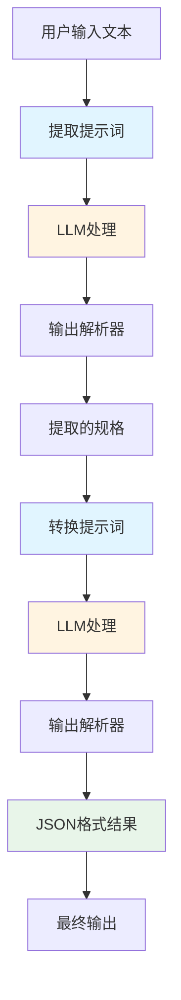

### 2.5 使用场景

**适用场景：**
- 学习提示链的基本概念和工作原理
- 简单的数据转换任务
- 理解LCEL语法和链式调用
- 构建两步的处理流程

**优势：**
- 代码简洁，易于理解
- 明确展示数据流向
- 适合初学者入门
- 展示了基本的链式编程模式

**局限性：**
- 仅支持两步处理
- 缺少错误处理和验证
- 不够灵活，难以扩展
- 没有状态管理机制

## 3. 信息处理工作流

### 3.1 范式原理

信息处理工作流演示多步骤信息处理管道：文本提取 → 摘要生成 → 实体提取 → 知识库搜索 → 报告生成。这是一个完整的信息处理流程，展示了提示链在复杂任务分解中的应用。

### 3.2 核心组件分析

**多阶段处理管道：**
- **文本提取**：从文档中提取正文内容
- **摘要生成**：为提取的文本生成简洁摘要
- **实体提取**：识别关键实体（姓名、日期、位置等）
- **知识库搜索**：基于实体生成搜索查询
- **报告生成**：整合所有信息生成综合报告

### 3.3 代码实现示例

```python
# --- 构建处理链 ---
text_extraction_chain = prompt_extract_text | llm | StrOutputParser()
summarization_chain = prompt_summarize | llm | StrOutputParser()
entity_extraction_chain = prompt_extract_entities | llm | StrOutputParser()
knowledge_search_chain = prompt_search_knowledge | llm | StrOutputParser()

# --- 完整的信息处理流程 ---
def process_information(document: str) -> str:
    """执行完整的信息处理流程"""

    # 步骤 1：文本提取
    text = text_extraction_chain.invoke({"document": document})

    # 步骤 2：摘要生成
    summary = summarization_chain.invoke({"text": text})

    # 步骤 3：实体提取
    entities = entity_extraction_chain.invoke({"text": text})

    # 步骤 4：知识库搜索
    search_results = knowledge_search_chain.invoke({"entities": entities})

    # 步骤 5：报告生成
    report = (prompt_generate_report | llm | StrOutputParser()).invoke({
        "summary": summary,
        "entities": entities,
        "search_results": search_results
    })

    return report
```

### 3.4 流程图

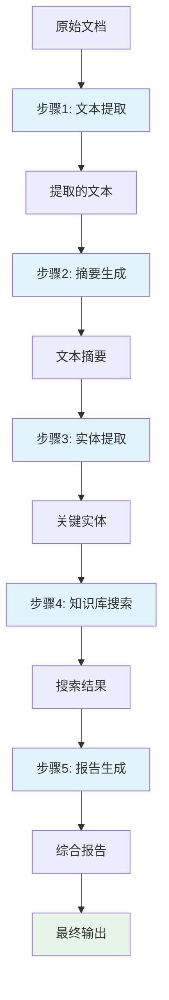

### 3.5 使用场景

**适用场景：**
- 自动化内容分析系统
- AI驱动的研究助手开发
- 复杂报告生成流程
- 文档处理和知识提取

**优势：**
- 完整的端到端处理流程
- 每个步骤职责明确
- 数据在步骤间传递和增强
- 模拟真实世界的信息处理场景

**局限性：**
- 串行处理，速度较慢
- 没有错误恢复机制
- 固定的处理步骤，不够灵活
- 步骤间依赖性强，一个失败影响全部

## 4. 复杂查询回答

### 4.1 范aring原理

复杂查询回答演示多步骤推理能力：问题分解 → 信息检索 → 答案综合。这是提示链在深度推理中的应用，展示了如何将复杂查询分解为可管理的子问题。

### 4.2 核心组件分析

**多步骤推理流程：**
- **问题分解**：将复杂问题分解为核心子问题
- **信息检索**：针对每个子问题进行专门研究
- **答案综合**：整合研究结果形成完整答案

**推理能力：**
- 支持需要多步推理的复杂查询
- 能够从不同角度分析问题
- 综合多个信息源形成连贯答案

### 4.3 代码实现示例

```python
# --- 构建处理链 ---
decompose_chain = prompt_decompose | llm | StrOutputParser()

# --- 复杂查询处理流程 ---
def answer_complex_query(complex_query: str) -> str:
    """处理复杂查询"""

    # 步骤 1：问题分解
    decomposition = decompose_chain.invoke({"query": complex_query})

    # 步骤 2：子问题 1 研究
    causes_research = (prompt_research_causes | llm | StrOutputParser()).invoke({
        "subquery_1": "1929年股市崩盘的主要原因"
    })

    # 步骤 3：子问题 2 研究
    response_research = (prompt_research_response | llm | StrOutputParser()).invoke({
        "subquery_2": "政府如何应对1929年股市崩盘"
    })

    # 步骤 4：答案综合
    final_answer = (prompt_synthesize | llm | StrOutputParser()).invoke({
        "original_query": complex_query,
        "causes_research": causes_research,
        "response_research": response_research
    })

    return final_answer
```

### 4.4 流程图

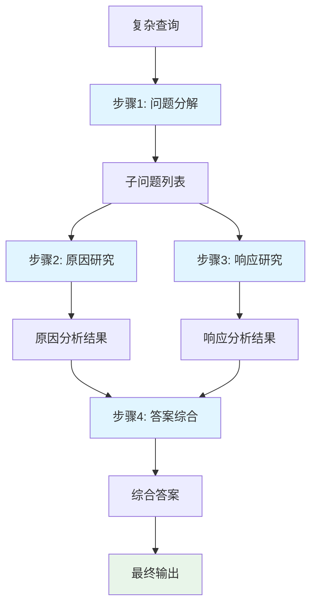

### 4.5 使用场景

**适用场景：**
- �需要多步推理的复杂问题
- 需要从不同角度分析的问题
- 需要综合多个信息源的查询
- 深度分析的AI应用

**优势：**
- 强大的推理能力
- 系统的问题分解方法
- 综合多种信息源
- 适合深度思考任务

**局限性：**
- 步骤固定，不够灵活
- 并行处理能力有限
- 依赖LLM的推理能力
- 可能产生推理错误

## 5. 数据提取和转换

### 5.1 范式原理

数据提取和转换演示从非结构化文本到结构化格式的转换，包含验证和改进循环。这是提示链在数据处理中的应用，展示了如何通过迭代改进来确保数据质量。

### 5.2 核心组件分析

**多阶段数据处理：**
- **初始提取**：从文本中提取结构化数据
- **数据验证**：检查提取数据的完整性和格式
- **错误修正**：基于验证结果改进数据
- **数据规范化**：统一数据格式和标准

**迭代改进机制：**
- 最多尝试指定次数的提取
- 每次提取后进行验证
- 根据验证结果进行改进
- 确保最终数据的质量

### 5.3 代码实现示例

```python
# --- 构建处理链 ---
json_parser = JsonOutputParser()
extraction_chain = prompt_extract_invoice | llm | json_parser
validation_chain = prompt_validate | llm | json_parser
correction_chain = prompt_correct | llm | json_parser
normalization_chain = prompt_normalize | llm | json_parser

# --- 带验证的发票提取 ---
def extract_invoice_with_validation(invoice_text, max_attempts=3):
    """带验证的发票提取"""

    for attempt in range(max_attempts):
        # 提取数据
        if attempt == 0:
            extracted_data = extraction_chain.invoke({"invoice_text": invoice_text})
        else:
            # 使用修正后的数据
            extracted_data = correction_chain.invoke({
                "invoice_text": invoice_text,
                "extracted_data": extracted_data,
                "missing_fields": validation_result["missing_fields"]
            })

        # 验证数据
        validation_result = validation_chain.invoke({"extracted_data": extracted_data})

        if validation_result["is_valid"]:
            break

    # 数据规范化
    normalized_data = normalization_chain.invoke({"data": extracted_data})
    return normalized_data
```

### 5.4 流程图

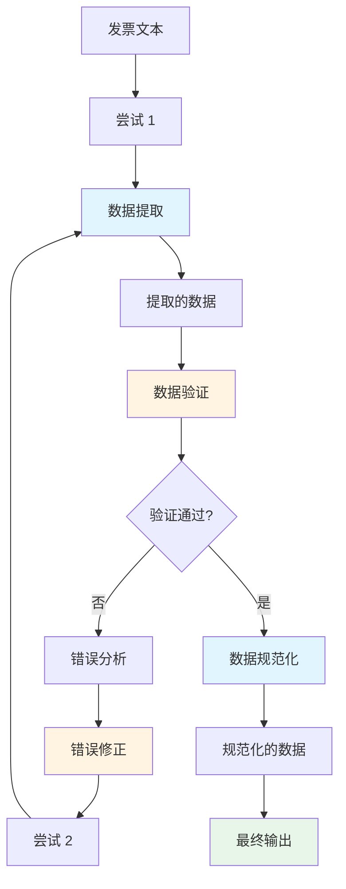

### 5.5 使用场景

**适用场景：**
- 从表单、发票或电子邮件提取数据
- 需要数据验证和格式化的场景
- OCR后处理和文本规范化
- 结构化数据转换

**优势：**
- 迭代改进确保数据质量
- 完整的验证机制
- 支持错误修正和重试
- 数据规范化功能

**局限性：**
- 迭代次数固定，可能不够
- 验证规则需要预先定义
- 依赖LLM的文本理解能力
- 可能无法处理所有异常情况

## 6. 内容生成工作流

### 6.1 范式原理

内容生成工作流演示多步骤内容创作：主题生成 → 大纲创建 → 逐段起草 → 审查完善。这是提示链在创意写作中的应用，展示了如何系统化地生成高质量内容。

### 6.2 核心组件分析

**多阶段内容创作：**
- **主题生成**：基于用户兴趣生成创意主题
- **大纲创建**：为选定主题创建详细大纲
- **内容起草**：逐段编写文章内容
- **审查完善**：全文审查和改进

**创意写作特性：**
- 使用高温度的模型进行创意生成
- 使用低温度的模型进行结构化内容
- 保持上下文连贯性
- 迭代改进内容质量

### 6.3 代码实现示例

```python
# --- 使用不同的模型温度 ---
用于创意内容生成
llm_creative = create_llm(temperature=0.8)
# 用于结构化内容
llm_structure = create_llm(temperature=0.3)

# --- 完整的博客文章生成流程 ---
def generate_blog_post(interests, selected_topic=None):
    """完整的博客文章生成流程"""

    # 步骤 1：生成主题
    topics_response = (prompt_generate_topics | llm_creative | StrOutputParser()).invoke({"interests": interests})

    # 选择主题
    if not selected_topic:
        selected_topic = topics_response.split('\n')[0].split('. ')[1]

    # 步骤 2：创建大纲
    outline = (prompt_create_outline | llm_structure | StrOutputParser()).invoke({"topic": selected_topic})

    # 步骤 3：逐段起草
    for i, point in enumerate(outline_points):
        section_content = (prompt_draft_section | llm_creative | StrOutputParser()).invoke({
            "topic": selected_topic,
            "outline_point": point,
            "previous_context": previous_context
        })

    # 步骤 4：审查和完善
    final_article = (prompt_review_refine | llm_structure | StrOutputParser()).invoke({"full_article": full_article})

    return final_article
```

### 6.4 流程图

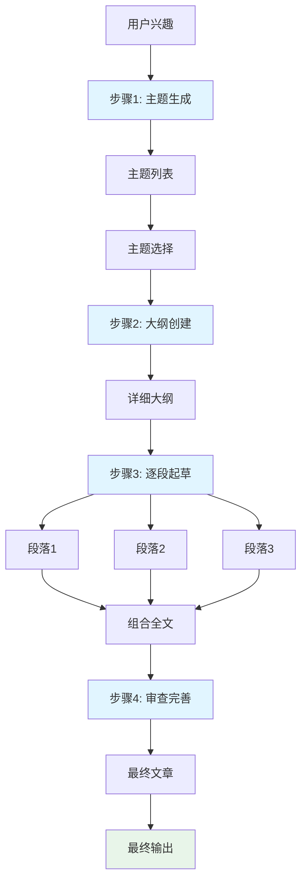

### 6.5 使用场景

**适用场景：**
- 博客文章自动生成
- 技术文档系统化创作
- 营销文案生成
- 创意写作辅助工具

**优势：**
- 系统化的内容生成流程
- 创意与结构相结合
- 迭代改进确保质量
- 支持长篇内容生成

**局限性：**
- 生成速度较慢
- 可能需要人工审查
- 依赖创意模型的质量
- 内容风格可能不够一致

## 7. 具有状态的对话智能体系统

### 7.1 范式原理

具有状态的对话智能体系统演示如何维护对话状态和上下文。这是提示链在对话系统中的应用，展示了如何在多轮对话中保持连贯性和个性化。

### 7.2 核心组件分析

**对话状态管理：**
- **用户档案**：跟踪用户的偏好和属性
- **对话上下文**：维护当前对话的相关信息
- **话题栈**：跟踪讨论过的话题
- **对话历史**：记录完整的交互历史

**处理流程：**
- **意图识别**：分析用户输入识别意图和实体
- **状态更新**：根据分析结果更新对话状态
- **响应生成**：基于当前状态生成合适响应
- **历史维护**：更新对话历史

### 7.3 代码实现示例

```python
class ConversationalAgent:
    """具有状态的对话智能体"""

    def __init__(self):
        self.conversation_history = []
        self.conversation_state = {
            "user_profile": {},
            "context": {},
            "last_intent": None,
            "topic_stack": []
        }
        self.turn_count = 0

    def process_user_input(self, user_input: str) -> str:
        """处理用户输入并生成响应"""

        self.turn_count += 1

        # 步骤 1：提取意图和实体
        intent_chain = prompt_intent_extraction | llm | StrOutputParser()
        analysis_text = intent_chain.invoke({"user_input": user_input})

        # 步骤 2：更新对话状态
        self._update_state(state(analysis_text))

        # 步骤 3：生成响应
        response_chain = prompt_generate_response | llm | StrOutputParser()
        response = response_chain.invoke({
            "conversation_state": json.dumps(self.conversation_state),
            "current_analysis": analysis_text
        })

        # 步骤 4：更新对话历史
        self.conversation_history.append({
            "turn": self.turn_count,
            "user_input": user_input,
            "response": response
        })

        return response
```

### 7.4 流程图

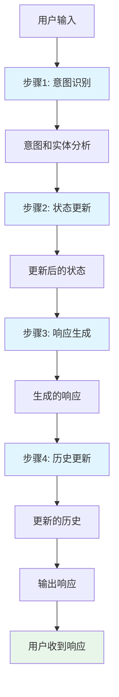

### 7.5 使用场景

**适用场景：**
- 客户服务聊天机器人
- 个性化助手系统
- 教育辅导AI
- 需要上下文感知的对话系统

**优势：**
- 维护对话连贯性
- 支持个性化交互
- 状态记忆功能
- 多轮对话能力

**局限性：**
- 状态管理复杂
- 可能出现状态不一致
- 长对话历史消耗token
- 需要仔细设计状态更新逻辑

## 8. 代码生成和完善

### 8.1 范式原理

代码生成和完善演示多步骤代码开发：需求理解 → 代码生成 → 错误检查 → 代码完善 → 文档测试。这是提示链在软件开发中的应用，展示了如何系统化地生成高质量代码。

### 8.2 核心组件分析

**多阶段代码开发：**
- **需求理解**：分析需求并生成实现大纲
- **初始生成**：基于大纲编写初始代码草稿
- **代码审查**：识别潜在错误和改进领域
- **代码完善**：基于审查结果改进代码
- **文档测试**：添加文档字符串和测试用例

**迭代改进机制：**
- 多次代码审查和完善循环
- 每次迭代解决特定问题
- 持续改进直到满足质量标准
- 生成完整的可执行代码

### 8.3 代码实现示例

```python
def code_development_pipeline(requirement: str, max_iterations: int = 2) -> Dict:
    """完整的代码开发流程"""

    # 步骤 1：理解需求
    understand_chain = prompt_understand_requirement | llm_coding | StrOutputParser()
    outline_text = understand_chain.invoke({"requirement": requirement})
    outline = json.loads(outline_text)

    # 步骤 2：生成初始代码
    code_gen_chain = prompt_generate_code | llm_coding | StrOutputParser()
    current_code = code_gen_chain.invoke({"outline": json.dumps(outline)})

    # 步骤 3-4：代码审查和完善循环
    for iteration in range(max_iterations):
        # 代码审查
        review_chain = prompt_review_code | llm_review | StrOutputParser()
        review_text = review_chain.invoke({"code": current_code})
        review = json.loads(review_text)

        if not review.get("has_issues", False):
            break

        # 完善代码
        refine_chain = prompt_refine_code | llm_coding | StrOutputParser()
        current_code = refine_chain.invoke({
            "original_code": current_code,
            "issues": json.dumps(review.get("critical_issues", [])),
            "improvements": json.dumps(review.get("improvements", []))
        })

    # 步骤 5：生成文档和测试
    docs_tests_chain = prompt_generate_docs_tests | llm_coding | StrOutputParser()
    final_code = docs_tests_chain.invoke({"code": current_code})

    return {"final_code": final_code, "iterations": iterations}
```

### 8.4 流程图

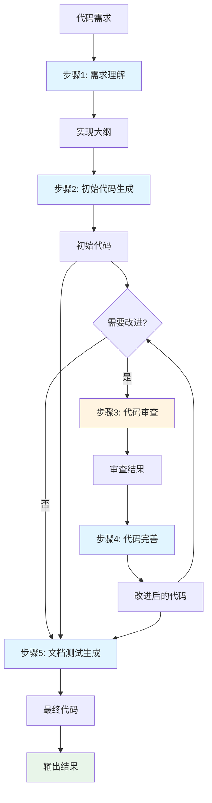

### 8.5 使用场景

**适用场景：**
- AI辅助软件开发
- 代码生成和重构工具
- 自动化编程助手
- 代码审查和优化系统

**优势：**
- 系统化的代码生成流程
- 迭代改进确保质量
- 完整的代码审查机制
- 生成文档和测试

**局限性：**
- 生成的代码可能需要人工审查
- 复杂功能生成困难
- 迭代次数固定可能不够
- 依赖代码模型的能力

## 9. 提示链模式比较与选择

### 9.1 不同应用场景对比

| 应用场景 | 复杂度 | 步骤数量 | 状态管理 | 迭代能力 |
|---------|--------|---------|---------|-----------|
| **基础提示链** | 简单 | 2步 | 无 | 无 |
| **信息处理工作流** | 中等 | 5步 | 简单 | 无 |
| **复杂查询回答** | 中等 | 4步 | 无 | 无 |
| **数据提取和转换** | 中等 | 4步 | 简单 | 有 |
| **内容生成工作流** | 复杂 | 4步 | 中等 | 无 |
| **对话智能体系统** | 复杂 | 4步 | 完整 | 无 |
| **代码生成和完善** | 复杂 | 5步 | 中等 | 有 |

### 9.2 选择决策树

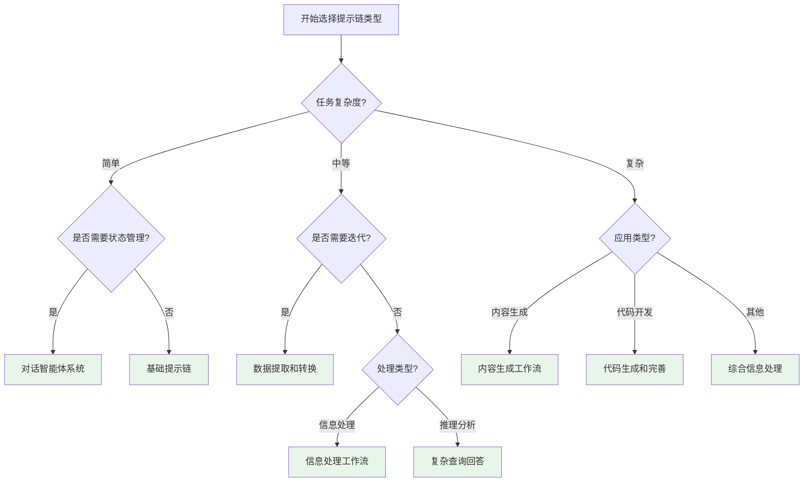

## 10. 提示链最佳实践

### 10.1 设计原则

**1. 单一职责原则**
- 每个提示词应该只做一件事
- 避免在一个提示词中混合多个任务
- 每个步骤聚焦单一目标

**2. 输出标准化**
- 使用结构化输出格式（JSON/XML）
- 定义明确的输出模式
- 便于后续步骤解析和使用

**3. 错误处理**
- 添加验证步骤检查输出质量
- 实现重试机制处理失败
- 提供合理的默认值

### 10.2 性能优化

**1. 并行处理**
- 独立的步骤可以并行执行
- 减少总体执行时间
- 提高系统吞吐量

**2. 缓存机制**
- 缓存常见的LLM调用结果
- 减少API调用次数
- 降低成本和延迟

**3. 模型选择**
- 不同步骤使用不同能力的模型
- 简单任务使用小模型
- 复杂任务使用大模型

### 10.3 质量保证

**1. 验证测试**
- 为每个步骤编写测试用例
- 验证输出格式和内容
- 确保数据质量

**2. 监控和日志**
- 记录每个步骤的输入输出
- 监控执行时间和成功率
- 便于问题诊断和优化

## 11. 提示链应用场景总结

### 11.1 内容创作领域

**博客文章生成系统**
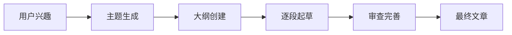

### 11.2 数据处理领域

**发票信息提取系统**
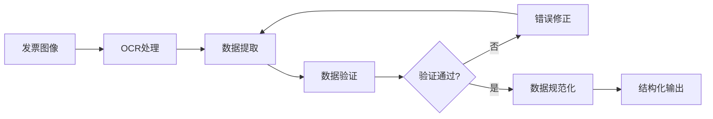

### 11.3 对话系统领域

**客户服务聊天机器人**
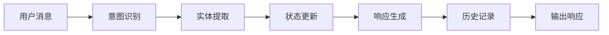

## 12. 总结与展望

### 12.1 提示链模式的核心价值

提示链模式是构建复杂AI系统的基础技术，它提供了：

1. **模块化架构**：将复杂任务分解为可管理的步骤
2. **系统化处理**：每个步骤都有明确的输入输出
3. **质量保证**：通过验证和迭代改进确保输出质量
4. **灵活扩展**：易于添加新的处理步骤和功能
5. **状态管理**：支持复杂的上下文感知系统

### 12.2 技术发展趋势

**1. 智能化提示链**
- 自动选择最优的处理路径
- 动态调整步骤顺序
- 自适应的任务分解策略

**2. 混合处理模式**
- 结合串行和并行处理
- 优化资源利用和性能
- 支持实时处理需求

**3. 可观测性增强**
- 详细的执行追踪
- 性能监控和分析
- 问题自动诊断

### 12.3 实施建议

**对于初学者：**
1. 从简单的两步链开始
2. 理解LCEL语法和链式编程
3. 学习结构化输出和解析
4. 逐步增加复杂度和功能

**对于高级用户：**
1. 设计复杂的多步骤处理流程
2. 实现状态管理和错误处理
3. 优化性能和成本
4. 构建可扩展的架构设计

提示链模式作为AI系统开发的基础模式，为构建复杂、可靠、高效的智能体系统提供了关键的架构支撑。掌握和应用提示链模式，是开发高质量AI应用的重要技能。