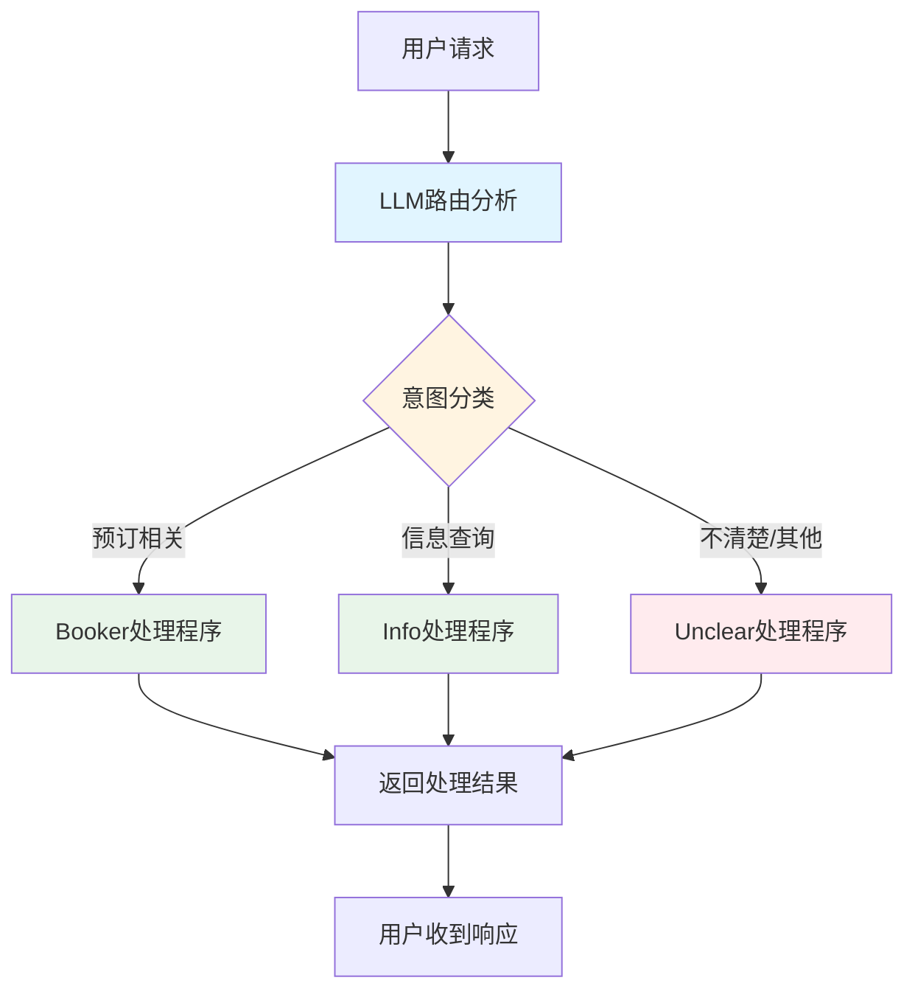
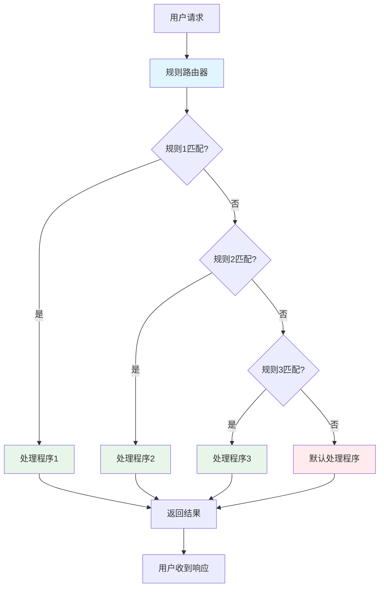
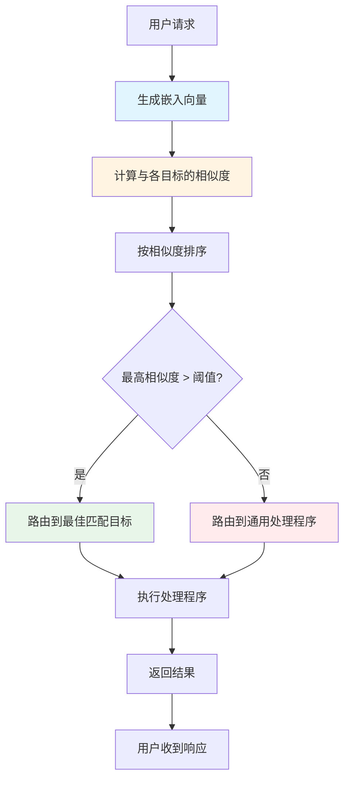
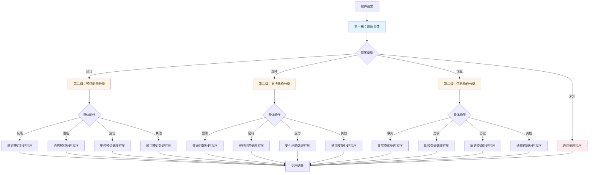
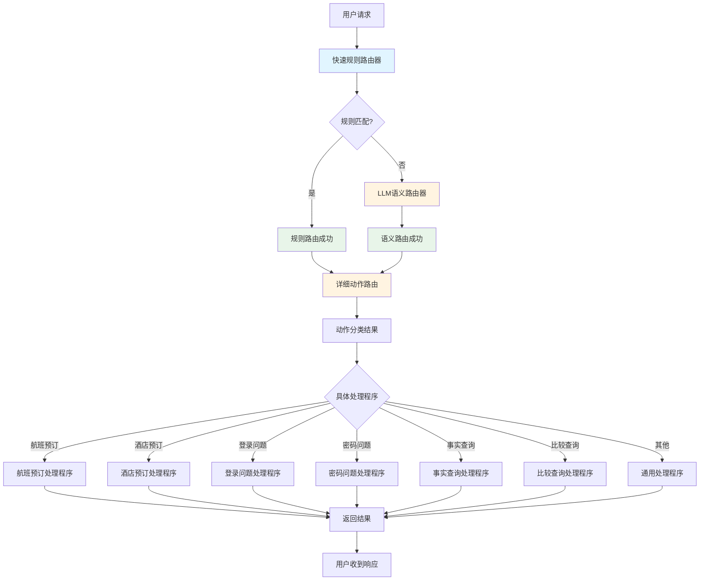
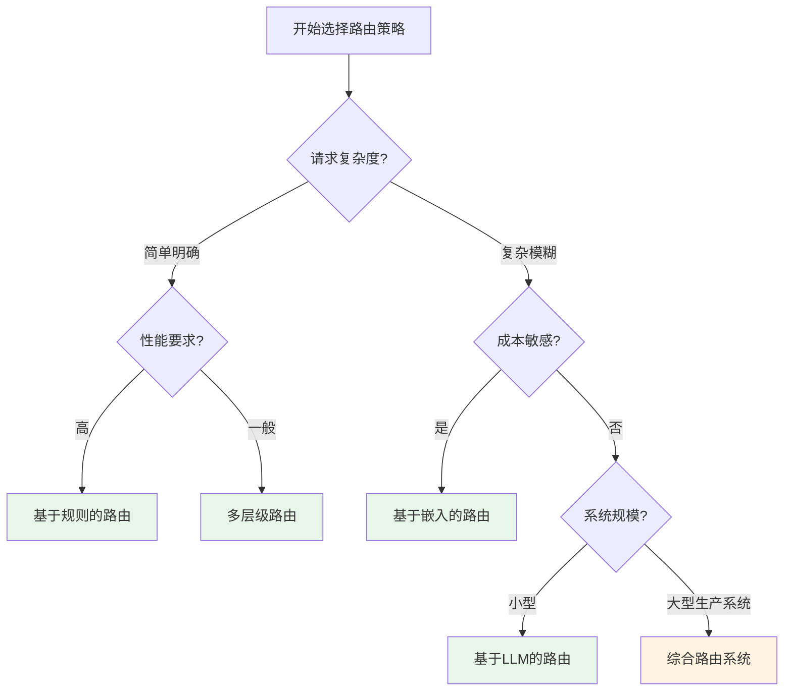

# 第2章 路由模式

## 1. 路由模式概述

### 1.1 路由模式的定义

路由模式是智能体系统中的关键控制机制，它使系统能够根据偶然因素（如用户输入、环境状态或前一操作的结果）在多个潜在行动之间进行动态决策。路由将条件逻辑引入智能体系统的操作框架，使其从固定的执行路径转变为能够动态评估特定标准的自适应模型。

### 1.2 路由模式的核心价值

**从线性到自适应的转变：**
- 传统的提示词链采用确定性、线性的处理方式
- 路由模式使系统能够根据上下文和条件动态改变执行路径
- 提供了创建功能多样化和上下文感知系统所必需的逻辑仲裁能力

**实际应用场景：**
- **人机交互**：虚拟助手或AI驱动的导师解释用户意图并选择适当的后续操作
- **数据处理管道**：自动化数据和文档处理管道中的分类和分发功能
- **复杂系统调度**：在涉及多个专门工具或智能体的系统中充当高级调度器

### 1.3 路由模式的实现方式

## 2. 基于LLM的路由

### 2.1 范式原理

基于LLM的路由使用语言模型本身作为路由器，通过提示词让模型分析输入并输出指示下一步或目的地的特定标识符或指令。这种方法利用LLM的语义理解能力来处理复杂的意图识别。

### 2.2 核心组件分析

**路由流程：**
1. 用户请求传入系统
2. LLM分析请求并输出分类标签（如 'booker'、'info'、'unclear'）
3. 系统根据分类标签将请求路由到相应的处理程序
4. 处理程序执行并返回结果

### 2.3 代码实现示例

```python
# 基于LLM的路由核心实现
coordinator_router_prompt = ChatPromptTemplate.from_messages([
    ("system", """分析用户的请求并确定哪个专家处理程序应处理它。
     - 如果请求与预订航班或酒店相关，输出 'booker'。
     - 对于所有其他一般信息问题，输出 'info'。
     - 如果请求不清楚或不适合任一类别，输出 'unclear'。
     只输出一个词：'booker'、'info' 或 'unclear'。"""),
    ("user", "{request}")
])

# 创建路由链
coordinator_router_chain = (
    coordinator_router_prompt |
    RunnablePassthrough.assign(debug_prompt=print_prompt) |
    llm |
    StrOutputParser()
)

# 使用RunnableBranch实现动态路由
branches = {
    "booker": RunnablePassthrough.assign(output=lambda x: booking_handler(x['request']['request'])),
    "info": RunnablePassthrough.assign(output=lambda x: info_handler(x['request']['request'])),
    "unclear": RunnablePassthrough.assign(output=lambda x: unclear_handler(x['request']['request'])),
}

delegation_branch = RunnableBranch(
(
lambda x: x['decision'].strip() == 'booker', branches["booker"]),
    (lambda x: x['decision'].strip() == 'info', branches["info"]),
    branches["unclear"]
)

# 组合成完整的路由智能体
coordinator_agent = {
    "decision": coordinator_router_chain,
    "request": RunnablePassthrough()
} | delegation_branch | (lambda x: x['output'])
```

**调用逻辑说明：**

1. **输入阶段**：
   ```python
   # 调用方式
   result = coordinator_agent.invoke({"request": "给我预订去伦敦的航班"})
   ```

2. **数据流转过程**：
   - `{"request": "给我预订去伦敦的航班"}` 输入到coordinator_agent
   - `RunnablePassthrough()` 将原始请求传递到输出字典
   - `coordinator_router_chain` 分析请求并返回分类结果（如 'booker'）
   - 中间状态变成：`{"decision": "booker", "request": {"request": "给我预订去伦敦的航班"}}`

3. **路由决策阶段**：
   - `delegation_branch` 检查 `decision` 字段
   - 如果 `decision == 'booker'`，调用 `branches["booker"]`
   - `booking_handler` 被执行，返回处理结果

4. **输出阶段**：
   - `(lambda x: x['output'])` 提取最终结果
   - 返回给用户：`"预订处理程序处理了请求：'给我预订去伦敦的航班'。结果：模拟预订操作。"`

**实际调用示例：**

```python
# 测试不同类型的请求
# 1. 预订请求
request_a = "给我预订去伦敦的航班"
result_a = coordinator_agent.invoke({"request": request_a})
# 输出：预订处理程序处理了请求：'给我预订去伦敦的航班'。结果：模拟预订操作。

# 2. 信息请求
request_b = "意大利的首都是什么？"
result_b = coordinator_agent.invoke({"request": request_b})
# 输出：信息处理程序处理了请求：'意大利的首都是什么？'。结果：模拟信息检索。

# 3. 不清楚的请求
request_c = "告诉我关于量子物理学的事"
result_c = coordinator_agent.invoke({"request": request_c})
# 输出：协调器无法委托请求：'告诉我关于量子物理学的事'。请澄清。
```

### 2.4 流程图



### 2.5 使用场景

**适用场景：**
- 复杂的意图识别需要语义理解
- 请求类型多样且难以用简单规则描述
- 需要处理模糊、新颖或复杂的用户输入
- 系统能够容忍较高的延迟和API调用成本

**优势：**
- 强大的语义理解能力
- 灵活性高，能够处理各种类型的请求
- 易于通过修改提示词来调整路由逻辑

**局限性：**
- 速度较慢，需要调用LLM API
- 成本较高，每次路由都需要消耗API额度
- 输出确定性较低，可能产生意外的分类结果

## 3. 基于规则的路由

### 3.1 范式原理

基于规则的路由使用预定义的规则或逻辑（如if-else语句、正则表达式）来处理路由决策。这种方法使用基于关键词、模式或从输入中提取的结构化数据进行路由。

### 3.2 核心组件分析

**路由引擎特点：**
- 按顺序检查规则，第一个匹配的规则生效
- 支持正则表达式模式匹配
- 快速且无需外部API调用
- 具有完全确定性的输出

### 3.3 代码实现示例

```python
# 基于规则的路由器实现
class RuleBasedRouter:
    """基于规则的路由器"""

    def __init__(self):
        self.rules = []
        self.default_handler = unclear_handler

    def add_rule(self, name: str, pattern: str, handler: Callable):
        """添加路由规则"""
        self.rules.append({
            'name': name,
            'pattern': re.compile(pattern, re.IGNORECASE),
            'handler': handler
        })

    def route(self, request: str) -> str:
        """根据规则路由请求"""
        print(f"\n[路由器] 收到请求: '{request}'")

        # 按顺序检查规则
        for rule in self.rules:
            if rule['pattern'].search(request):
                return rule['handler'](request)

        # 没有匹配的规则，使用默认处理程序
        return self.default_handler(request)

# 配置规则
router = RuleBasedRouter()

# 添加预订相关规则
router.add_rule(
    name="预订航班",
    pattern=r"(预订|预定|book).*?(航班|飞机|flight)",
    handler=booking_handler
)

router.add_rule(
    name="预订酒店",
    pattern=r"(预订|预定|book).*?(酒店|旅馆|hotel)",
    handler=booking_handler
)

# 添加技术支持相关规则
router.add_rule(
    name="技术支持",
    pattern=r"(无法|不能|故障|错误|问题|help|support|error|trouble)",
    handler=tech_support_handler
)
```

**调用逻辑说明：**

1. **路由调用方式**：
   ```python
   # 简单直接调用
   result = router.route("帮我预订一张去北京的机票")
   ```

2. **规则匹配过程**：
   - 路由器收到请求："帮我预订一张去北京的机票"
   - 依次检查每个规则的正则表达式模式
   - 规则1（预订航班）匹配成功，立即执行对应的处理程序
   - 后续规则不再检查（第一个匹配的规则生效）

3. **规则执行**：
   - 调用 `booking_handler("帮我预订一张去北京的机票")`
   - 返回处理结果给调用者

4. **无匹配情况**：
   - 如果所有规则都不匹配
   - 调用 `default_handler` 返回默认响应

**实际调用示例：**

```python
# 测试用例
test_requests = [
    "帮我预订一张去北京的机票",
    "我想在东京预订一家酒店",
    "系统登录不了怎么办",
    "我的密码忘记了",
    "世界上最高的山是什么"
]

for request in test_requests:
    result = router.route(request)
    print(f"请求: {request}")
    print(f"结果: {result}")
    print("-" * 40)
```

### 3.4 流程图



### 3.5 使用场景

**适用场景：**
- 简单明确的意图识别
- 请求模式相对固定和可预测
- 对性能和响应速度有较高要求
- 需要完全确定性的路由结果

**优势：**
- 速度极快，无需等待外部API响应
- 零成本，不消耗API额度
- 输出完全确定，便于调试和测试
- 易于理解和维护

**局限性：**
- 灵活性较差，难以处理细微或新颖的输入
- 需要手动编写和维护规则
- 不具备语义理解能力
- 规则冲突时可能导致意外的路由结果

## 4. 基于嵌入的路由

### 4.1 范式原理

基于嵌入的路由将输入查询转换为向量嵌入，然后与代表不同路由或能力的嵌入进行比较。查询被路由到嵌入最相似的路由。这种方法基于语义相似性进行路由决策。

### 4.2 核心组件分析

**相似度计算：**
- 使用余弦相似度计算查询与目标之间的相似度
- 支持语义级别的匹配，而不仅仅是关键词匹配
- 可设置相似度阈值来控制路由的严格程度

### 4.3 代码实现示例

```python
# 基于嵌入的路由器实现
class EmbeddingRouter:
    """基于嵌入的路由器"""

    def __init__(self, targets: List[RoutingTarget], threshold: float = 0.5):
        self.targets = targets
        self.threshold = threshold

    def route(self, request: str, verbose=True) -> tuple[str, float]:
        """路由请求到最相似的目标"""
        # 计算请求的嵌入
        request_embedding = mock_embedding(request)

        # 计算与所有目标的相似度
        similarities = []
        for target in self.targets:
            similarity = cosine_similarity(request_embedding, target.embedding)
            similarities.append((target.name, similarity))

        # 按相似度排序
        similarities.sort(key=lambda x: x[1], reverse=True)

        if verbose:
            print(f"\n[嵌入路由器] 收到请求: '{request}'")
            print(f"[嵌入路由器] 目标相似度分析:")
            for name, score in similarities:
                print(f"  - {name}: {score:.3f}")

        # 返回最相似的目标
        best_match = similarities[0]
        return best_match

    def route_and_execute(self, request: str) -> str:
        """路由并执行请求"""
        target_name, similarity = self.route(request)

        # 找到对应的目标
        target = next((t for t in self.targets if t.name == target_name), None)

        if target and similarity >= self.threshold:
            return target.handler(request)
        else:
            return general_handler(request)

# 创建路由目标
routing_targets = [
    RoutingTarget(
        name="booking",
        description="处理航班和酒店预订",
        example_queries=[
            "预订航班",
            "book a hotel",
            "预定机票",
            "make reservation"
        ],
        handler=booking_handler
    ),
    RoutingTarget(
        name="tech_support",
        description="处理技术问题和故障排除",
        example_queries=[
            "系统故障",
            "无法登录",
            "密码错误"
        ],
        handler=tech_support_handler
    )
]

# 初始化路由器
router = EmbeddingRouter(routing_targets, threshold=0.3)
```

**调用逻辑说明：**

1. **路由调用方式**：
   ```python
   # 路由并执行请求
   result = router.route_and_execute("我想预订一张去上海的机票")
   ```

2. **嵌入计算过程**：
   - 路由器收到请求："我想预订一张去上海的机票"
   - 计算请求的嵌入向量：`request_embedding = mock_embedding("我想预订一张去上海的机票")`

3. **相似度计算**：
   - 计算请求与每个路由目标嵌入的余弦相似度
   - `similarity_booking = cosine_similarity(request_embedding, booking_target.embedding)`
   - `similarity_support = cosine_similarity(request_embedding, tech_support_target.embedding)`

4. **路由决策**：
   - 比较所有相似度分数，选择最高的
   - 如果最高分数 >= 阈值（0.3），路由到对应目标
   - 如果低于阈值，路由到通用处理程序

5. **执行处理**：
   - 调用对应处理程序：`booking_handler("我想预订一张去上海的机票")`
   - 返回处理结果

**实际调用示例：**

```python
# 测试用例
test_requests = [
    "我想预订一张去上海的机票",
    "我的账户登录不了",
    "世界上最高的山是什么",
    "告诉我一些关于人工智能的信息"
]

for request in test_requests:
    result = router.route_and_execute(request)
    print(f"请求: {request}")
    print(f"结果: {result}")
    print("-" * 50)
```

### 4.4 流程图



### 4.5 使用场景

**适用场景：**
- 需要语义级别的路由匹配
- 请求类型较多但相对稳定
- 能够维护和维护示例查询集合
- 对延迟有一定容忍度但希望比LLM路由更快

**优势：**
- 基于语义相似性，比规则路由更智能
- 速度比LLM路由快
- 可以调整相似度阈值来控制路由行为
- 支持多种语言和表达方式

**局限性：**
- 需要为每个路由目标维护示例查询
- 需要嵌入模型的计算资源
- 对于非常复杂的意图，语义匹配可能不够准确
- 新的路由目标需要收集示例数据

## 5. 多层级路由

### 5.1 范式原理

多层级路由将路由决策分解为多个层次，每个层次负责不同粒度的分类。通常第一层进行粗粒度的意图分类，后续层次进行细粒度的动作分类。

### 5.2 核心组件分析

**路由层次结构：**
- **第一级：意图分类** - 识别用户的高层意图（如预订、支持、信息）
- **第二级：动作分类** - 在意图基础上识别具体动作（如航班预订、登录问题）
- **处理程序映射** - 将分类结果映射到具体的处理函数

### 5.3 代码实现示例

```python
# 多层级路由器实现
class MultiLevelRouter:
    """多层级路由器"""

    def __init__(self):
        self.intent_classifier = IntentClassifier()
        self.action_classifier = ActionClassifier()
        self.handlers = RequestHandlers()

        # 路由映射表
        self.route_map = {
            'booking': {
                'flight_booking': self.handlers.flight_booking_handler,
                'hotel_booking': self.handlers.hotel_booking_handler,
                'seat_booking': self.handlers.seat_booking_handler,
                'general_booking': self.handlers.general_booking_handler
            },
            'support': {
                'login_issue': self.handlers.login_issue_handler,
                'password_issue': self.handlers.password_issue_handler,
                'payment_issue': self.handlers.payment_issue_handler,
                'general_support': self.handlers.general_support_handler
            },
            'info': {
                'fact_query': self.handlers.fact_query_handler,
                'comparison_query': self.handlers.comparison_query_handler,
                'historical_query': self.handlers.historical_query_handler,
                'general_info': self.handlers.general_info_handler
            }
        }

    def route(self, request: str, verbose: bool = True) -> str:
        """多层级路由处理"""
        if verbose:
            print(f"\n[多层级路由] 收到请求: '{request}'")

        # 第一级：意图分类
        intent = self.intent_classifier.classify(request)
        if verbose:
            print(f"[第一级路由] 意图分类: {intent or '未知'}")

        # 如果无法分类意图，使用fallback
        if not intent or intent not in self.route_map:
            if verbose:
                print(f"[路由结果] 使用通用处理")
            return self.handlers.fallback_handler(request)

        # 第二级：动作分类
        if intent == 'booking':
            action = self.action_classifier.classify_booking(request)
        elif intent == 'support':
            action = self.action_classifier.classify_support(request)
        elif intent == 'info':
            action = self.action_classifier.classify_info(request)
        else:
            action = None

        if verbose:
            print(f"[第二级路由] 动作分类: {action or '未知'}")

        # 查找对应的处理程序
        if action and action in self.route_map[intent]:
            handler = self.route_map[intent][action]
            if verbose:
                print(f"[路由结果] 执行: {intent} -> {action}")
            return handler(request)
```

**调用逻辑说明：**

1. **路由调用方式**：
   ```python
   # 多层级路由调用
   result = router.route("帮我预订一张去北京的机票", verbose=True)
   ```

2. **第一级路由（意图分类）**：
   - 路由器收到请求："帮我预订一张去北京的机票"
   - `intent_classifier.classify()` 分析请求中的关键词
   - 匹配到"预订"模式，返回意图：`intent = 'booking'`

3. **第二级路由（动作分类）**：
   - 根据 `intent = 'booking'` 选择对应的动作分类器
   - `action_classifier.classify_booking()` 进一步分析请求
   - 匹配到"航班"关键词，返回动作：`action = 'flight_booking'`

4. **处理程序查找与执行**：
   - 在 `route_map` 中查找对应的处理程序
   - `handler = route_map['booking']['flight_booking']`
   - 调用 `flight_booking_handler("帮我预订一张去北京的机票")`
   - 返回处理结果

5. **Fallback处理**：
   - 如果意图无法识别，返回 `fallback_handler` 结果
   - 如果动作无法识别，使用该意图的默认处理程序

**实际调用示例：**

```python
# 初始化路由器
router = MultiLevelRouter()

# 测试用例
test_requests = [
    "帮我预订一张去北京的机票",      # booking -> flight_booking
    "我想在上海预定一家酒店",          # booking -> hotel_booking
    "我的账户登录不了怎么办",          # support -> login_issue
    "忘记了密码，如何重置",           # support -> password_issue
    "a中国的首都是哪里",               # info -> fact_query
    "比较这两个产品的优缺点"           # info -> comparison_query
]

for request in test_requests:
    result = router.route(request)
    print(f"请求: {request}")
    print(f"结果: {result}")
    print("-" * 60)
```

### 5.4 流程图



### 5.5 使用场景

**适用场景：**
- 复杂的智能体系统需要细粒度的路由控制
- 请求类型复杂，需要多层次的分类
- 系统中有多个专门的子智能体或工具需要协调
- 需要清晰的路由结构便于维护和扩展

**优势：**
- 结构清晰，层次分明，易于理解和维护
- 可以针对不同层次使用不同的路由策略
- 灵活的路由映射表，易于扩展新的处理程序
- 支持fallback机制，保证系统的鲁棒性

**局限性：**
- 配置较为复杂，需要精心设计路由层次
- 需要维护较多的分类器和处理程序
- 如果层次设计不合理，可能导致路由逻辑混乱
- 增加了系统的复杂度和维护成本

## 6. 综合路由系统

### 6.1 范式原理

综合路由系统将多种路由策略结合起来，根据请求的特点选择最合适的路由方法。通常结合快速规则路由、LLM语义路由和多层级路由，构建一个完整的生产级路由系统。

### 6.2 核心组件分析

**混合路由策略：**
1. **第一层：快速规则路由** - 用于处理明确的、高频的请求
2. **第二层：LLM语义路由** - 用于处理复杂或模糊的请求
3. **第三层：详细动作路由** - 根据意图进行细粒度路由

**系统特性：**
- 路由统计和性能监控
- 支持A/B测试
- 生产级错误处理和fallback机制

### 6.3 代码实现示例

```python
# 综合路由系统实现
class HybridRouter:
    """混合路由系统 - 结合多种路由策略"""

    def __init__(self):
        self.fast_router = FastRuleRouter()
        self.semantic_router = SemanticRouter() if LLM_AVAILABLE else None
        self.detail_router = DetailRouter()
        self.handler = RequestHandler()

        # 统计信息
        self.stats = {
            'fast_route': 0,
            'semantic_route': 0,
            'fallback': 0
        }

    def route(self, request: str, verbose: bool = True) -> Tuple[str, str, str]:
        """路由请求"""
        if verbose:
            print(f"\n[混合路由] 收到请求: '{request}'")

        # 第一步：尝试快速规则路由
        intent = self.fast_router.route(request)
        if intent:
            self.stats['fast_route'] += 1
            if verbose:
                print(f"  → 快速规则路由匹配: {intent}")
        else:
            # 第二步：使用语义路由
            if self.semantic_router:
                intent = self.semantic_router.route(request)
                self.stats['semantic_route'] += 1
                if verbose:
                    print(f"  → 语义路由分析: {intent}")
            else:
                intent = 'info'  # 默认意图
                self.stats['fallback'] += 1
                if verbose:
                    print(f"  → 使用默认意图: {intent}")

        # 第三步：详细动作路由
        if intent == 'booking':
            action = self.detail_router.route_booking(request)
        elif intent == 'support':
            action = self.detail_router.route_support(request)
        else:  # info 或其他
            action = self.detail_router.route_info(request)

        if verbose:
            print(f"  → 详细动作路由: {action}")

        # 处理请求
        result = self.handler.handle(request, intent, action)

        return intent, action, result

# 初始化综合路由系统
router = HybridRouter()
```

**调用逻辑说明：**

1. **路由调用方式**：
   ```python
   # 综合路由调用
   intent, action, result = router.route("预订一张去北京的机票", verbose=True)
   ```

2. **第一层：快速规则路由**：
   - 路由器收到请求："预订一张去北京的机票"
   - `fast_router.route()` 尝试用规则匹配
   - 匹配到预订相关规则，返回意图：`intent = 'booking'`
   - 路由统计更新：`stats['fast_route'] += 1`

3. **第二层：详细动作路由**：
   - 基于 `intent = 'booking'` 调用对应的动作分类器
   - `detail_router.route_booking()` 分析请求内容
   - 匹配"航班"关键词，返回动作：`action = 'flight_booking'`

4. **第三层：请求处理**：
   - 调用 `handler.handle()` 执行最终处理逻辑
   - 根据动作返回相应的处理结果

5. **回退处理**：
   - 如果快速规则路由失败，尝试LLM语义路由
   - 如果LLM也不可用，使用默认意图
   - 确保系统能够处理所有类型的请求

6. **统计监控**：
   - 记录每次路由使用的策略类型
   - 可以通过 `router.print_stats()` 查看统计信息

**实际调用示例：**

```python
# 初始化综合路由系统
router = HybridRouter()

# 测试用例 - 包含不同类型的请求
test_requests = [
    # 快速规则路由应该能处理的请求
    ("预订一张去北京的机票", "快速规则路由"),
    ("登录不了怎么办", "快速规则路由"),
    ("预定上海酒店", "快速规则路由"),

    # 需要语义路由的请求
    ("我想安排一次旅行", "语义路由"),
    ("系统好像有问题", "语义路由"),
    ("你能帮我了解一下吗", "语义路由"),
]

for request, expected_route in test_requests:
    intent, action, result = router.route(request, verbose=True)
    print(f"请求: {request}")
    print(f"预期路由: {expected_route}")
    print(f"实际路由: {intent} -> {action}")
    print(f"结果: {result}")
    print("-" * 60)

# 显示路由统计信息
router.print_stats()
```

### 6.4 流程图



### 6.5 使用场景

**适用场景：**
- 生产级智能体系统需要最优的性能和准确性平衡
- 请求类型多样，既有简单的明确请求，也有复杂的模糊请求
- 需要监控和优化路由性能
- 希望充分利用不同路由策略的优势

**优势：**
- 综合了各种路由策略的优点
- 针对不同类型的请求使用最合适的路由方法
- 提供了完整的监控和统计功能
- 灵活性高，可以根据需要调整路由策略
- 性能优化：快速路由处理大部分请求，复杂路由处理少数请求

**局限性：**
- 系统复杂度最高，开发和维护成本最大
- 需要配置和调优多个路由组件
- 调试和问题排查更加复杂
- 对开发者的技术要求较高

## 7. 路由模式比较与选择

### 7.1 路由策略对比表

| 路由类型 | 响应速度 | 成本 | 灵活性 | 确定性 | 实现复杂度 |
|---------|---------|------|--------|--------|-----------|
| **基于LLM** | 慢 | 高 | 高 | 低 | 中 |
| **基于规则** | 快 | 无 | 低 | 高 | 低 |
| **基于嵌入** | 中 | 中 | 中 | 中 | 中 |
| **多层级** | 中 | 低 | 中 | 高 | 高 |
| **综合系统** | 中 | 中 | 高 | 中 | 很高 |

### 7.2 路由选择决策树



## 8. 路由模式最佳实践

### 8.1 设计原则

**1. 性能优先原则**
- 对于高频的简单请求，优先使用规则路由
- 避免不必要的LLM API调用
- 考虑添加缓存机制

**2. 可扩展性原则**
- 设计清晰的路由层次结构
- 使用配置而非硬编码规则
- 支持动态添加新的路由目标

**3. 鲁棒性原则**
- 始终提供默认处理程序
- 处理路由失败的情况
- 记录路由决策用于调试

### 8.2 实现建议

**1. 监控和统计**
- 记录路由决策的时间戳
- 统计各路由策略的使用频率
- 监控路由准确率和失败率

**2. 测试策略**
- 为每个路由策略编写单元测试
- 使用代表性测试数据集
- 进行性能基准测试

**3. 配置管理**
- 将路由规则和参数外部化
- 支持热更新路由配置
- 提供路由配置的版本控制

## 9. 路由模式应用场景总结

### 9.1 客户服务机器人

**特点：** 请求类型多，需要精确路由到不同服务模块
**推荐路由：** 综合路由系统
**理由：** 结合规则路由处理常见问题，LLM路由处理复杂查询

### 9.2 内容管理系统

**特点：** 内容分类明确，规则相对固定
**推荐路由：** 基于规则的路由或多层级路由
**理由：** 请求模式稳定，性能要求高

### 9.3 智能助手

**特点：** 请求复杂多样，需要深度语义理解
**推荐路由：** 基于LLM的路由或基于嵌入的路由
**理由：** 需要处理模糊和复杂的用户意图

### 9.4 技术支持系统

**特点：** 问题类型多，需要细粒度分类
**推荐路由：** 多层级路由或综合路由系统
**理由：** 需要精确的问题分类和路由

## 10. 总结与展望

### 10.1 路由模式的核心价值

路由模式是构建真正动态响应式智能体系统的关键步骤。它实现了从简单线性执行流到智能条件决策的转变，使智能体能够：

1. **动态适应**：根据上下文和条件选择最佳处理路径
2. **智能决策**：利用多种技术进行精确的意图识别
3. **系统协调**：在多个专门组件之间进行高效的任务分配
4. **持续优化**：通过监控和统计不断改进路由决策

### 10.2 技术发展趋势

**1. 混合路由成为主流**
- 结合多种路由策略的优势
- 平衡性能、准确性和成本
- 提供生产级的可靠性保证

**2. 自学习和自适应路由**
- 基于历史数据自动优化路由决策
- 动态调整路由规则和阈值
- 实现路由策略的自动化调优

**3. 分布式路由系统**
- 支持大规模的分布式智能体系统
- 实现跨节点的路由决策协调
- 提供高可用性和负载均衡

### 10.3 实施建议

**对于初学者：**
1. 从简单的基于规则的路由开始
2. 逐步引入基于LLM的路由来处理复杂场景
3. 学习和理解多层级路由的设计原理

**对于高级用户：**
1. 设计和实现综合路由系统
2. 关注性能优化和成本控制
3. 建立完整的监控和测试体系
4. 探索自学习和自适应路由机制

路由模式作为智能体设计的基础模式，为构建复杂、高效、智能的AI系统提供了关键的架构支撑。掌握和正确应用路由模式，是开发高质量智能体应用的重要技能。