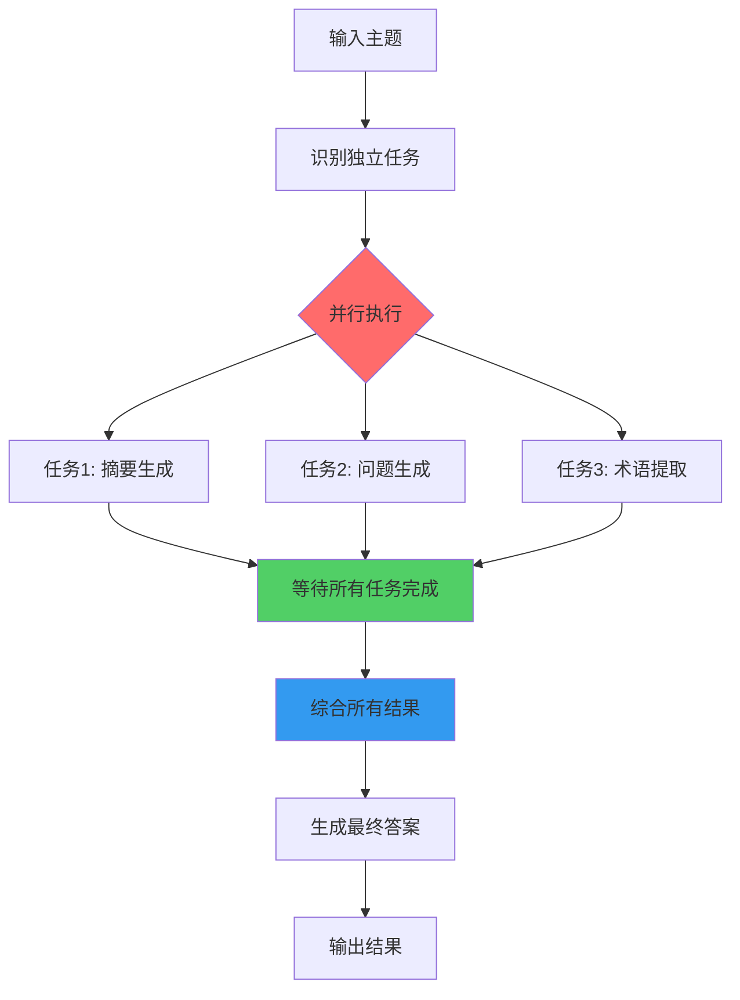

# 并行化

## 概述

并行化是一种通过并发执行多个组件来优化智能体系统性能的重要设计模式。不同于传统的顺序执行，并行化允许独立的任务同时运行，显著缩短总执行时间，特别是在处理涉及多个外部API调用、数据库查询或LLM调用的场景中。

### 核心原理

并行化的核心思想是识别工作流中不依赖其他部分输出的环节，并将它们并行执行。在处理具有延迟的外部服务（如API或数据库）时尤其有效，因为可以同时发出多个请求而不是等待每个请求完成后再发出下一个。

### 技术实现

现代智能体框架如LangChain、LangGraph和Google ADK都提供了内置的并行执行机制：
- **LangChain LCEL**: 使用`RunnableParallel`构造同时执行多个可运行对象
- **LangGraph**: 通过图结构定义可从单个状态转换执行的多个节点
- **Google ADK**: 提供`ParallelAgent`和`SequentialAgent`原语管理多智能体并发执行

## 并行化模式的执行流程



## LangChain实现示例

### 基本并行处理链

以下代码展示了使用LangChain实现并行处理的核心模式：

```python
import os
import asyncio
from typing import Optional
from langchain_openai import ChatOpenAI
from langchain_core.prompts import ChatPromptTemplate
from langchain_core.output_parsers import StrOutputParser
from langchain_core.runnables import Runnable, RunnableParallel, RunnablePassthrough

## --- 配置 ---
try:
    llm: Optional[ChatOpenAI] = ChatOpenAI(model="gpt-4o-mini", temperature=0.7)
except Exception as e:
    print(f"初始化语言模型时出错: {e}")
    llm = None

## --- 定义独立链 ---
## 这三个链代表可以并行执行的不同任务。
summarize_chain: Runnable = (
    ChatPromptTemplate.from_messages([
        ("system", "简洁地总结以下主题："),
        ("user", "{topic}")
    ])
    | llm
    | StrOutputParser()
)

questions_chain: Runnable = (
    ChatPromptTemplate.from_messages([
        ("system", "生成关于以下主题的三个有趣问题："),
        ("user", "{topic}")
    ])
    | llm
    | StrOutputParser()
)

terms_chain: Runnable = (
    ChatPromptTemplate.from_messages([
        ("system", "从以下主题中识别 5-10 个关键术语，用逗号分隔："),
        ("user", "{topic}")
    ])
    | llm
    | StrOutputParser()
)

## --- 构建并行 + 综合链 ---
map_chain = RunnableParallel(
    {
        "summary": summarize_chain,
        "questions": questions_chain,
        "key_terms": terms_chain,
        "topic": RunnablePassthrough(),  # 传递原始主题

    }
)

synthesis_prompt = ChatPromptTemplate.from_messages([
    ("system", """基于以下信息：
    摘要：{summary}
    相关问题：{questions}
    关键术语：{key_terms}
    综合一个全面的答案。"""),
    ("user", "原始主题：{topic}")
])

full_parallel_chain = map_chain | synthesis_prompt | llm | StrOutputParser()

## --- 运行链 ---
async def run_parallel_example(topic: str) -> None:
    if not llm:
        print("LLM 未初始化。无法运行示例。")
        return

    print(f"\n--- 运行主题的并行 LangChain 示例：'{topic}' ---")
    try:
        response = await full_parallel_chain.ainvoke(topic)
        print("\n--- 最终响应 ---")
        print(response)
    except Exception as e:
        print(f"\n链执行期间发生错误：{e}")

if __name__ == "__main__":
    test_topic = "太空探索的历史"
    asyncio.run(run_parallel_example(test_topic))
```

### 技术解析

1. **独立链定义**: 创建三个独立的处理链，每个链完成不同的任务
2. **RunnableParallel构造**: 将三个链打包并行执行，同时保留原始输入
3. **异步执行**: 使用`ainvoke`和asyncio实现真正的并发调用
4. **结果综合**: 通过综合步骤将并行结果整合为统一输出

## Google ADK多智能体并行实现

### 多智能体并行研究系统

以下代码展示了使用Google ADK构建的多智能体并行系统：

```python
from google.adk.agents import LlmAgent, ParallelAgent, SequentialAgent
from google.adk.tools import google_search

GEMINI_MODEL = "gemini-2.0-flash"

## --- 1. 定义研究员子智能体（并行运行）---
researcher_agent_1 = LlmAgent(
    name="RenewableEnergyResearcher",
    model=GEMINI_MODEL,
    instruction="""你是一名专门研究能源的 AI 研究助理。研究"可再生能源"的最新进展。使用提供的 Google 搜索工具。简洁地总结你的主要发现（1-2 句话）。*只*输出摘要。""",
    description="研究可再生能源。",
    tools=[google_search],
    output_key="renewable_energy_result"
)

researcher_agent_2 = LlmAgent(
    name="EVResearcher",
    model=GEMINI_MODEL,
    instruction="""你是一名专门研究交通的 AI 研究助理。研究"电动汽车技术"的最新发展。使用提供的 Google 搜索工具。简洁地总结你的主要发现（1-2 句话）。*只*输出摘要。""",
    description="研究电动汽车技术。",
    tools=[google_search],
    output_key="ev_technology_result"
)

researcher_agent_3 = LlmAgent(
    name="CarbonCaptureResearcher",
    model=GEMINI_MODEL,
    instruction="""你是一名专门研究气候解决方案的 AI 研究助理。研究"碳捕获方法"的当前状态。使用提供的 Google 搜索工具。简洁地总结你的主要发现（1-2 句话）。*只*输出摘要。""",
    description="研究碳捕获方法。",
    tools=[google_search],
    output_key="carbon_capture_result"
)

## --- 2. 创建 ParallelAgent（并发运行研究员）---
parallel_research_agent = ParallelAgent(
    name="ParallelWebResearchAgent",
    sub_agents=[researcher_agent_1, researcher_agent_2, researcher_agent_3],
    description="并行运行多个研究智能体以收集信息。"
)

## --- 3. 定义合并智能体（在并行智能体*之后*运行）---
merger_agent = LlmAgent(
    name="SynthesisAgent",
    model=GEMINI_MODEL,
    instruction="""你是一名负责将研究发现组合成结构化报告的 AI 助理。你的主要任务是综合以下研究摘要，清楚地将发现归属于其来源领域。使用每个主题的标题构建你的响应。确保报告连贯并平滑地整合关键点。
**关键：你的整个响应必须*完全*基于下面"输入摘要"中提供的信息。不要添加这些特定摘要中不存在的任何外部知识、事实或细节。**

**输入摘要：**
*   **可再生能源：**
    {renewable_energy_result}
*   **电动汽车：**
    {ev_technology_result}
*   **碳捕获：**
    {carbon_capture_result}

**输出格式：**
## 近期可持续技术进展摘要

### 可再生能源发现
（基于 RenewableEnergyResearcher 的发现）
[*仅*综合并详细说明上面提供的可再生能源输入摘要。]

### 电动汽车发现
（基于 EVResearcher 的发现）
[*仅*综合并详细说明上面提供的电动汽车输入摘要。]

### 碳捕获发现
（基于 CarbonCaptureResearcher 的发现）
[*仅*综合并详细说明上面提供的碳捕获输入摘要。]

### 总体结论
[提供一个简短的（1-2 句话）结论性陈述，*仅*连接上面提供的发现。]

*仅*输出遵循此格式的结构化报告。不要在此结构之外包含介绍性或结论性短语，并严格遵守仅使用提供的输入摘要内容。""",
    description="将并行智能体的研究发现组合成结构化的、引用的报告，严格基于提供的输入。",
)

## --- 4. 创建 SequentialAgent（协调整体流程）---
sequential_pipeline_agent = SequentialAgent(
    name="ResearchAndSynthesisPipeline",
    sub_agents=[parallel_research_agent, merger_agent],
    description="协调并行研究并综合结果。"
)

root_agent = sequential_pipeline_agent
```

### 技术解析

1. **专用研究员智能体**: 每个智能体专注于特定研究领域，使用Google搜索工具
2. **ParallelAgent协调**: 管理多个研究员智能体的并发执行
3. **状态管理**: 通过`output_key`在智能体间传递研究结果
4. **结果结果**: 合并智能体将并行结果整合为结构化报告

## 实际应用场景

### 1. 信息收集与研究

**场景描述**: 公司调研智能体需要从多个来源收集信息

**并行任务**:
- 同时搜索新闻文章
- 获取股票数据
- 监控社交媒体提及
- 查询公司数据库

**优势**: 相比顺序查询能更快获得全面视图

### 2. 数据处理与分析

**场景描述**: 客户反馈分析智能体对一批反馈条目进行多维分析

**并行任务**:
- 情感分析
- 关键词提取
- 反馈分类
- 紧急问题识别

**优势**: 快速提供多维度分析结果

### 3. 多API或工具交互

**场景描述**: 旅行规划智能体查询多个服务

**并行任务**:
- 查询航班价格
- 酒店可用性
- 当地活动
- 餐厅推荐

**优势**: 更快呈现完整的旅行方案

### 4. 多组件内容生成

**场景描述**: 营销邮件创建智能体生成邮件的各个部分

**并行任务**:
- 生成邮件主题
- 起草正文内容
- 查找相关图片
- 创建行动号召按钮文本

**优势**: 更高效地组装最终邮件

### 5. 验证与核实

**场景描述**: 用户输入验证智能体

**并行任务**:
- 验证邮箱格式
- 手机号码验证
- 地址信息数据库匹配
- 不当内容检测

**优势**: 更快提供输入有效性反馈

### 6. 多模态处理

**场景描述**: 社交媒体帖子分析（包含文本和图像）

**并行任务**:
- 分析文本情感与关键词
- 识别图像中的对象和场景

**优势**: 更快速整合来自不同模态的洞察

### 7. A/B测试或多选项生成

**场景描述**: 创意文本生成智能体

**并行任务**:
- 使用不同提示生成三个不同标题
- 或使用不同模型生成变体

**优势**: 便于快速比较并选择最佳选项

## 性能优化要点

### 执行时间对比

**顺序执行**:
```
总时间 = 任务1时间 + 任务2时间 + 任务3时间 + ... + 任务N时间
```

**并行执行**:
```
总时间 = max(任务1时间, 任务2时间, 任务3时间, ..., 任务N时间) + 综合时间
```

在涉及外部I/O操作的场景中，并行化可以显著减少总执行时间。

### 注意事项

1. **并发vs并行**: Python的asyncio提供的是并发性而非真正的并行性，通过事件循环在单线程上智能切换任务
2. **错误处理**: 并行任务中的错误需要妥善处理，避免影响整体工作流
3. **资源管理**: 大量并行请求可能触发API速率限制，需要适当的限流控制
4. **状态同步**: 确保并行任务完成后再进行综合步骤
5. **依赖关系**: 只有真正独立的任务才能并行执行

## 关键要点总结

1. **效率提升**: 并行化通过并发执行独立任务来提高效率，特别在涉及等待外部资源（如API调用）的任务中效果显著

2. **框架支持**: 像LangChain和Google ADK这样的智能体框架提供定义和管理并行执行的内置支持

3. **LangChain实现**: 在LangChain表达式语言（LCEL）中，`RunnableParallel`是并行运行多个可运行对象的关键构造

4. **Google ADK实现**: Google ADK可通过LLM驱动的委托实现并行执行，协调器智能体的LLM识别独立子任务并触发专门子智能体的并发处理

5. **复杂性与成本**: 采用并发或并行架构会引入显著复杂性和成本，影响设计、调试和系统日志等关键开发环节

6. **延迟优化**: 并行化有助于减少整体延迟，使智能体系统在处理复杂任务时更具响应性

7. **与其他模式结合**: 通过将并行处理与顺序（链式）和条件（路由）控制流相结合，可以构建能够高效管理各类复杂任务的复杂、高性能计算系统

## 结论

并行化模式是通过并发执行了独立子任务来优化方法计算工作流的重要技术。该模式有效减少整体延迟，在涉及多个模型推理或对外部服务调用的复杂操作中尤为显著。

不同框架为此模式提供了不同的实现机制。在LangChain中，通过`RunnableParallel`等构造显式定义并同时执行多个处理链。而Google智能体开发工具包(ADK)等框架则通过多智能体委托实现并行化，由主协调器模型将不同子任务分配给可并发操作的专门智能体。

并行化是智能体设计中的基础优化技术，使开发人员能够通过利用独立任务的并发执行来构建更高性能和响应更快的应用程序。