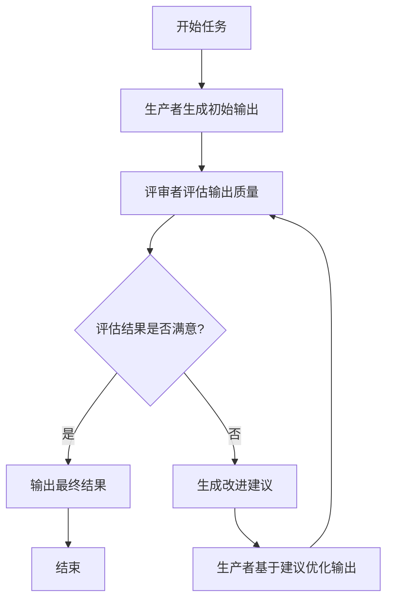

# 反思模式

## 模式概述

反思模式是指智能体评估其自身工作、输出或内部状态，并利用该评估来提升性能或优化响应。这是一种自我纠正或自我改进机制，允许智能体基于反馈、内部评审或与预期标准的对比，迭代优化其输出或调整策略。

## 核心原理

### 1. 反思循环的四个步骤

反思模式通常包含以下步骤：

1. **执行：** 智能体执行任务或生成初始输出
2. **评估/评审：** 智能体分析上一步结果，评估其质量
3. **反思/优化：** 基于评审意见生成优化后的输出
4. **迭代：** 重复该过程直到获得满意结果或达到停止条件

### 2. 生成器-评审者模型

反思模式的一种关键实现方式是将流程分离为两个不同的逻辑角色：

- **生产者智能体：** 专注于内容生成，接收初始提示并生成初始输出
- **评审者智能体：** 评估生产者生成的输出，发现缺陷并提供改进建议

这种关注点分离避免了智能体评审自身工作时可能产生的"认知偏差"，使评审更客观、更全面。

### 3. 反思与自我反思

反思模式有两种主要实现方式：

1. **外部反思：** 使用独立的评审者智能体评估工作
2. **自我反思：** 单个智能体通过角色切换实现自我评估

## 反思模式流程



## 实现方式

### 1. 单步反思

单步反思实现一个完整的生成-评审-优化周期，适用于需要一次性质量检查的场景。

### 2. 迭代反思

迭代反思实现多轮反思循环，不断改进输出质量，直到满足停止条件。

### 3. 并行反思

并行反思使用多个评审者智能体从不同角度评估同一输出，提供更全面的反馈。

## 代码实现

### 代码1：代码反思循环

这个示例展示了完整的代码反思循环，实现了生成器-评审者模型：

```python
import os
from dotenv import load_dotenv
from langchain_openai import ChatOpenAI
from langchain_core.messages import SystemMessage, HumanMessage

# 配置
load_dotenv()
llm = ChatOpenAI(model="gpt-4o", temperature=0.1)

def run_reflection_loop():
    """演示多步 AI 反思循环以逐步改进 Python 函数"""
    task_prompt = """
    你的任务是创建一个名为 `calculate_factorial` 的 Python 函数。
    此函数应执行以下操作：
    1. 接受单个整数 `n` 作为输入。
    2. 计算其阶乘 (n!)。
    3. 包含清楚解释函数功能的文档字符串。
    4. 处理边缘情况：0 的阶乘是 1。
    5. 处理无效输入：如果输入是负数，则引发 ValueError。
    """

    max_iterations = 3
    current_code = ""
    message_history = [HumanMessage(content=task_prompt)]

    for i in range(max_iterations):
        # 生成/完善阶段
        if i == 0:
            response = llm.invoke(message_history)
            current_code = response.content
        else:
            message_history.append(HumanMessage(content="请使用提供的批评完善代码。"))
            response = llm.invoke(message_history)
            current_code = response.content

        message_history.append(response)

        # 反思阶段
        reflector_prompt = [
            SystemMessage(content="""
                你是一名高级软件工程师和 Python 专家。
                你的角色是执行细致的代码审查。
                如果代码完美，用 'CODE_IS_PERFECT' 响应。
                否则，提供批评的项目符号列表。
            """),
            HumanMessage(content=f"原始任务：\n{task_prompt}\n\n要审查的代码：\n{current_code}")
        ]

        critique_response = llm.invoke(reflector_prompt)
        critique = critique_response.content

        # 停止条件
        if "CODE_IS_PERFECT" in critique:
            break

        message_history.append(HumanMessage(content=f"对先前代码的批评：\n{critique}"))

    return current_code
```

**使用范式：** 反思模式（迭代反思循环）
**核心特点：** 使用对话历史维护上下文，迭代改进代码质量

### 代码2：生成器-评审者智能体

这个示例实现了分离的生成器和评审者智能体，展示关注点分离的原则：

```python
from langchain_openai import ChatOpenAI
from langchain_core.prompts import ChatPromptTemplate

llm = ChatOpenAI(model="gpt-4o", temperature=0.7)

class GeneratorAgent:
    """生成器智能体：负责创建初始内容"""
    def __init__(self, description, instruction):
        self.description = description
        self.instruction = instruction
        self.system_prompt = ChatPromptTemplate.from_messages([
            ("system", f"{description}\n{instruction}"),
            ("user", "{topic}")
        ])

    def generate(self, topic):
        response = llm.invoke(self.system_prompt.format(topic=topic))
        return response.content

class ReviewerAgent:
    """评审者智能体：负责评估生成内容的质量"""
    def __init__(self, description, instruction):
        self.description = description
        self.instruction = instruction
        self.system_prompt = ChatPromptTemplate.from_messages([
            ("system", f"{description}\n{instruction}"),
            ("user", "待评审文本：\n{text}\n\n请提供你的结构化评审：")
        ])

    def review(self, text):
        response = llm.invoke(self.system_prompt.format(text=text))
        return response.content

class SequentialAgent:
    """顺序智能体：管理生成器和评审者的执行顺序"""
    def __init__(self, name, generator, reviewer):
        self.name = name
        self.generator = generator
        self.reviewer = reviewer

    def execute(self, topic):
        # 生成器运行
        draft = self.generator.generate(topic)
        # 评审者运行
        review = self.reviewer.review(draft)
        return {"draft": draft, "review": review}
```

**使用范式：** 反思模式（生成器-评审者模型）
**核心特点：** 分离生成和评审逻辑，管道式执行

### 代码3：自我反思智能体

这个示例展示单个智能体如何通过角色切换实现自我反思：

```python
class SelfReflectingAgent:
    """自我反思智能体：能够生成内容并自我评审"""
    def __init__(self, name, task_description):
        self.name = name
        self.task_description = task_description

        # 不同角色的提示模板
        self.generator_prompt = ChatPromptTemplate.from_messages([
            ("system", "你是一个专业的{role}。"),
            ("user", "{task}\n\n请完成这个任务。")
        ])

        self.reflector_prompt = ChatPromptTemplate.from_messages([
            ("system", "你是一个严谨的评审者。"),
            ("user", """任务描述：{task}\n生成的内容：{content}\n\n请评审上述内容。""")
        ])

        self.improver_prompt = ChatPromptTemplate.from_messages([
            ("system", "你是一个专业的{role}。"),
            ("user", """原始内容：{content}\n评审反馈：{feedback}\n\n请根据反馈改进内容。""")
        ])

    def execute_with_reflection(self, role, task, max_iterations=3):
        # 生成初始内容
        content = self.generate(role, task)

        # 迭代反思和改进
        for iteration in range(1, max_iterations + 1):
            feedback, is_perfect = self.reflect(task, content)
            if is_perfect:
                break
            content = self.improve(role, content, feedback)

        return content
```

**使用范式：** 反思模式（自我反思）
**核心特点：** 单个智能体通过角色切换实现生成-评审-改进循环

### 代码4：迭代规划反思

这个示例展示反思模式在复杂任务规划中的应用：

```python
class PlanningReflectionSystem:
    """规划反思系统：能够生成、评估和优化行动计划"""
    def __init__(self, system_name):
        self.system_name = system_name

        self.planner_prompt = ChatPromptTemplate.from_messages([
            ("system", "你是一个专业的项目规划师。"),
            ("user", """目标：{goal}\n约束条件：{constraints}\n\n请创建一个详细的行动计划。""")
        ])

        self.evaluator_prompt = ChatPromptTemplate.from_messages([
            ("system", "你是一个严格的项目评估师。"),
            ("user", """原始目标：{goal}\n提出的计划：{plan}\n\n请评估这个计划。""")
        ])

        self.optimizer_prompt = ChatPromptTemplate.from_messages([
            ("system", "你是一个经验丰富的项目优化师。"),
            ("user", """原始计划：{current_plan}\n评估反馈：{feedback}\n\n请根据反馈优化计划。""")
        ])

    def iterative_planning(self, goal, constraints, max_iterations=3):
        # 生成初始计划
        current_plan = self.generate_plan(goal, constraints)

        # 迭代评估和优化
        for iteration in range(1, max_iterations + 1):
            feedback, is_perfect = self.evaluate_plan(goal, constraints, current_plan)
            if is_perfect:
                break
            current_plan = self.optimize_plan(current_plan, feedback)

        return current_plan
```

**使用范式：** 反思模式（迭代规划优化）
**核心特点：** 应用于复杂任务规划，多轮计划评估和优化

## 应用场景

### 1. 创意写作与内容生成

**场景：** 博客文章撰写智能体
**反思应用：** 生成草稿，评审其流畅性、语气和清晰度，然后基于评审重写
**优势：** 产出更精炼有效的内容

### 2. 代码生成与调试

**场景：** Python 函数编写智能体
**反思应用：** 编写初始代码，运行测试或静态分析，识别错误，然后修改代码
**优势：** 生成更健壮实用的代码

### 3. 复杂问题解决

**场景：** 逻辑谜题求解智能体
**反思应用：** 提出一个步骤，评估它是否更接近解决方案，必要时回溯
**优势：** 提升智能体导航复杂问题空间的能力

### 4. 摘要与信息综合

**场景：** 长文档摘要智能体
**反思应用：** 生成初始摘要，与原始文档对比，优化摘要以提高准确性
**优势：** 创建更准确全面的摘要

### 5. 规划与策略

**场景：** 目标达成行动规划智能体
**反思应用：** 生成计划，模拟其执行，评估可行性，基于评估修订计划
**优势：** 制定更有效现实的计划

### 6. 对话智能体

**场景：** 客户支持聊天机器人
**反思应用：** 审查对话历史和最后生成消息，确保连贯性和准确性
**优势：** 促成更自然有效的对话

## 关键优势

1. **质量提升：** 通过迭代改进显著提高输出质量
2. **自我纠正：** 智能体能够识别和修复自身错误
3. **客观性：** 使用独立评审者减少认知偏差
4. **上下文感知：** 利用对话历史提供丰富上下文
5. **质量控制：** 建立结构化的质量评估机制

## 权衡与限制

1. **成本增加：** 迭代反思会增加 API 调用次数
2. **延迟管理：** 多轮反思会增加响应时间
3. **上下文窗口：** 长对话历史可能超出模型限制
4. **停止条件：** 需要设计合理的停止条件

## 实现建议

### 1. 使用独立评审者

当需要高客观性或专门评估时，使用独立的评审者智能体，避免自我反思中的认知偏差。

### 2. 设计合理的停止条件

设置明确的停止条件，如最大迭代次数、质量阈值或满足特定标准。

### 3. 管理对话历史

有效管理对话历史，避免超出模型上下文窗口，同时提供充足的上下文信息。

### 4. 结构化反馈

使用结构化的反馈格式，便于生成者智能体理解和应用改进建议。

## 与其他模式的关系

### 1. 与目标设定和监控的协同

目标为智能体的自我评估提供最终基准，而监控则跟踪其进展。反思作为纠正引擎，利用监控反馈分析偏差并调整策略。

### 2. 与对话记忆的协同

当智能体保持对话记忆时，反思模式的有效性会显著增强。对话历史为评估阶段提供关键上下文，使智能体能够在先前交互和用户反馈的背景下进行评估。

### 3. 与其他基础模式的集成

反思模式可以与提示词链、路由和并行化等基础模式集成，构建更健壮和功能更复杂的智能体系统。

## 总结

反思模式为智能体工作流中的自我纠正提供了关键机制，实现了超越单次执行的迭代改进。通过创建一个执行、评估和优化的循环，系统能够不断改进其输出质量。

从简单的单步反思到复杂的迭代规划，从自我反思到生成器-评审者模型，反思模式为构建高质量、可靠的智能体系统提供了强大的工具。虽然它带来了成本和延迟的权衡，但在需要高质量输出的场景中，这种权衡通常是值得的。

反思模式代表了智能体从单纯执行指令转向更复杂的问题解决和内容生成的重要一步，是构建自适应、自我改进智能体系统的核心范式之一。
