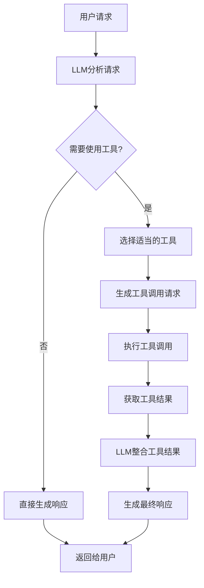

# 工具使用模式

## 模式概述

工具使用模式是让智能体真正发挥作用并与现实世界或外部系统交互的关键机制。该模式通常通过**函数调用（Function Calling）**实现，使智能体能够与外部 API、数据库、服务交互，甚至执行代码。

### 核心价值

工具使用模式打破了 LLM 训练数据的限制，允许它：
- 访问最新信息
- 执行内部无法完成的计算
- 与用户特定数据交互
- 触发现实世界的行动

## 工具使用的六个步骤

### 1. 工具定义
向 LLM 定义并描述外部函数或能力，包括：
- 函数的用途和名称
- 接受的参数及其类型
- 参数的详细描述

### 2. LLM 决策
LLM 接收用户的请求和可用的工具定义，基于其对请求和工具的理解，决定是否需要调用工具来满足请求。

### 3. 函数调用生成
如果 LLM 决定使用工具，它会生成结构化输出（通常是 JSON 对象），指定：
- 要调用的工具名称
- 要传递给它的参数（从用户请求中提取）

### 4. 工具执行
智能体框架或编排层拦截此结构化输出，识别请求的工具并使用提供的参数执行实际的外部函数。

### 5. 观察/结果
工具执行的输出或结果返回给智能体。

### 6. LLM 处理（可选）
LLM 接收工具的输出作为上下文，并使用它向用户制定最终响应或决定工作流中的下一步。

## 工具使用模式流程



## 实现方式

### 1. 简单工具调用

实现单个工具的基本功能，适用于单一职责的工具。

### 2. 多工具协作

使用多个工具协同工作解决工作复杂问题，工具之间可以传递数据。

### 3. 工具链

一个工具的输出作为另一个工具的输入，形成处理链。

### 4. 并行工具调用

同时调用多个独立的工具，提高处理效率。

### 代码1：基础工具使用

这个示例展示了工具使用模式的完整实现流程：

```python
import os
import getpass
from langchain_openai import ChatOpenAI
from langchain_core.prompts import ChatPromptTemplate
from langchain_core.tools import tool as langchain_tool
from langchain.agents import create_tool_calling_agent, AgentExecutor

# 配置 API 密钥
os.environ["OPENAI_API_KEY"] = getpass.getpass("Enter your OpenAI API key: ")
llm = ChatOpenAI(model="gpt-4o", temperature=0)

# --- 定义工具 ---
@langchain_tool
def search_information(query: str) -> str:
    """提供有关给定主题的事实信息。"""
    simulated_results = {
        "weather in london": "伦敦目前多云，温度为 15°C。",
        "capital of france": "法国的首都是巴黎。",
        "default": f"'{'query'}' 的模拟搜索结果。"
    }
    return simulated_results.get(query.lower(), simulated_results["default"])

@langchain_tool
def calculate(expression: str) -> str:
    """计算数学表达式。"""
    import math
    safe_dict = {"math": math, "sqrt": math.sqrt, "pow": pow}
    result = eval(expression, {"__builtins__": {}}, safe_dict)
    return str(result)

tools = [search_information, calculate]

# --- 创建工具调用智能体 ---
agent_prompt = ChatPromptTemplate.from_messages([
    ("system", "你是一个有用的助手，可以使用搜索和计算工具。"),
    ("human", "{input}"),
    ("placeholder", "{agent_scratchpad}"),
])

agent = create_tool_calling_agent(llm, tools, agent_prompt)
agent_executor = AgentExecutor(agent=agent, verbose=True, tools=tools)

# --- 执行查询 ---
response = agent_executor.invoke({"input": "法国的首都是什么？"})
print(response["output"])
```

**使用范式：** 工具使用模式（基础实现）
**核心特点：** 展示完整的工具定义、LLM决策、工具执行和结果处理流程

### 代码2：金融分析智能体

这个示例展示了如何创建专门的金融分析智能体：

```python
from langchain_core.tools import tool as langchain_tool
from typing import Dict

@langchain_tool
def get_stock_price(ticker: str) -> float:
    """获取给定股票代码符号的最新模拟股票价格。"""
    simulated_prices = {
        "AAPL": 178.15,
        "GOOGL": 1750.30,
        "MSFT": 425.50,
    }
    price = simulated_prices.get(ticker.upper())
    if price is not None:
        return price
    else:
        raise ValueError(f"未找到代码 '{ticker.upper()}' 的模拟价格。")

@langchain_tool
def calculate_roi(investment_amount: float, current_value: float) -> float:
    """计算投资回报率 (ROI)。"""
    if investment_amount == 0:
        raise ValueError("投资金额不能为零")
    roi = ((current_value - investment_amount) / investment_amount) * 100
    return round(roi, 2)

@langchain_tool
def get_investment_advice(ticker: str, price: float, holding_period: str) -> str:
    """基于当前价格和持仓期间提供投资建议。"""
    if price > 400:
        recommendation = "建议谨慎投资，考虑分批建仓"
    else:
        recommendation = "投资价值相对稳定，适合分散投资"

    return f"""
    投资建议分析 ({ticker}):
    - 当前价格: ${price}
    - 风险等级: {'高风险' if price > 400 else '中等风险'}
    - 建议: {recommendation}
    """

tools = [get_stock_price, calculate_roi, get_investment_advice]
```

**使用范式：** 工具使用模式（领域专业化）
**核心特点：** 多个金融相关工具协同工作，提供完整的金融分析能力

### 代码3：多工具协作智能体

这个示例展示了工具之间的协作能力：

```python
@langchain_tool
def get_weather(location: str) -> Dict:
    """获取指定位置的当前天气信息。"""
    weather_data = {
        "北京": {"temperature": 22, "humidity": 45, "condition": "晴朗"},
        "上海": {"temperature": 25, "humidity": 70, "condition": "多云"},
    }
    return weather_data.get(location, {})

@langchain_tool
def calculate_distance(city1: str, city2: str, unit: str = "km") -> Dict:
    """计算两个城市之间的直线距离。"""
    # 实现距离计算逻辑
    return coordinates_info

@langchain_tool
def estimate_travel_time(distance: float, transport_mode: str) -> Dict:
    """基于距离和交通方式估算旅行时间。"""
    speeds = {"car": 80, "train": 120, "plane": 800}
    time_hours = distance / speeds[transport_mode]
    return travel_time_info

def demonstrate_tool_chain():
    # 工具链演示：距离计算 -> 时间估算
    distance_result = calculate_distance("上海", "北京", "km")
    time_result = estimate_travel_time(distance_result["distance"], "train")
    return {
        "distance": distance_result,
        "travel_time": time_result
    }
```

**使用范式：** 工具使用模式（工具协作）
**核心特点：** 工具之间传递数据，形成处理链，解决复杂问题

### 代码4：代码执行智能体

这个示例展示了如何在智能体中安全执行代码：

```python
from typing import Dict, Any

@langchain_tool
def execute_python_code(code: str) -> Dict[str, Any]:
    """在安全的沙盒环境中执行 Python 代码。"""
    # 创建受限的执行环境
    safe_globals = {
        "__builtins__": {
            "print": print, "len": len, "range": range,
            "sum": sum, "max": max, "min": min,
        },
        "math": __import__("math"),
        "statistics": __import__("statistics"),
    }

    result = {"success": False, "output": None, "error": None}

    try:
        exec(code, safe_globals)
        if "output" in safe_globals:
            result["output"] = safe_globals["output"]
            result["success"] = True
    except Exception as e:
        result["error"] = str(e)

    return result

@langchain_tool
def calculate_math(expression: str) -> Dict[str, Any]:
    """计算数学表达式并返回结果。"""
    import math
    safe_math_dict = {
        "math": math, "sqrt": math.sqrt,
        "pow": pow, "sin": math.sin, "cos": math.cos,
    }

    result = {"expression": expression, "result": None, "success": False}

    try:
        calculation_result = eval(expression, {"__builtins__": {}}, safe_math_dict)
        result["result"] = calculation_result
        result["success"] = True
    except Exception as e:
        result["error"] = str(e)

    return result
```

**使用范式：** 工具使用模式（代码执行）
**核心特点：** 在安全环境中执行代码，实现精确计算和数据分析

## 应用场景

### 1. 从外部源检索信息

**场景：** 天气智能体
**工具：** 接受位置并返回当前天气状况的天气 API
**智能体流程：** 用户问天气 → LLM 识别需要天气工具 → 调用工具 → LLM 格式化响应

### 2. 与数据库和 API 交互

**场景：** 电子商务智能体
**工具：** 检查产品库存、获取订单状态、处理付款的 API
**智能体流程：** 用户查询库存 → 调用库存 API → 返回库存状态

### 3. 执行计算和数据分析

**场景：** 金融智能体
**工具：** 计算器函数、股票市场数据 API、电子表格工具
**智能体流程：** 查询股票价格 → 调用股票 API → 执行计算 → 格式化响应

### 4. 发送通信

**场景：** 个人助理智能体
**工具：** 电子邮件发送 API
**智能体流程：** 用户要求发邮件 → 提取收件人、主题、正文 → 调用邮件工具

### 5. 执行代码

**场景：** 编码助手智能体
**工具：** 代码解释器
**智能体流程：** 用户提供代码 → 使用解释器运行代码 → 分析输出

### 6. 控制其他系统或设备

**场景：** 智能家居智能体
**工具：** 控制智能设备的 API
**智能体流程：** 用户说"关闭客厅的灯" → 调用智能家居工具

## 关键优势

1. **知识扩展：** 突破 LLM 训练数据的限制
2. **实时性：** 访问最新的外部信息
3. **精确性：** 通过工具执行确定性计算
4. **灵活性：** 动态集成各种外部功能
5. **实用性：** 执行实际的操作和任务

## 工具设计最佳实践

### 1. 函数命名
- 使用清晰、描述性的函数名
- 遵循命名约定（snake_case）
- 体现工具的功能和目的

### 2. 参数设计
- 定义明确的参数类型
- 提供详细的参数描述
- 设置合理的默认值
- 验证输入参数

### 3. 返回格式
- 返回结构化的数据（字典、列表）
- 包含状态信息（成功/失败）
- 提供清晰的错误信息
- 保持返回格式的一致性

### 4. 文档和描述
- 编写清晰的函数文档字符串
- 描述工具的用途和功能
- 说明参数要求和返回格式
- 提供使用示例

## 安全考虑

### 1. 输入验证
- 验证所有输入参数
- 防止注入攻击
- 限制输入长度和复杂度
- 清理敏感信息

### 2. 执行环境
- 使用沙盒环境执行代码
- 限制可用的函数和模块
- 设置执行时间限制
- 监控资源使用

### 3. 权限管理
- 实现细粒度的权限控制
- 记录工具调用日志
- 限制危险操作的访问
- 审计敏感操作

### 4. 错误处理
- 提供清晰的错误信息
- 避免暴露系统细节
- 实现优雅的错误恢复
- 记录错误日志

## 性能优化

### 1. 缓存策略
- 缓存常用查询的结果
- 设置适当的缓存过期时间
- 实现智能缓存失效机制
- 监控缓存命中率

### 2. 并行执行
- 并行调用独立的工具
- 使用异步处理
- 合理管理并发数量
- 优化工具响应时间

### 3. 资源管理
- 池化外部连接
- 优化数据库查询
- 管理内存使用
- 控制并发请求数量

### 4. 监控和调优
- 监控工具调用性能
- 识别性能瓶颈
- 优化慢速工具
- 调整资源配置

## 与其他模式的集成

### 1. 与反思模式的结合
- 使用工具调用结果作为反思的输入
- 通过工具验证反思结果
- 根据工具反馈调整反思策略

### 2. 与路由模式的结合
- 根据工具可用性路由选择
- 基于工具类型选择不同处理流程
- 动态路由到适当的工具

### 3. 与并行化模式的结合
- 并行执行多个工具调用
- 合并多个工具的结果
- 优化整体执行时间

### 4. 与提示词链的结合
- 将工具结果传递给下一个提示词
- 在链中使用多个工具
- 基于工具结果动态调整后续步骤

## 框架支持

### 1. LangChain
- `@tool` 装饰器：简化工具定义
- `create_tool_calling_agent`：创建工具调用智能体
- `AgentExecutor`：管理工具执行
- 内置工具库：丰富的预构建工具

### 2. Google ADK
- 预构建工具：Google 搜索、代码执行、企业搜索
- 企业级安全性：数据隐私和性能保证
- Vertex AI 扩展：结构化 API 包装器
- 自动执行：自动执行扩展和工具

### 3. CrewAI
- `@tool` 装饰器：工具定义
- 工具管理：与智能体和任务集成
- 工具权限：细粒度的访问控制
- 工具监控：使用和性能跟踪

## 总结

工具使用模式是将大型语言模型的功能范围扩展到其固有文本生成能力之外的关键架构原则。通过为模型配备与外部软件和数据源交互的能力，此范式允许智能体执行操作、进行计算并从其他系统检索信息。

从简单的外部信息检索到复杂的代码执行，从单一工具调用到多工具协作，工具使用模式为构建强大、交互式且具外部环境感知能力的智能体提供了坚实的基础。

虽然工具使用带来了复杂性和安全考虑，但其带来的能力扩展使其成为构建实际可用的智能体系统的必不可少的技术。通过正确设计工具、确保安全执行和优化性能，开发者可以创建出超越传统 LLM 限制的强大智能体应用。

工具使用模式代表了智能体从被动文本生成器向主动问题解决者和操作执行者的关键转变，是智能体面世的核心使能技术之一。
