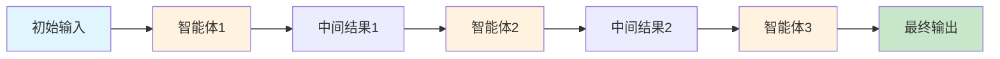
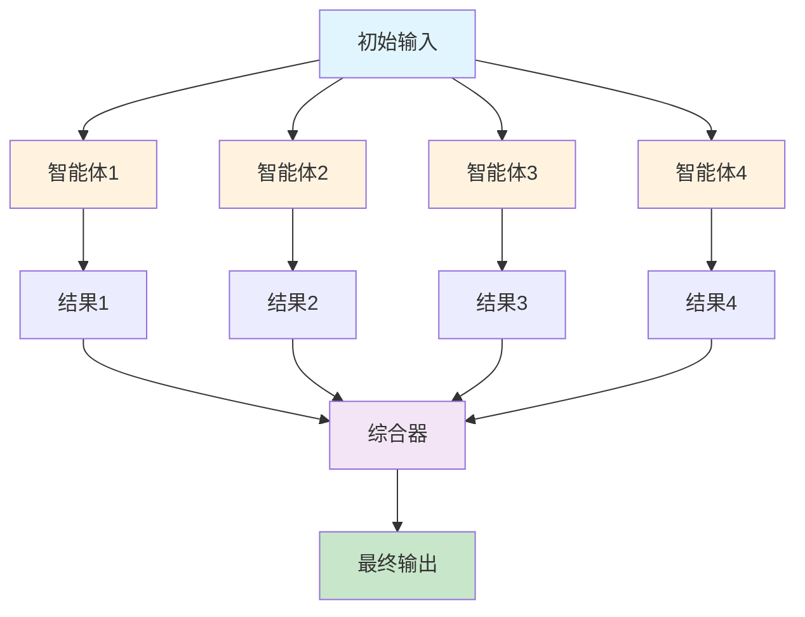
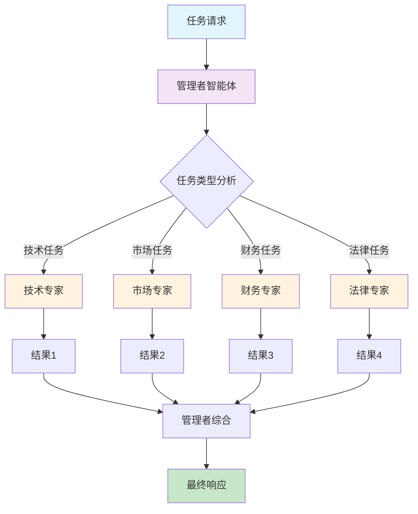
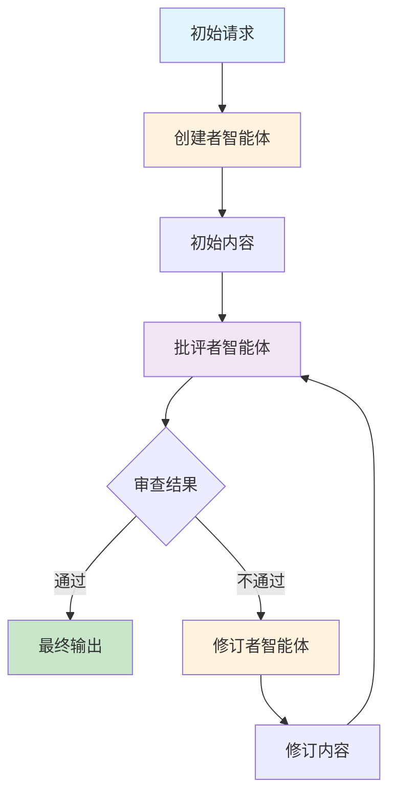
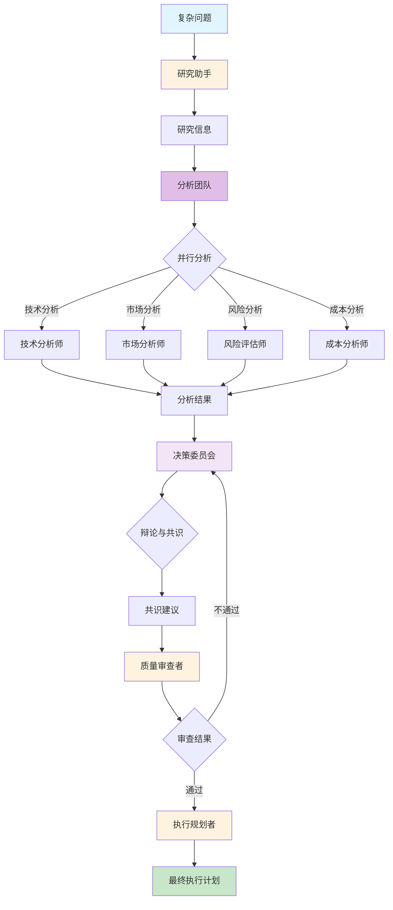

# 多智能体协作

## 概述

多智能体协作模式通过将系统构建为由不同专门化智能体组成的协作集合来解决复杂问题。基于任务分解原则，将高级目标拆解为离散的子问题，然后将每个子问题分配给拥有最适合该任务的特定工具、数据访问或推理能力的智能体。

这种分布式架构提供了几个优势，包括增强的模块化、可扩展性和稳健性，因为单个智能体故障不一定会导致整个系统故障。协作允许产生协同结果，其中多智能体系统的性能超过集合内任何单个智能体的能力。

## 协作形式

### 1. 顺序交接

顺序交接模式下，一个智能体处理任务并将其输出传递给另一个智能体进行流水线中的下一步。这种模式类似于规划模式，但明确涉及不同的智能体。

#### 应用场景
- 文档处理工作流（提取 → 分析 → 汇总）
- 数据流水线（收集 → 清洗 → 转换）
- 代码生成（需求分析 → 设计 → 编码）

#### 流程图



#### 代码实现

```python
"""
1_顺序交接模式
演示多个智能体按顺序处理任务，每个智能体将输出传递给下一个智能体
"""
from typing import Dict, Any
from langchain.schema import HumanMessage, AIMessage
from langchain.prompts import ChatPromptTemplate
from langchain.chains import LLMChain
from langchain_openai import ChatOpenAI
import sys
import os

sys.path.insert(0, os.path.dirname(os.path.dirname(os.path.abspath(__file__))))
from llm_config import create_llm


class SequentialAgent:
    """顺序智能体基类"""

    def __init__(self, name: str, role: str, goal: str, llm: ChatOpenAI):
        self.name = name
        self.role = role
        self.goal = goal
        self.llm = llm
        self.prompt_template = ChatPromptTemplate.from_messages([
            ("system", f"你是一个{role}。你的目标是：{goal}"),
            ("human", "{input}")
        ])
        self.chain = LLMChain(llm=llm, prompt=self.prompt_template)

    def process(self, input_text: str) -> str:
        """处理输入并返回输出"""
        print(f"\n[{self.name}] 正在处理...")
        result = self.chain.run(input=input_text)
        print(f"[{self.name}] 输出: {result[:100]}...")
        return result


def sequential_handover_example():
    """顺序交接示例：创建一个技术博客文章"""

    print("=== 顺序交接模式示例：技术博客创建 ===\n")

    # 创建LLM
    llm = create_llm(temperature=0.7)

    # 定义三个顺序智能体
    # 第一步：研究员 - 收集信息
    researcher = SequentialAgent(
        name="研究员",
        role="研究专家",
        goal="收集并整理关于指定主题的关键信息",
        llm=llm
    )

    # 第二步：分析师 - 分析信息
    analyst = SequentialAgent(
        name="分析师",
        role="技术分析师",
        goal="深入分析研究信息，提取关键见解和趋势",
        llm=llm
    )

    # 第三步：作家 - 撰写博客
    writer = SequentialAgent(
        name="作家",
        role="技术博客作家",
        goal="将分析结果转化为引人入胜的技术博客文章",
        llm=llm
    )

    # 初始输入
    topic = "Python异步编程的发展与最佳实践"
    print(f"初始主题: {topic}\n")

    # 顺序处理
    research_output = researcher.process(topic)

    analysis_output = analyst.process(f"研究主题：{topic}\n\n研究发现：\n{research_output}")

    final_blog = writer.process(f"分析结果：\n{analysis_output}\n\n请基于以上分析撰写一篇结构完整的技术博客文章。")

    print("\n" + "="*50)
    print("最终输出：技术博客文章")
    print("="*50)
    print(final_blog)
```

### 2. 并行处理

并行处理模式下，多个智能体同时处理问题的不同部分，然后它们的结果稍后被组合。这种模式可以显著提高处理效率，特别是当任务可以分解为独立的部分时。

#### 应用场景
- 多源数据收集（多个API同时获取）
- 并行分析（从不同角度分析同一数据）
- 分布式决策（多个专家同时评估）

#### 流程图



#### 代码实现

```python
"""
2_并行处理模式
演示多个智能体同时处理不同任务，然后汇总结果
"""
import asyncio
from typing import List, Dict, Any
from concurrent.futures import ThreadPoolExecutor
from langchain.schema import HumanMessage
from langchain.prompts import ChatPromptTemplate
from langchain.chains import LLMChain
from langchain_openai import ChatOpenAI
import sys
import os

sys.path.insert(0, os.path.dirname(os.path.dirname(os.path.abspath(__file__))))
from llm_config import create_llm


class ParallelAgent:
    """并行智能体基类"""

    def __init__(self, name: str, role: str, goal: str, llm: ChatOpenAI):
        self.name = name
        self.role = role
        self.goal = goal
        self.llm = llm
        self.prompt_template = ChatPromptTemplate.from_messages([
            ("system", f"你是一个{role}。你的目标是：{goal}"),
            ("human", "{input}")
        ])
        self.chain = LLMChain(llm=llm, prompt=self.prompt_template)

    def process(self, input_text: str) -> Dict[str, Any]:
        """处理输入并返回结果"""
        print(f"[{self.name}] 开始处理...")
        try:
            result = self.chain.run(input=input_text)
            print(f"[{self.name}] 处理完成")
            return {
                "agent": self.name,
                "success": True,
                "result": result
            }
        except Exception as e:
            print(f"[{self.name}] 处理失败: {e}")
            return {
                "agent": self.name,
                "success": False,
                "error": str(e)
            }


async def run_agent_async(agent: ParallelAgent, input_text: str) -> Dict[str, Any]:
    """异步执行智能体"""
    loop = asyncio.get_event_loop()
    with ThreadPoolExecutor() as executor:
        return await loop.run_in_executor(
            executor,
            agent.process,
            input_text
        )


class ParallelProcessor:
    """并行处理器"""

    def __init__(self, name: str, synthesizer_role: str = "综合器"):
        self.name = name
        self.agents: List[ParallelAgent] = []
        self.synthesizer_role = synthesizer_role

    def add_agent(self, agent: ParallelAgent):
        """添加智能体"""
        self.agents.append(agent)

    async def process_parallel(self, input_text: str) -> List[Dict[str, Any]]:
        """并行处理所有智能体"""
        print(f"\n=== {self.name} 开始并行处理 ===")
        tasks = [run_agent_async(agent, input_text) for agent in self.agents]
        results = await asyncio.gather(*tasks)
        print(f"=== {self.name} 并行处理完成 ===\n")
        return results

    def synthesize(self, results: List[Dict[str, Any]], llm: ChatOpenAI) -> str:
        """汇总所有智能体的结果"""
        synthesis_input = "以下是多个并行智能体的处理结果：\n\n"
        for result in results:
            if result["success"]:
                synthesis_input += f"【{result['agent']}】\n{result['result']}\n\n"
            else:
                synthesis_input += f"【{result['agent']}】处理失败：{result['error']}\n\n"

        synthesis_input += "\n请综合以上所有智能体的结果，提供一个全面、连贯的总结。"

        synthesizer_chain = LLMChain(
            llm=llm,
            prompt=ChatPromptTemplate.from_messages([
                ("system", f"你是一个{self.synthesizer_role}。你的目标是将多个智能体的结果整合成一个连贯、全面的总结。"),
                ("human", "{input}")
            ])
        )

        print("=== 开始综合处理 ===")
        synthesis_result = synthesizer_chain.run(input=synthesis_input)
        print("=== 综合处理完成 ===\n")
        return synthesis_result
```

### 3. 层次结构

层次结构模式下，管理者智能体根据工具访问或插件能力动态将任务委托给工作智能体，并综合其结果。每个智能体管理一组相关工具，而非由单个智能体处理所有事务。

#### 应用场景
- 任务分解与分配（复杂任务拆解为子任务）
- 专家团队协作（管理者协调多个专家）
- 层级决策（上级协调下级执行）

#### 流程图



#### 代码实现

```python
"""
3_层次结构模式
演示管理者智能体将任务委托给专门的工作智能体，并综合其结果
"""
from typing import Dict, Any, List
from langchain.schema import HumanMessage
from langchain.prompts import ChatPromptTemplate
from langchain.chains import LLMChain
from langchain_openai import ChatOpenAI
import sys
import os

sys.path.insert(0, os.path.dirname(os.path.dirname(os.path.abspath(__file__))))
from llm_config import create_llm


class WorkerAgent:
    """工作智能体 - 专门处理特定任务的智能体"""

    def __init__(self, name: str, specialty: str, description: str, llm: ChatOpenAI):
        self.name = name
        self.specialty = specialty  # 专长领域
        self.description = description
        self.llm = llm

        # 创建专用的处理链
        self.processing_chain = LLMChain(
            llm=llm,
            prompt=ChatPromptTemplate.from_messages([
                ("system", f"你是一个{specialty}专家。\n{description}\n请用专业、准确的方式处理用户的请求。"),
                ("human", "{task}")
            ])
        )

    def can_handle(self, task: str) -> float:
        """评估该智能体能否处理此任务，返回一个置信度分数（0-1）"""
        keywords = {
            "技术": ["开发", "代码", "架构", "技术", "编程", "算法", "系统"],
            "市场": ["营销", "推广", "客户", "市场", "品牌", "销售", "竞争"],
            "财务": ["预算", "成本", "财务", "资金", "投资", "收入", "支出"],
            "法律": ["合同", "法规", "法律", "合规", "条款", "义务"]
        }

        task_lower = task.lower()
        match_count = 0
        for keyword in keywords.get(self.specialty, []):
            if keyword in task_lower:
                match_count += 1

        return min(match_count * 0.3, 1.0)  # 最大置信度为1.0

    def execute_task(self, task: str) -> Dict[str, Any]:
        """执行任务"""
        print(f"  [{self.name}] 正在处理任务...")
        try:
            result = self.processing_chain.run(task=task)
            print(f"  [{self.name}] 任务完成")
            return {
                "agent": self.name,
                "specialty": self.specialty,
                "success": True,
                "result": result
            }
        except Exception as e:
            print(f"  [{self.name}] 任务失败: {e}")
            return {
                "agent": self.name,
                "specialty": self.specialty,
                "success": False,
                "error": str(e)
            }


class ManagerAgent:
    """管理者智能体 - 协调和委托任务"""

    def __init__(self, name: str, coordination_style: str, llm: ChatOpenAI):
        self.name = name
        self.coordination_style = coordination_style
        self.llm = llm
        self.workers: List[WorkerAgent] = []

        # 协调链
        self.coordination_chain = LLMChain(
            llm=llm,
            prompt=ChatPromptTemplate.from_messages([
                ("system", f"你是一个任务协调管理者。\n{coordination_style}\n你的职责是分析任务需求，分解任务，并整合下属智能体的结果。"),
                ("human", "{request}")
            ])
        )

    def add_worker(self, worker: WorkerAgent):
        """添加工作智能体"""
        self.workers.append(worker)
        print(f"[{self.name}] 添加工作智能体: {worker.name} ({worker.specialty})")

    def delegate_task(self, task: str) -> Dict[str, Any]:
        """分析任务，找到最适合的工作智能体"""
        print(f"\n[{self.name}] 分析任务需求...")

        # 找到最适合的工作智能体
        best_worker = None
        best_confidence = 0.0

        for worker in self.workers:
            confidence = worker.can_handle(task)
            if confidence > best_confidence:
                best_confidence = confidence
                best_worker = worker

        if best_worker and best_confidence > 0.3:
            print(f"[{self.name}] 委派任务给 {best_worker.name} (置信度: {best_confidence:.2f})")
            return best_worker.execute_task(task)
        else:
            # 如果没有合适的工作智能体，管理者自己处理
            print(f"[{self.name}] 没有找到合适的工作智能体，由管理者处理")
            return self._handle_directly(task)
```

### 4. 批评者-审查者

批评者-审查者模式下，一个智能体生成初始输出，如计划、草稿或答案。第二组智能体批判性地评估此输出是否符合政策、安全性、合规性、正确性、质量以及与组织目标的一致性。原始创建者或最终智能体根据反馈修订输出。

#### 应用场景
- 代码审查（生成代码 → 质量检查 → 修正）
- 内容审核（生成内容 → 合规检查 → 修改）
- 安全审查（生成方案 → 安全评估 → 改进）

#### 流程图



#### 代码实现

```python
"""
4_批评者审查者模式
演示一个智能体生成内容，另一个智能体审查和评估，然后修订
"""
from typing import Dict, Any, List
from langchain.schema import HumanMessage
from langchain.prompts import ChatPromptTemplate
from langchain.chains import LLMChain
from langchain_openai import ChatOpenAI
import sys
import os

sys.path.insert(0, os.path.dirname(os.path.dirname(os.path.abspath(__file__))))
from llm_config import create_llm


class CreatorAgent:
    """创建者智能体 - 生成初始内容"""

    def __init__(self, name: str, role: str, llm: ChatOpenAI):
        self.name = name
        self.role = role
        self.llm = llm

        self.creation_chain = LLMChain(
            llm=llm,
            prompt=ChatPromptTemplate.from_messages([
                ("system", f"你是一个{role}。你的目标是根据用户需求生成高质量的初始内容。"),
                ("human", "{request}")
            ])
        )

    def create(self, request: str) -> Dict[str, Any]:
        """创建内容"""
        print(f"[{self.name}] 正在生成内容...")
        try:
            content = self.creation_chain.run(request=request)
            print(f"[{self.name}] 内容生成完成")
            return {
                "success": True,
                "content": content,
                "version": 1
            }
        except Exception as e:
            print(f"[{self.name}] 内容生成失败: {e}")
            return {
                "success": False,
                "error": str(e),
                "content": None
            }


class CriticAgent:
    """批评者智能体 - 审查和评估内容"""

    def __init__(self, name: str, role: str, review_criteria: str, llm: ChatOpenAI):
        self.name = name
        self.role = role
        self.review_criteria = review_criteria
        self.llm = llm

        self.review_chain = LLMChain(
            llm=llm,
            prompt=ChatPromptTemplate.from_messages([
                ("system", f"你是一个{role}。\n\n你的审查标准是：{review_criteria}\n\n请按照以下格式提供审查意见：\n1. 整体评估（通过/不通过）\n2. 发现的问题列表\n3. 具体的改进建议\n4. 是否需要重新生成"),
                ("human", "原始请求：{request}\n\n待审查内容：\n{content}")
            ])
        )

    def review(self, request: str, content: str) -> Dict[str, Any]:
        """审查内容"""
        print(f"[{self.name}] 正在审查内容...")
        try:
            review_result = self.review_chain.run(request=request, content=content)
            print(f"[{self.name}] 审查完成")

            # 分析审查结果
            needs_revision = "需要重新生成" in review_result or "不通过" in review_result

            return {
                "success": True,
                "review": review_result,
                "needs_revision": needs_revision
            }
        except Exception as e:
            print(f"[{self.name}] 审查失败: {e}")
            return {
                "success": False,
                "error": str(e),
                "review": None,
                "needs_revision": False
            }


class CriticReviewerWorkflow:
    """批评者-审查者工作流"""

    def __init__(self, creator: CreatorAgent, critic: CriticAgent, revisor: RevisorAgent, max_iterations: int = 3):
        self.creator = creator
        self.critic = critic
        self.revisor = revisor
        self.max_iterations = max_iterations

    def execute(self, request: str, verbose: bool = True) -> Dict[str, Any]:
        """执行批评者-审查者循环"""

        if verbose:
            print(f"\n{'='*60}")
            print("批评者-审查者工作流启动")
            print(f"{'='*60}\n")

        # 第一步：创建初始内容
        creation_result = self.creator.create(request)
        if not creation_result["success"]:
            return {
                "success": False,
                "error": f"创建内容失败: {creation_result['error']}",
                "final_content": None,
                "iterations": 0
            }

        current_content = creation_result["content"]
        iteration = 0
        reviews = []

        # 循环：审查 -> 修订
        while iteration < self.max_iterations:
            iteration += 1

            if verbose:
                print(f"\n{'#'*60}")
                print(f"迭代 {iteration}/{self.max_iterations}")
                print(f"{'#'*60}\n")

            # 审审查内容
            review_result = self.critic.review(request, current_content)
            reviews.append(review_result)

            if not review_result["success"]:
                if verbose:
                    print("审查失败，停止迭代")
                break

            if verbose:
                print(f"\n审查结果:\n{review_result['review']}\n")

            # 检查是否需要修订
            if not review_result["needs_revision"]:
                if verbose:
                    print("✓ 内容通过审查，无需进一步修订")
                break

            # 修订内容
            if iteration >= self.max_iterations:
                if verbose:
                    print(f"已达到最大迭代次数 ({self.max_iterations})，停止修订")
                break

            revision_result = self.revisor.revise(request, current_content, review_result["review"])

            if revision_result["success"]:
                current_content = revision_result["content"]
            else:
                if verbose:
                    print(f"修订失败: {revision_result['error']}")
                break

        return {
            "success": True,
            "final_content": current_content,
            "iterations": iteration,
            "reviews": reviews
        }
```

## 综合协作系统

综合协作系统演示多种多智能体协作模式的组合使用，构建复杂的协作系统。这种系统可以解决需要多种协作模式的复杂问题。

### 系统架构



### 代码实现

```python
"""
5_综合协作系统
演示多种多智能体协作模式的组合使用，构建复杂的协作系统
"""
import asyncio
from typing import Dict, Any, List, Optional
from langchain.schema import HumanMessage
from langchain.prompts import ChatPromptTemplate
from langchain.chains import LLMChain
from langchain_openai import ChatOpenAI
import sys
import os
from concurrent.futures import ThreadPoolExecutor

sys.path.insert(0, os.path.dirname(os.path.dirname(os.path.abspath(__file__))))
from llm_config import create_llm


class IntelligentProblemSolvingSystem:
    """智能问题解决系统 - 综合多智能体协作"""

    def __init__(self, llm: ChatOpenAI):
        self.llm = llm
        self.researcher = ResearchAssistant(llm)
        self.analysis_team = AnalysisTeam(llm)
        self.decision_council = DecisionCouncil(llm)
        self.quality_reviewer = QualityReviewer(llm)
        self.execution_planner = ExecutionPlanner(llm)

    async def solve(self, problem: str) -> Dict[str, Any]:
        """解决复杂问题"""

        print("="*70)
        print("智能问题解决系统启动")
        print("="*70)
        print(f"待解决问题: {problem}\n")

        # 阶段1：信息收集
        print("【阶段1：信息收集】")
        research_result = self.researcher.gather_information(problem)

        # 阶段2：多维分析
        print("\n【阶段2：多维分析】")
        analysis_results = await self.analysis_team.comprehensive_analysis(research_result)

        # 阶段3：决策辩论
        print("\n【阶段3：决策辩论】")
        decision_result = self.decision_council.debate(analysis_results)

        # 阶段4：质量审查
        print("\n【阶段4：质量审查】")
        review_result = self.quality_reviewer.review(decision_result)

        # 阶段5：执行规划
        print("\n【阶段5：执行规划】")
        execution_plan = self.execution_planner.create_plan(decision_result, review_result)

        print("="*70)
        print("智能问题解决系统完成")
        print("="*70)

        return {
            "problem": problem,
            "research": research_result,
            "analysis": analysis_results,
            "decision": decision_result,
            "review": review_result,
            "execution_plan": execution_plan
        }
```

## LLM 配置

所有示例都使用统一的 LLM 配置管理，支持多种 API 提供商：

```python
"""
API配置模块
支持多种兼容OpenAI API的服务（OpenAI、Azure OpenAI、国内模型服务商等）
"""
import os
from typing import Optional
from langchain_openai import ChatOpenAI
import httpx

# 禁用代理，避免代理配置问题
os.environ['NO_PROXY'] = '*'
os.environ['no_proxy'] = '*'

class LLMConfig:
    """LLM配置类"""

    def __init__(
        self,
        api_key: Optional[str] = None,
        api_url: Optional[str] = None,
        model: str = "gpt-3.5-turbo",
        temperature: float = 0.7,
        **kwargs
    ):
        """
        初始化LLM配置

        Args:
            api_key: API密钥，默认从环境变量 OPENAI_API_KEY 读取
            api_url: API地址，默认从环境变量 OPENAI_API_BASE 或 OPENAI_API_URL 读取
            model: 模型名称，默认 gpt-3.5-turbo
            temperature: 温度参数，默认 0.7
            **kwargs: 其他传递给ChatOpenAI的参数
        """
        self.api_key = api_key or os.getenv("OPENAI_API_KEY", "")
        self.api_url = api_url or os.getenv("OPENAI_API_BASE") or os.getenv("OPENAI_API_URL", "")
        self.model = model
        self.temperature = temperature
        self.extra_kwargs = kwargs

        # 验证配置
        if not self.api_key:
            raise ValueError(
                "API密钥未设置！请设置环境变量 OPENAI_API_KEY 或传递 api_key 参数。\n"
                "例如：export OPENAI_API_KEY='your-api-key'"
            )

    def create_llm(self, **override_params) -> ChatOpenAI:
        """
        创建ChatOpenAI实例

        Args:
            **override_params: 覆盖盖默认配置的参数

        Returns:
            ChatOpenAI实例
        """
        # 创建不使用代理的http_client
        http_client = httpx.Client(timeout=30.0)

        params = {
            "api_key": self.api_key,
            "model": override_params.get("model", self.model),
            "temperature": override_params.get("temperature", self.temperature),
            "http_client": http_client,
            **self.extra_kwargs
        }

        # 如果设置了自定义API URL，添加到参数中
        if self.api_url:
            params["base_url"] = self.api_url

        # 合并其他覆盖参数
        params.update(override_params)

        return ChatOpenAI(**params)


def get_default_llm_config() -> "LLMConfig":
    """
    获取默认LLM配置

    优先级：
    1. 环境变量 OPENAI_API_KEY + OPENAI_API_URL/OPENAI_API_BASE
    2. OPENAI默认配置

    Returns:
        LLMConfig实例
    """
    api_key = os.getenv("OPENAI_API_KEY")
    api_url = os.getenv("OPENAI_API_URL") or os.getenv("OPENAI_API_BASE")

    if api_key:
        return LLMConfig(
            api_key=api_key,
            api_url=api_url,
            model=os.getenv("OPENAI_MODEL", "gpt-3.5-turbo"),
            temperature=float(os.getenv("OPENAI_TEMPERATURE", "0.7"))
        )
    else:
        raise ValueError(
            "未找到API配置！请设置以下环境变量之一：\n"
            "1. OPENAI_API_KEY（使用OpenAI）\n"
            "2. OPENAI_API_KEY + OPENAI_API_URL（使用自定义API）\n\n"
            "示例：\n"
            "export OPENAI_API_KEY='your-api-key'\n"
            "export OPENAI_API_URL='https://your-api-endpoint'"
        )


def create_llm(
    api_key: Optional[str] = None,
    api_url: Optional[str] = None,
    model: Optional[str] = None,
    temperature: Optional[float] = None,
    **kwargs
) -> ChatOpenAI:
    """
    快捷创建LLM实例

    Args:
        api_key: API密钥，默认从环境变量读取
        api_url: API地址，默认从环境变量读取
        model: 模型名称，默认从环境变量 OPENAI_MODEL 读取，否则为 gpt-3.5-turbo
        temperature: 温度参数，默认从环境变量 OPENAI_TEMPERATURE 读取，否则为 0.7
        **kwargs:: 其他参数

    Returns:
        ChatOpenAI实例
    """
    # 如果没有提供参数，从环境变量读取默认值
    final_api_key = api_key or os.getenv("OPENAI_API_KEY")
    final_api_url = api_url or os.getenv("OPENAI_API_URL") or os.getenv("OPENAI_API_BASE")
    final_model = model or os.getenv("OPENAI_MODEL", "gpt-3.5-turbo")
    final_temperature = temperature if temperature is not None else float(os.getenv("OPENAI_TEMPERATURE", "0.7"))

    config = LLMConfig(
        api_key=final_api_key,
        api_url=final_api_url,
        model=final_model,
        temperature=final_temperature,
        **kwargs
    )
    return config.create_llm()
```

## 使用场景总结

多智能体协作模式在以下场景中特别有效：

### 1. 复杂研究和分析
一组智能体协作完成研究项目。一个智能体搜索学术数据库，另一个总结发现，第三个识别趋势，第四个将信息综合成报告。这反映了人类研究团队可能如何运作。

### 2. 软件开发
想象智能体构建软件。一个智能体是需求分析师，另一个是代码生成器，第三个是测试员，第四个是文档编写者。他们可以在彼此之间传递输出以构建和验证组件。

### 3. 创意内容生成
创建营销活动可能涉及市场研究智能体、文案撰写智能体、图形设计智能体（使用图像生成工具）和社交媒体调度智能体，所有这些都在一起工作。

### 4. 财务分析
多智能体可以分析金融市场。智能体可能专门获取股票数据、分析新闻情绪、执行技术分析和生成投资建议。

### 5. 客户支持升级
前线支持智能体处理初始查询，在需要时将复杂问题升级给专家智能体（例如，技术专家或计费专家），展示基于问题复杂性的顺序交接。

### 6. 供应链优化
多个智能体代表供应链中的不同节点（供应商、制造商、分销商）并协作优化库存水平、物流和调度以响应需求变化或中断。

### 7. 网络分析与修复
自主操作从多智能体协作中受益匪浅，特别是在故障定位方面。多个智能体协作分类和修复问题，建议最佳行动。

## 关键要点

1. **模块化设计**：每个智能体都是独立的模块，可以单独测试和替换
2. **专业分工**：不同智能体具有不同的专业知识和工具访问权限
3. **协作机制**：通过标准化的通信协议和共享本体实现智能体间的协作
4. **协同效应**：多智能体系统的性能超过集合内任何单个智能体的能力
5. **容错性**：单个智能体故障不一定会导致整个系统故障
6. **可扩展性**：可以轻松添加新的智能体来扩展系统功能

## 技术实现要点

1. **异步处理**：充分利用异步编程提高并行处理效率
2. **错误处理**：所有智能体都应该有适当的错误处理机制
3. **状态管理**：设计清晰的状态传递和更新机制
4. **资源管理**：合理管理API调用资源，避免超限
5. **性能监控**：添加性能监控和日志记录功能
6. **安全性**：确保智能体间的通信是安全的，防止数据泄露

## 扩展建议

1. **添加自定义工具**：在智能体中集成外部API和工具
2. **状态持久化**：添加记忆和状态持久化功能
3. **监控和日志**：集成监控系统跟踪智能体执行状态
4. **测试覆盖**：添加单元测试和集成测试
5. **性能优化**：添加缓存机制和性能优化策略
6. **人机交互**：添加人类智能体接口，支持人在环路的协作
