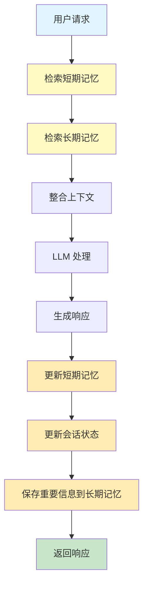

# 记忆管理

## 范式概述

记忆管理是智能体架构中的核心模式, 它使智能体能够存储、检索和利用过去的信息。该模式区分了短期记忆(会话级)和长期记忆(持久化), 确保智能体能够维护对话上下文、学习用户偏好并在多个会话间保持连续性。

记忆管理解决了智能体面临的关键问题:
- 如何维护对话的连贯性?
- 如何跨会话记住用户偏好和历史?
- 如何高效地存储和检索大量信息?

## 核心概念

### 短期记忆(短期上下文)
- 存储当前对话或线程的信息
- 临时性, 会话结束后丢失
- 受 LLM 上下文窗口限制

### 长期记忆(持久化知识)
- 跨会话存储用户和应用数据
- 使用数据库或向量存储实现
- 支持语义搜索和快速检索

### 记忆类型
- **语义记忆**: 存储事实和概念(如用户偏好)
- **情景记忆**: 存储经历和事件(如交互历史)
- **程序记忆**: 存储规则和指令(如系统提示词)

## 流程图



## 代码实现

### 1. 基础记忆管理(基于 LangChain)

```python
"""
记忆管理示例代码
基于 LangChain 和 LangGraph 实现短期和长期记忆管理
"""
from langchain_core.messages import HumanMessage, AIMessage, SystemMessage
from typing import Dict, List, Any
from datetime import datetime
import json
from llm_config import create_llm


class SimpleMemory:
    """简化的记忆实现 - 替代已废弃的 langchain.memory"""

    def __init__(self, memory_key: str = "chat_history"):
        self.memory_key = memory_key
        self.messages: List[Any] = []

    def add_user_message(self, message: str):
        """添加用户消息"""
        self.messages.append(HumanMessage(content=message))

    def add_ai_message(self, message: str):
        """添加AI消息"""
        self.messages.append(AIMessage(content=message))

    def save_context(self, inputs: Dict, outputs: Dict):
        """保存上下文"""
        if "input" in inputs:
            self.add_user_message(inputs["input"])
        if "output" in outputs:
            self.add_ai_message(outputs["output"])

    def load_memory_variables(self, inputs: Dict = None) -> Dict:
        """加载记忆变量"""
        return {self.memory_key: self.messages}

    @property
    def chat_memory(self):
        """提供 chat_memory 接口"""
        return self


class MemoryManager:
    """记忆管理器 - 综合管理短期和长期记忆"""

    def __init__(self):
        self.short_term_memory = SimpleMemory(
            memory_key="chat_history"
        )
        self.long_term_memory = {}  # 简化的长期记忆存储
        self.session_state = {}  # 会话状态

    def add_user_message(self, message: str):
        """添加用户消息到短期记忆"""
        self.short_term_memory.chat_memory.add_user_message(message)

    def add_ai_message(self, message: str):
        """添加AI消息到短期记忆"""
        self.short_term_memory.chat_memory.add_ai_message(message)

    def update_session_state(self, key: str, value: Any):
        """更新会话状态"""
        self.session_state[key] = value
        self.session_state['last_updated'] = datetime.now().isoformat()

    def save_long_term_memory(self, user_id: str, key: str, value: Any):
        """保存长期记忆"""
        if user_id not in self.long_term_memory:
            self.long_term_memory[user_id] = {}
        self.long_term_memory[user_id][key] = {
            'value': value,
            'timestamp': datetime.now().isoformat()
        }

    def get_long_term_memory(self, user_id: str, key: str) -> Any:
        """获取长期记忆"""
        if user_id in self.long_term_memory and key in self.long_term_memory[user_id]:
            return self.long_term_memory[user_id][key]['value']
        return None


def demonstrate_short_term_memory():
    """演示短期记忆管理"""
    print("=== 短期记忆管理演示 ===\n")

    memory = SimpleMemory(
        memory_key="chat_history"
    )

    # 模拟对话
    conversation_pairs = [
        ("我叫张三", "你好张三!很高兴认识你."),
        ("我是一名软件工程师", "听起来是个很棒的职业!你主要使用什么技术栈?"),
        ("我主要使用Python和Java", "Python和Java都是优秀的编程语言!"),
    ]

    for user_input, ai_response in conversation_pairs:
        memory.save_context(
            {"input": user_input},
            {"output": ai_response}
        )
        print(f"用户: {user_input}")
        print(f"AI: {ai_response}\n")

    # 检索记忆
    memory_vars = memory.load_memory_variables({})
    print("当前对话记忆:")
    for msg in memory_vars['chat_history']:
        msg_type = "用户" if isinstance(msg, HumanMessage) else "AI"
        print(f"  {msg_type}: {msg.content}")


def demonstrate_long_term_memory():
    """演示长期记忆管理"""
    print("\n=== 长期记忆管理演示 ===\n")

    manager = MemoryManager()

    # 保存用户偏好和历史数据
    user_id = "user_123"
    manager.save_long_term_memory(user_id, 'preferred_language', 'Python')
    manager.save_long_term_memory(user_id, 'experience_level', 'intermediate')
    manager.save_long_term_memory(user_id, 'last_project', '数据分析系统')

    # 获取长期记忆
    print(f"用户 {user_id} 的长期记忆:")
    print(f"  偏好语言: {manager.get_long_term_memory(user_id, 'preferred_language')}")
    print(f"  经验水平: {manager.get_long_term_memory(user_id, 'experience_level')}")
    print(f"  上一个项目: {manager.get_long_term_memory(user_id, 'last_project')}")
```

**使用的范式**:
- **短期记忆管理**: 使用 SimpleMemory 维护对话历史
- **会话状态管理**: 跟踪临时数据和会话元信息
- **长期记忆存储**: 持久化用户偏好和历史数据

### 2. LangGraph 记忆存储

```python
"""
LangGraph 记忆存储示例
演示如何在 LangGraph 中使用存储来管理长期记忆
"""
from langgraph.store.memory import InMemoryStore
from langgraph.graph import StateGraph, START, END
from typing import TypedDict, Annotated, List, Sequence
import operator
from llm_config import create_llm


class AgentState(TypedDict):
    """智能体状态"""
    messages: Annotated[Sequence[str], operator.add]
    user_id: str
    context: dict


class LangGraphMemoryManager:
    """LangGraph 记忆管理器"""

    def __init__(self):
        # 创建带有嵌入索引的存储
        self.store = InMemoryStore()
        self.llm = create_llm(temperature=0.3)

    def semantic_memory_storage(self):
        """演示语义记忆存储(事实和概念)"""
        print("=== 语义记忆存储演示 ===\n")

        # 定义命名空间
        user_id = "user_123"
        namespace = (user_id, "semantic_memory")

        # 存储用户偏好和事实
        self.store.put(
            namespace,
            "preferences",
            {
                "language": "Python",
                "difficulty": "intermediate",
                "topics": ["机器学习", "数据分析", "Web开发"]
            }
        )

        self.store.put(
            namespace,
            "learning_progress",
            {
                "completed_lessons": 15,
                "current_lesson": "数据结构",
                "total_lessons": 30
            }
        )

        # 检索记忆
        preferences = self.store.get(namespace, "preferences")
        progress = self.store.get(namespace, "learning_progress")

        print("用户偏好:")
        print(f"  编程语言: {preferences.value['language']}")
        print(f"  难度水平: {preferences.value['difficulty']}")
        print(f"  兴趣话题: {preferences.value['topics']}")

        print("\n学习进度:")
        print(f"  完成课程: {progress.value['completed_lessons']}/{progress.value['total_lessons']}")
        print(f"  当前课程: {progress.value['current_lesson']}")

    def episodic_memory_storage(self):
        """演示情景记忆存储(经历和事件)"""
        print("\n=== 情景记忆存储演示 ===\n")

        user_id = "user_123"
        namespace = (user_id, "episodic_memory")

        # 存储重要的学习事件
        learning_events = [
            {
                "event_id": "event_001",
                "description": "完成第一个Python项目",
                "date": "2026-03-15",
                "outcome": "成功",
                "skills_gained": ["基础语法", "变量", "循环"]
            },
            {
                "event_id": "event_002",
                "description": "解决数据分析问题",
                "date": "2026-03-20",
                "outcome": "成功",
                "skills_gained": ["pandas", "数据清洗", "可视化"]
            }
        ]

        for event in learning_events:
            self.store.put(namespace, event['event_id'], event)

        # 搜索特定类型的记忆
        print("最近的学习事件:")
        items = self.store.search(namespace, query="学习项目")
        for item in items:
            print(f"  - {item.value['description']}: {item.value['outcome']}")

    def procedural_memory_storage(self):
        """演示程序记忆存储(规则和指令)"""
        print("\n=== 程序记忆存储演示 ===\n")

        user_id = "user_123"
        namespace = (user_id, "procedural_memory")

        # 存储智能体指令和规则
        agent_instructions = {
            "system_prompt": """你是一个编程学习助手, 专门帮助用户学习Python编程.

指导原则:
1. 鼓励渐进式学习, 从基础到高级
2. 提供具体的代码示例和解释
3. 针对用户水平调整难度
4. 鼓励实践和动手编程
5. 耐心回答问题, 避免技术术语过多
""",
            "interaction_rules": [
                "每次回答后询问是否需要更多解释",
                "遇到错误时提供调试建议",
                "推荐相关的练习项目"
            ]
        }

        self.store.put(namespace, "agent_instructions", agent_instructions)

        # 检索指令
        instructions = self.store.get(namespace, "agent_instructions")
        print("智能体系统指令:")
        print(instructions.value['system_prompt'][:200] + "...")
```

**使用的范式**:
- **语义记忆**: 存储用户偏好、事实和概念
- **情景记忆**: 存储经历、事件和交互历史
- **程序记忆**: 存储智能体指令和规则
- **记忆感知智能工作流**: 集成记忆检索、处理和更新

## 使用场景

### 1. 聊天机器人与对话式 AI
- 维护对话流程需要短期记忆
- 记住用户偏好和历史需要长期记忆
- 提供个性化和持续的交互体验

### 2. 面向任务的智能体
- 管理多步骤任务的进度(短期记忆)
- 访问用户特定数据(长期记忆)
- 跟踪任务状态和中间结果

### 3. 个性化体验
- 存储用户偏好和行为模式
- 提供定制化的响应和建议
- 跨会话保持个性化

### 4. 学习与改进
- 存储成功策略和错误经验
- 从过去交互中学习
- 强化学习智能体存储策略

### 5. 信息检索(RAG)
- 访问知识库(长期记忆)
- 检索相关文档指导响应
- 结合知识和上下文生成答案

### 6. 自主系统
- 机器人或自动驾驶汽车存储地图和路线
- 短期记忆用于即时环境
- 长期记忆用于通用环境知识

## 最佳实践

### 1. 记忆分层
- 使用短期记忆存储临时、会话级信息
- 使用长期记忆存储持久化、跨会话信息
- 明确区分不同类型的记忆

### 2. 命名空间组织
- 使用清晰的命名空间组织记忆
- 例如: `(user_id, "semantic_memory")`、`(user_id, "episodic_memory")`
- 便于检索和隔离不同类型的记忆

### 3. 前缀使用
- 使用前缀标识数据范围和持久性
- `user:` - 用户特定数据
- `app:` - 应用级共享数据
- `temp:` - 临时数据, 不持久化

### 4. 记忆更新
- 避免直接修改状态字典
- 使用框架提供的方法更新记忆
- 确保记忆变更被正确持久化

### 5. 记忆清理
- 定期清理过期的短期记忆
- 使用总结记忆处理长对话
- 优化存储空间和检索性能

## 关键优势

1. **连续性** - 维护对话上下文和连贯性
2. **个性化** - 记住用户偏好和历史
3. **学习能力** - 从过去经验中学习和改进
4. **效率** - 避免重复询问相同信息
5. **扩展性** - 支持大规模用户和数据

## 配置示例

```python
# LLM 配置(与 Chapter 1 保持一致)
from llm_config import create_llm

llm = create_llm(
    model="gpt-3.5-turbo",
    temperature=0.7
)
```

## 总结

记忆管理是构建智能智能体的基础模式。通过区分短期和长期记忆, 智能体能够:
- 维护对话的连贯性和上下文
- 跨会话记住用户偏好和历史
- 从过去经验中学习和改进
- 提供个性化和持续的用户体验

该模式适用于聊天机器人、任务型智能体、个性化系统、学习型智能体等多种场景, 是 AI 智能体架构中的核心组件。
