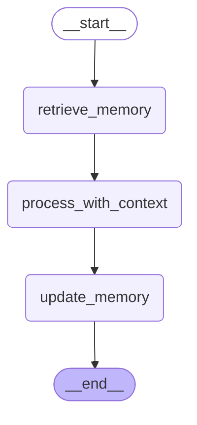

# LangGraph 流程图

```mermaid
---
config:
  flowchart:
    curve: linear
---
graph TD;
	__start__([<p>__start__</p>]):::first
	retrieve_memory(retrieve_memory)
	process_with_context(process_with_context)
	update_memory(update_memory)
	__end__([<p>__end__</p>]):::last
	__start__ --> retrieve_memory;
	process_with_context --> update_memory;
	retrieve_memory --> process_with_context;
	update_memory --> __end__;
	classDef default fill:#f2f0ff,line-height:1.2
	classDef first fill-opacity:0
	classDef last fill:#bfb6fc

```
