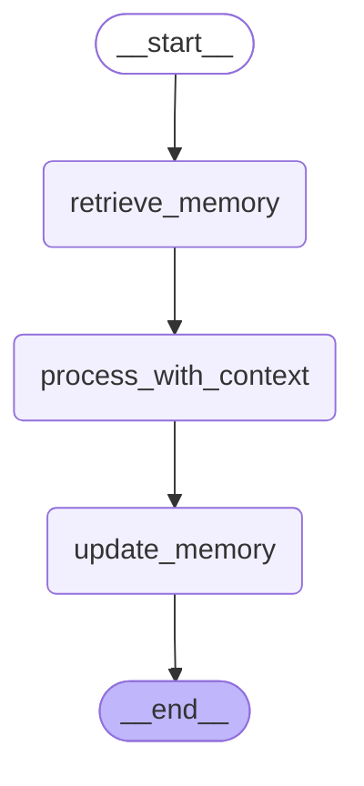

# LangGraph 流程图


```mermaid
---
config:
  flowchart:
    curve: linear
---
graph TD;
	__start__([<p>__start__</p>]):::first
	retrieve_memory(retrieve_memory)
	process_with_context(process_with_context)
	update_memory(update_memory)
	__end__([<p>__end__</p>]):::last
	__start__ --> retrieve_memory;
	process_with_context --> update_memory;
	retrieve_memory --> process_with_context;
	update_memory --> __end__;
	classDef default fill:#f2f0ff,line-height:1.2
	classDef first fill-opacity:0
	classDef last fill:#bfb6fc

```

## 使用说明
可以通过以下方式查看此图：
1. 将此文件复制到支持 Mermaid 的编辑器（如 VS Code + Mermaid Preview）
2. 在线查看: https://mermaid.live/ (将 ```mermaid``` 中的代码粘贴)
3. 使用 GitHub、GitLab 等平台的 Markdown 渲染
