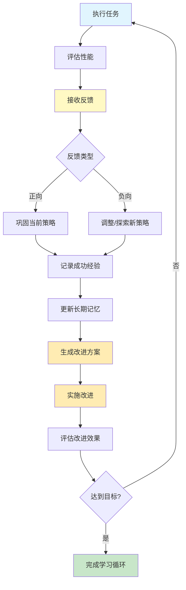

# 学习和适应

## 范式概述

学习和适应是智能体从经验中改进自身能力的核心模式. 该模式使智能体能够突破预设参数的限制,通过反馈 自我改进和进化机制实现自主优化,从而在动态环境中提供更优的性能和体验. 

学习和适应解决了智能体面临的挑战: 
- 如何在新情况下保持良好性能?
- 如何从用户反馈中学习和改进?
- 如何持续优化策略和行为?
- 如何实现自我进化和改进?

## 核心概念

### 学习类型
1. **强化学习**: 通过奖励和惩罚学习最优策略
2. **监督学习**: 从标注示例中学习映射关系
3. **无监督学习**: 从未标注数据中发现模式
4. **基于 LLM 的学习**: 利用大语言模型快速适应新任务
5. **在线学习**: 持续更新知识库适应动态环境
6. **基于记忆的学习**: 利用过往经验调整行为

### 适应机制
1. **基于反馈的调整**: 根据用户反馈调整参数和策略
2. **自我改进**: 智能体评估和优化自身代码或指令
3. **进化优化**: 使用进化算法发现和优化解决方案
4. **近端策略优化(PPO)**: 稳定的强化学习算法
5. **直接偏好优化(DPO)**: 简化的大语言模型对齐方法

## 流程图



## 代码实现

### 1. 基于反馈的学习

```python
"""
学习和适应模式示例代码
演示智能体如何通过反馈学习和自我改进
"""
from typing import Dict, List, Any, Tuple
from dataclasses import dataclass
from enum import Enum
import random
from datetime import datetime
from llm_config import create_llm


class FeedbackType(Enum):
    """反馈类型"""
    POSITIVE = "positive"
    NEGATIVE = "negative"
    NEUTRAL = "neutral"


@dataclass
class PerformanceMetric:
    """性能指标"""
    success_rate: float
    average_time: float
    resource_usage: float
    user_satisfaction: float

    def calculate_score(self) -> float:
        """计算综合得分"""
        weights = {'success': 0.4, 'time': 0.2, 'resource': 0.2, 'satisfaction': 0.2}
        return (
            self.success_rate * weights['success'] +
            (1.0 - self.average_time / 100.0) * weights['time'] +
            (1.0 - self.resource_usage / 100.0) * weights['resource'] +
            self.user_satisfaction * weights['satisfaction']
        )


class LearningAgent:
    """学习智能体 - 能够从反馈中学习"""

    def __init__(self, name: str):
        self.name = name
        self.strategy_params = {
            'temperature': 0.7,
            'top_p': 0.9,
            'max_tokens': 500
        }
        self.performance_history: List[PerformanceMetric] = []
        self.total_interactions = 0
        self.successful_interactions = 0

    def execute_task(self, task: str) -> str:
        """执行任务"""
        print(f"  {self.name} 执行任务: {task}")

        # 模拟任务执行
        success = random.random() < 0.8  # 80% 成功率
        execution_time = random.uniform(10, 50)

        if success:
            self.successful_interactions += 1
            return f"任务完成!耗时: {execution_time:.1f}秒"
        else:
            return f"任务失败. 耗时: {execution_time:.1f}秒"

    def receive_feedback(self, feedback: FeedbackType, rating: float = 0.0):
        """接收反馈并调整策略"""
        print(f"  接收反馈: {feedback.value}, 评分: {rating}")

        self.total_interactions += 1

        # 根据反馈调整参数
        if feedback == FeedbackType.POSITIVE:
            # 成功时保持当前策略
            self.strategy_params['temperature'] = max(0.3, self.strategy_params['temperature'] * 0.95)
        elif feedback == FeedbackType.NEGATIVE:
            # 失败时增加探索
            self.strategy_params['temperature'] = min(1.0, self.strategy_params['temperature'] * 1.1)

    def evaluate_performance(self) -> PerformanceMetric:
        """评估当前性能"""
        if self.total_interactions == 0:
            return PerformanceMetric(0.0, 50.0, 50.0, 0.0)

        success_rate = self.successful_interactions / self.total_interactions
        avg_time = 30.0  # 简化计算
        resource_usage = 40.0
        user_satisfaction = success_rate * 0.8 + 0.2

        metric = PerformanceMetric(success_rate, avg_time, resource_usage, user_satisfaction)
        self.performance_history.append(metric)

        return metric


class AdaptiveLearningSystem:
    """自适应学习系统"""

    def __init__(self):
        self.agents: Dict[str, LearningAgent] = {}
        self.task_queue: List[str] = []
        self.feedback_log: List[Dict] = []

    def register_agent(self, agent: LearningAgent):
        """注册学习智能体"""
        self.agents[agent.name] = agent
        print(f"已注册智能体: {agent.name}")

    def add_task(self, task: str):
        """添加任务到队列"""
        self.task_queue.append(task)

    def process_tasks(self, iterations: int = 10):
        """处理任务并学习"""
        print(f"\n开始处理任务({iterations}次迭代):")
        print("=" * 60)

        for iteration in range(iterations):
            print(f"\n=== 迭代 {iteration + 1} ===")

            for agent_name, agent in self.agents.items():
                if self.task_queue:
                    task = self.task_queue.pop(0)

                    # 执行任务
                    result = agent.execute_task(task)

                    # 生成模拟反馈
                    if "完成" in result:
                        feedback = FeedbackType.POSITIVE
                        rating = random.uniform(0.7, 1.0)
                    else:
                        feedback = FeedbackType.NEGATIVE
                        rating = random.uniform(0.0, 0.4)

                    agent.receive_feedback(feedback, rating)

                    # 记录反馈
                    self.feedback_log.append({
                        'timestamp': datetime.now().isoformat(),
                        'agent': agent_name,
                        'task': task,
                        'feedback': feedback.value,
                        'rating': rating
                    })
```

**使用的范式**: 
- **基于反馈的学习**: 根据正向/负向反馈调整策略参数
- **性能评估**: 计算成功率 效率等综合指标
- **自适应系统**: 多智能体协作学习和优化

### 2. 自我改进(SICA 概念)

```python
class SelfImprovingAgent:
    """自我改进智能体 - 模拟 SICA 概念"""

    def __init__(self, initial_capabilities: Dict[str, float]):
        self.capabilities = initial_capabilities.copy()
        self.improvement_history: List[Dict] = []
        self.version = 1

    def self_evaluate(self) -> Dict[str, float]:
        """自我评估当前能力"""
        print(f"  版本 {self.version} 自我评估...")

        # 模拟评估
        evaluation = {
            'code_editing': random.uniform(0.5, 0.9),
            'navigation': random.uniform(0.5, 0.9),
            'problem_solving': random.uniform(0.5, 0.9),
            'efficiency': random.uniform(0.5, 0.9)
        }

        return evaluation

    def generate_improvement(self, evaluation: Dict[str, float]) -> Dict[str, str]:
        """生成改进方案"""
        print("  分析评估结果并生成改进方案...")

        improvements = {}

        for capability, score in evaluation.items():
            if score < 0.7:
                improvements[capability] = f"改进 {capability}(当前得分: {score:.2f})"

        return improvements

    def implement_improvement(self, improvements: Dict[str, str]):
        """实施改进"""
        if not improvements:
            print("  无需改进,当前表现良好")
            return

        print(f"  实施改进(共{len(improvements)}项):")
        for capability, description in improvements.items():
            print(f"    - {description}")
            self.capabilities[capability] = min(1.0, self.capabilities[capability] + random.uniform(0.1, 0.2))

        self.version += 1

        # 记录改进历史
        self.improvement_history.append({
            'version': self.version,
            'improvements': improvements,
            'timestamp': datetime.now().isoformat()
        })

    def improve(self, max_iterations: int = 5):
        """自我改进循环"""
        print(f"开始自我改进(最多 {max_iterations} 次迭代):")
        print("=" * 60)

        for iteration in range(max_iterations):
            print(f"\n=== 改进迭代 {iteration +1 } ===")

            # 评估
            evaluation = self.self_evaluate()

            # 生成改进方案
            improvements = self.generate_improvement(evaluation)

            # 实施改进
            self.implement_improvement(improvements)

            # 检查是否达到目标
            avg_score = sum(evaluation.values()) / len(evaluation)
            if avg_score >= 0.85:
                print(f"\n✓ 达到目标性能(平均得分: {avg_score:.3f})")
                break
```

**使用的范式**: 
- **自我评估**: 智能体评估当前能力和性能
- **改进生成**: 基于评估结果生成改进方案
- **迭代改进**: 持续评估和改进直到达到目标

### 3. 进化优化(AlphaEvolve/OpenEvolve 概念)

```python
class EvolutionaryOptimizer:
    """进化优化器 - 模拟 AlphaEvolve/OpenEvolve 概念"""

    def __init__(self, initial_solution: str, fitness_function):
        self.population = [initial_solution]
        self.fitness_function = fitness_function
        self.generation = 0
        self.best_fitness = 0.0
        self.best_solution = initial_solution

    def mutate(self, solution: str) -> str:
        """变异操作"""
        # 简化示例: 随机添加字符
        mutations = ["优化", "改进", "加速", "精简"]
        mutation = random.choice(mutations)
        return solution + " " + mutation

    def crossover(self, parent1: str, parent2: str) -> str:
        """交叉操作"""
        # 简化示例: 合并两个解
        midpoint = len(parent1) // 2
        return parent1[:midpoint] + parent2[midpoint:]

    def select(self) -> str:
        """选择操作"""
        return random.choice(self.population)

    def evolve(self, max_generations: int = 10, population_size: int = 5):
        """进化循环"""
        print(f"开始进化优化(最多 {max_generations} 代):")
        print("=" * 60)

        for generation in range(max_generations):
            self.generation = generation + 1
            print(f"\n=== 第 {generation + 1} 代 ===")

            new_population = []

            # 生成新个体
            while len(new_population) < population_size:
                parent = self.select()

                # 变异
                mutated = self.mutate(parent)
                fitness = self.fitness_function(mutated)

                print(f"  生成候选: {mutated[:50]}... | 适应度: {fitness:.3f}")

                new_population.append(mutated)

                # 更新最优解
                if fitness > self.best_fitness:
                    self.best_fitness = fitness
                    self.best_solution = mutated

            self.population = new_population

            print(f"  当前最优适应度: {self.best_fitness:.3f}")

            # 检查收敛
            if self.best_fitness >= 0.9:
                print(f"\n✓ 收敛到最优解(适应度: {self.best_fitness:.3f})")
                break
```

**使用的范式**: 
- **变异(Mutation)**: 生成新变体
- **交叉(Crossover)**: 组合优秀解
- **选择(Selection)**: 选择适应度高的个体
- **进化循环**: 迭代优化直到收敛

## 使用场景

### 1. 个性化助手
- 学习用户行为模式
- 优化交互方式
- 生成定制化响应

### 2. 交易机器人
- 基于实时市场数据动态调整
- 优化决策算法
- 平衡风险与收益

### 3. 应用程序智能体
- 根据用户行为动态修改界面
- 提升系统直观性
- 增加用户参与度

### 4. 机器人和自动驾驶
- 整合传感器数据和历史行动
- 实现安全高效操作
- 适应各种环境

### 5. 欺诈检测
- 识别新型欺诈模式
- 改进预测模型
- 增强异常检测能力

### 6. 推荐系统
- 采用用户偏好学习算法
- 提供个性化推荐
- 持续优化推荐质量

### 7. 游戏 AI
- 动态调整战略算法
- 增加游戏复杂性
- 提升玩家参与度

### 8. 知识库学习
- 维护问题和解决方案的动态知识库
- 存储成功策略
- 应用已知模式避免陷阱

## 关键案例

### SICA(Self-Improving Coding Agent)
- 自我修改源代码的智能体
- 通过迭代改进提升基准测试性能
- 开发了智能编辑器 AST 符号定位器等工具

### AlphaEvolve(Google)
- 利用 LLM 和进化算法发现新算法
- 优化数据中心调度(节省 0.7% 资源)
- 加速 AI 性能(FlashAttention 32.5% 优化)
- 重新发现和改进数学算法

### OpenEvolve
- 进化编码智能体
- 支持多语言和多目标优化
- 分布式评估处理复杂挑战

## 最佳实践

### 1. 反馈机制设计
- 提供清晰 可操作的反馈
- 区分正向和负向反馈
- 记录反馈历史用于分析

### 2. 性能指标定义
- 定义多维性能指标
- 设置明确的改进目标
- 定期评估和报告性能

### 3. 改进策略
- 使用渐进式改进,避免剧烈变化
- 保持备份和回滚机制
- 记录改进历史和原因

### 4. 安全性考虑
- 设置改进的安全边界
- 限制修改范围和频率
- 实施监督和验证机制

### 5. 评估和验证
- 在沙箱环境中测试改进
- 使用综合评估套件
- 确保改进不会引入新问题

## 关键优势

1. **自主性** - 无需持续人工干预即可改进
2. **适应性** - 应对动态和未知情况
3. **个性化** - 学习用户偏好和行为
4. **效率** - 持续优化性能和资源使用
5. **可扩展性** - 支持大规模系统和复杂任务

## 配置示例

```python
# LLM 配置(与 Chapter 1 保持一致)
from llm_config import create_llm

llm = create_llm(
    model="gpt-3.5-turbo",
    temperature=0.7
)
```

## 总结

学习和适应是构建高级智能体的关键模式. 通过反馈学习 自我改进和进化优化,智能体能够: 
- 从经验中学习和改进
- 适应动态和不确定的环境
- 持续优化性能和效率
- 实现自主进化和改进

该模式特别适用于需要在复杂 动态或个性化环境中运行的智能体,如个性化助手 交易机器人 推荐系统等. 通过结合其他模式(如记忆管理 多智能体协作),可以构建具有强大学习能力的智能系统. 
