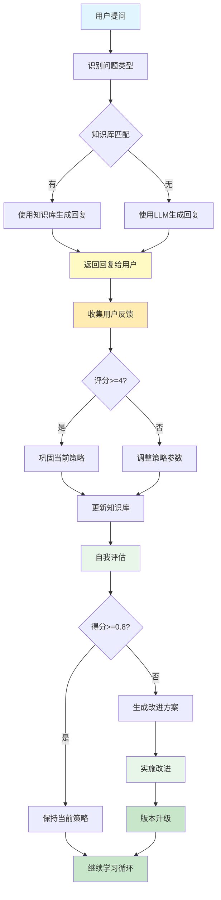

# 智能客服学习助手 - 学习和适应模式实战

## 项目概述

本项目展示了学习和适应模式在实际业务场景中的应用。通过构建一个智能客服系统，演示智能体如何：
- 从用户反馈中学习和调整策略
- 自我评估当前表现
- 自动生成和实施改进方案
- 持续优化服务质量

## 核心功能

### 1. 智能对话
- 使用LLM生成自然、专业的回复
- 自动识别问题类型（产品、价格、技术支持、配送、退款等）
- 基于知识库提供准确答案
- 根据用户偏好调整回答风格

### 2. 反馈学习
- 收集用户评分（1-5星）和文本反馈
- 分析反馈数据调整策略参数
- 学习成功和失败案例
- 更新用户偏好档案

### 3. 自我评估
- 使用LLM深度评估系统表现
- 分析问题类型成功率
- 识别优势和改进领域
- 生成综合评分

### 4. 自动改进
- 基于评估结果生成改进方案
- 调整策略参数（温度、共情、示例使用等）
- 更新知识库内容
- 版本控制和改进历史记录

## 学习流程



## 安装和运行

### 1. 安装依赖

```bash
cd Chapter_9_Learning_and_Adaptation/practical

# 创建虚拟环境（推荐）
python -m venv venv
source venv/bin/activate  # Linux/Mac

# 安装依赖
pip install flask langchain langchain-openai python-dotenv
```

### 2. 配置环境变量

设置环境变量：

```bash
export OPENAI_API_KEY="your-api-key"
export OPENAI_API_URL="your-api-url"  # 可选
export OPENAI_MODEL="gpt-3.5-turbo"  # 可选
```

### 3. 运行应用

```bash
python app.py
```

应用将在 `http://localhost:5000` 启动

## 使用指南

### 基本对话流程

1. **输入问题**
   - 在输入框中输入问题
   - 可选：输入用户ID用于个性化
   - 点击"提问"按钮

2. **查看回复**
   - 系统会生成并显示回复
   - 显示问题类型识别结果

3. **提交反馈**
   - 选择评分（1-5星）
   - 输入反馈文本（可选）
   - 点击"提交反馈"

### 学习和改进

1. **查看统计**
   - 查看总反馈数、用户数
   - 查看平均评分和综合得分
   - 查看当前策略参数

2. **自我评估**
   - 点击"自我评估"按钮
   - 查看评估结果和改进建议

3. **自动改进**
   - 点击"自动改进"按钮
   - 系统将执行学习-评估-改进循环
   - 查看改进实施结果

## API 端点

### POST /api/ask
处理用户问题

### POST /api/feedback
提交用户反馈

### GET /api/evaluate
自我评估系统表现

### POST /api/improve
执行自动改进

### GET /api/statistics
获取系统统计信息

## 设计理念

### 1. 节点操作可视化
每个关键操作都会输出详细信息：
- **入参**：函数调用的输入参数
- **出参**：函数返回的结果
- **Tips**：显示代码文件名+方法名（filename#methodName）

### 2. 降级策略
- LLM调用失败时自动回退到默认行为
- 确保系统稳定运行
- 记录失败日志便于排查

### 3. 持续学习
- 每次反馈都触发学习
- 定期进行自我评估
- 自动实施改进方案

## 注意事项

- 本项目仅用于学习和演示目的
- 生产环境使用时需要考虑安全性、性能优化等问题
